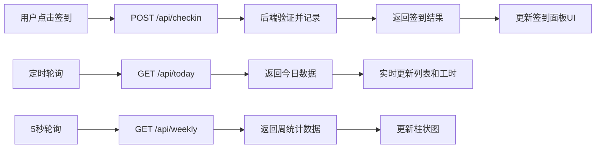

## 1. 产品概述

轻量级在线签到与工时记录看板，为小团队提供便捷的每日签到和工时统计功能，替代传统Excel表格，支持实时数据展示和可视化图表统计。

- **目标用户**：小型团队（5-20人）的独立开发者或团队管理员
- **解决问题**：繁琐的Excel签到表格，缺乏实时反馈和图表统计能力
- **核心价值**：简洁直观的签到体验、实时团队状态展示、可视化工时统计

## 2. 核心功能

### 2.1 用户角色

| 角色 | 登录方式 | 核心权限 |
|------|----------|----------|
| 团队成员 | 无需登录（演示版） | 进行每日签到、查看团队签到状态和工时统计 |

### 2.2 功能模块

1. **签到面板**：签到按钮、今日已签到人员列表、实时工时显示
2. **工时统计图表**：近7天团队总工时柱状图、数据可视化展示
3. **实时数据刷新**：自动轮询更新、签到即时反馈

### 2.3 页面详情

| 页面名称 | 模块名称 | 功能描述 |
|----------|----------|----------|
| 主页面 | 签到面板 | 显示签到按钮、今日签到列表、每人累计工时，支持一键签到 |
| 主页面 | 图表视图 | 展示近7天团队总工时柱状图，支持悬停详情和动画效果 |

## 3. 核心流程

### 3.1 签到流程
用户点击签到按钮 → 前端发送POST请求到后端 → 后端验证今日是否已签到 → 记录签到时间 → 返回签到结果 → 前端更新UI显示已签到状态和列表

### 3.2 数据刷新流程
前端定时轮询（签到面板实时更新、图表5秒轮询） → 发送GET请求获取最新数据 → 后端返回当前数据 → 前端平滑更新UI

## 4. 用户界面设计

### 4.1 设计风格
- **主色调**：品牌蓝 #3b82f6，悬停色 #2563eb
- **背景色**：极浅灰 #f5f6fa
- **卡片颜色**：白色 #ffffff，8px圆角，柔光阴影 0 2px 12px rgba(0,0,0,0.06)
- **文字颜色**：标题深灰 #1e293b，正文中等灰 #64748b
- **网格线**：淡灰色 #e2e8f0
- **布局**：卡片式左右分栏布局，签到面板40%，图表视图60%
- **字体**：现代无衬线字体，清晰易读
- **按钮风格**：品牌蓝填充，悬停上浮效果，点击压平反馈

### 4.2 页面设计概览

| 页面名称 | 模块名称 | UI元素 |
|----------|----------|--------|
| 主页面 | 签到面板 | 签到按钮（带状态变化动画）、人员列表（淡入动画）、累计工时（实时更新）、未签到占位符 |
| 主页面 | 图表视图 | 柱状图（渐变色柱子）、悬停放大效果、数值标签、入场缩入动画、标题文字 |

### 4.3 响应式设计
- 桌面端（>768px）：左右两栏布局，签到面板40%，图表60%
- 移动端（≤768px）：上下排列，卡片宽度100%
- 所有交互切换携带300ms平滑过渡动画

### 4.4 动效设计
- 签到按钮：悬停上浮+阴影加深，点击scale(0.97)压平
- 新签到人员：透明度0→1淡入，持续0.3s
- 图表柱体：缩放入场效果，悬停弹性变大
- 数据更新：平滑过渡，避免突兀跳变
