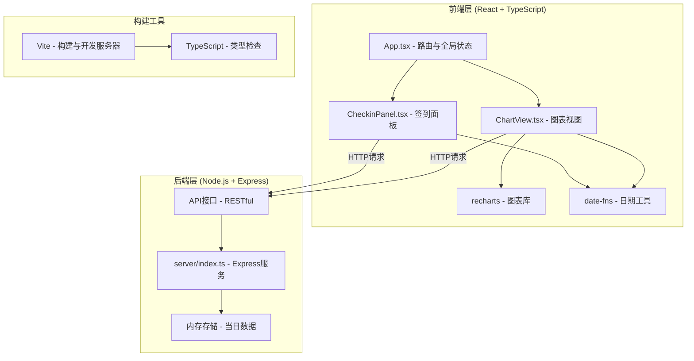
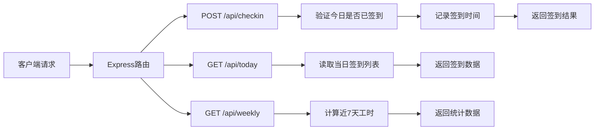

## 1. 架构设计



## 2. 技术描述

- **前端框架**：React 18 + TypeScript
- **构建工具**：Vite 5 + @vitejs/plugin-react
- **后端框架**：Express 4 + TypeScript (ts-node)
- **图表库**：recharts 2
- **日期工具**：date-fns 2
- **开发服务器端口**：前端 5173，后端 3000
- **数据存储**：内存存储（当日数据），演示用
- **跨域处理**：Vite 代理 /api 到后端

## 3. 文件结构与调用关系

```
project-root/
├── package.json              # 项目配置与依赖
├── vite.config.js            # Vite构建配置，代理/api到3000
├── tsconfig.json             # TypeScript配置
├── index.html                # HTML入口
├── src/
│   ├── App.tsx               # 主应用组件，管理状态，传递数据给子组件
│   ├── CheckinPanel.tsx      # 签到面板组件
│   └── ChartView.tsx         # 图表视图组件
└── server/
    └── index.ts              # Express后端服务
```

**数据流向**：
- 组件触发事件 → 发送HTTP请求 → 后端处理 → 返回JSON响应 → 更新UI状态
- App.tsx 作为数据中心，通过props向子组件传递数据和回调函数

## 4. API 定义

### 4.1 类型定义

```typescript
interface CheckinRecord {
  userId: string;
  userName: string;
  checkinTime: string; // ISO 时间戳
}

interface TeamMember {
  id: string;
  name: string;
  avatar: string;
}

interface DailyStats {
  date: string; // YYYY-MM-DD
  totalHours: number;
}
```

### 4.2 接口列表

| 方法 | 路径 | 描述 | 请求体 | 响应 |
|------|------|------|--------|------|
| POST | /api/checkin | 用户签到 | { userId, userName } | { success, message, record } |
| GET | /api/today | 获取今日签到数据 | - | { checkins: CheckinRecord[], members: TeamMember[] } |
| GET | /api/weekly | 获取近7天工时统计 | - | DailyStats[] |

## 5. 服务器架构



## 6. 数据模型

### 6.1 内存数据结构

```typescript
// 当日签到记录（按日期存储）
interface CheckinStore {
  [date: string]: {
    [userId: string]: CheckinRecord;
  };
}

// 团队成员列表（固定数据）
const TEAM_MEMBERS: TeamMember[] = [
  { id: '1', name: '张三', avatar: '👨‍💻' },
  { id: '2', name: '李四', avatar: '👩‍💻' },
  { id: '3', name: '王五', avatar: '🧑‍💻' },
  { id: '4', name: '赵六', avatar: '👨‍🎨' },
  { id: '5', name: '钱七', avatar: '👩‍🔬' },
];
```

### 6.2 工时计算逻辑
- 当日工时 = 当前时间 - 首次签到时间
- 历史数据：模拟生成近7天数据
- 总工时精度：保留1位小数

## 7. 性能约束

- 签到请求响应时间：< 100ms（后端处理）
- 前端UI更新：< 500ms（从点击到渲染完成）
- 图表轮询间隔：5秒
- 列表更新：React diff 优化，只更新变化的节点
- 动画帧率：60fps，使用 CSS transition
