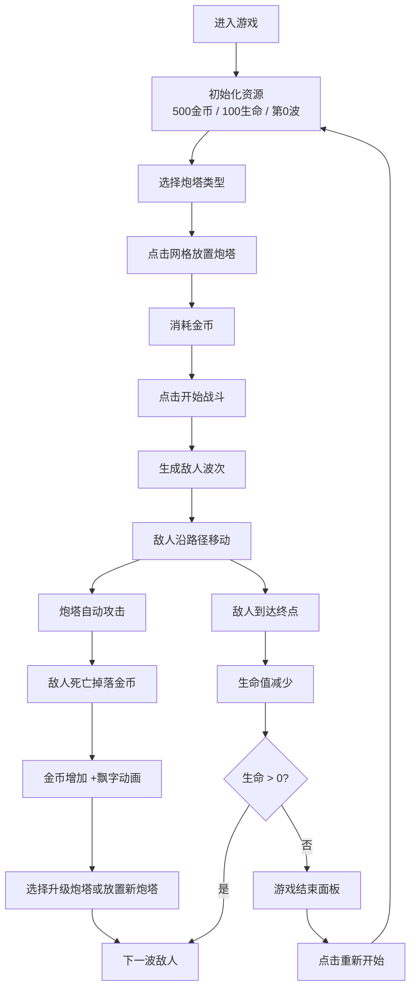

## 1. 产品概述

中世纪策略塔防游戏，运行于浏览器中，玩家通过在路径两侧放置和升级炮塔来阻止敌人抵达终点，保护生命值不被消耗殆尽。

- 核心目标：提供具有动态视觉反馈的塔防游戏体验，解决传统塔防玩法缺乏丰富视觉效果和战斗反馈的问题
- 目标用户：休闲游戏爱好者、策略游戏玩家
- 市场价值：纯前端实现，无需安装，即开即玩，具有高度可扩展性

## 2. 核心功能

### 2.1 用户角色

| 角色 | 注册方式 | 核心权限 |
|------|----------|----------|
| 玩家 | 无需注册，直接进入游戏 | 放置炮塔、升级炮塔、开始波次、重新开始游戏 |

### 2.2 功能模块

1. **游戏主界面**：中央游戏画布、左侧信息面板、右侧炮塔选择与升级面板
2. **敌人波次系统**：自动生成敌人波次、不同速度敌人、精英敌人
3. **炮塔系统**：3种炮塔类型（箭塔、减速塔、范围塔）、3级升级系统
4. **经济系统**：金币获取与消耗、飘字动画反馈
5. **战斗系统**：碰撞检测、弹道动画、伤害计算、粒子效果
6. **状态管理**：波次显示、生命值、金币、暂停/继续、游戏结束

### 2.3 功能详情

| 功能模块 | 子模块 | 功能描述 |
|----------|--------|----------|
| 敌人波次系统 | 波次生成 | 每波5-10个敌人，间隔10秒自动生成，从左向右沿路径移动 |
| 敌人波次系统 | 敌人类型 | 普通敌人（10金币）、精英敌人（25金币），移动速度各异 |
| 敌人波次系统 | 生命值 | 初始100点，敌人到达终点减少生命值 |
| 炮塔系统 | 炮塔类型 | 普通箭塔（单体伤害）、减速炮塔（减速效果）、范围炮塔（AOE伤害） |
| 炮塔系统 | 升级系统 | 最高3级，每级增加伤害和射程，消耗金币升级 |
| 炮塔系统 | 放置机制 | 路径两侧网格点击放置，带淡入动画 |
| 经济系统 | 金币获取 | 击败敌人掉落金币，普通10金币，精英25金币 |
| 经济系统 | 金币消耗 | 炮塔放置100-250金币，升级消耗递增 |
| 经济系统 | 视觉反馈 | 金币变化时显示飘字动画 |
| 战斗系统 | 血条显示 | 敌人头顶显示血条，受击时闪烁红色 |
| 战斗系统 | 弹道动画 | 箭塔飞箭、范围塔爆炸圆圈 |
| 战斗系统 | 死亡效果 | 敌人死亡灰飞烟灭粒子效果 |
| 战斗系统 | 路径光效 | 敌人行走时路径淡淡微光 |
| 状态管理 | 信息显示 | 当前波次、生命值、金币数 |
| 状态管理 | 控制按钮 | 开始战斗、下一波按钮 |
| 状态管理 | 游戏结束 | 生命归零时弹出结束面板，带重新开始按钮 |
| 状态管理 | 暂停功能 | 所有动画暂停，界面不变透明度 |

## 3. 核心流程

玩家进入游戏 → 查看初始资源（500金币，100生命） → 在右侧面板选择炮塔类型 → 在路径两侧网格点击放置炮塔 → 点击"开始战斗"按钮 → 敌人波次自动生成 → 炮塔自动攻击敌人 → 击败敌人获得金币 → 使用金币升级炮塔或放置新炮塔 → 生命值归零则游戏结束 → 点击"重新开始"重新游戏

## 4. 用户界面设计

### 4.1 设计风格

- **主色调**：深灰 #2a2a2a（背景）、铁锈红 #8b4513（强调）、金色 #d4af37（高亮）
- **整体风格**：暗色系中世纪风格，厚重质感
- **按钮样式**：矩形带圆角，hover时颜色变亮并伴随0.2秒缩小动画
- **炮塔图标**：圆形带轮廓样式，不同颜色区分类型
- **网格地块**：浅灰边框，悬停时高亮
- **字体**：选择具有中世纪风格的衬线字体作为标题，无衬线字体作为正文

### 4.2 页面布局

| 区域 | 位置 | 宽度占比 | UI元素 |
|------|------|----------|--------|
| 信息面板 | 左侧 | ~10% | 波次数、生命值条、金币数 |
| 游戏画布 | 中央 | ~80% | 网格地图、敌人路径、炮塔、敌人、弹道、粒子 |
| 炮塔面板 | 右侧 | ~10% | 3种炮塔选择、升级按钮、选中炮塔信息 |

### 4.3 响应式设计

- **桌面端（1024px以上）**：三栏布局，中央画布80%宽度，左右面板各10%
- **小屏设备（1024px以下）**：自适应布局，调整画布和面板比例，保证游戏可玩性
- **触控优化**：按钮最小点击区域40px，适合触屏操作

### 4.4 动画与特效

- 炮塔放置：淡入动画（opacity 0→1，scale 0.8→1）
- 金币飘字：向上飘动 + 渐隐
- 敌人受击：红色闪烁
- 敌人死亡：灰飞烟灭粒子效果
- 路径微光：敌人经过时路径发光
- 按钮hover：颜色变亮 + 0.2秒缩小动画
- 弹道动画：箭塔飞箭轨迹、范围塔爆炸圆圈扩散
