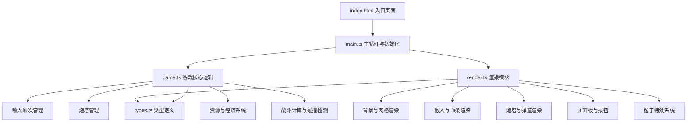

## 1. 架构设计

纯前端单页应用，采用模块化设计，分离游戏逻辑、渲染和类型定义。



## 2. 技术说明

- **前端框架**：原生 TypeScript + HTML5 Canvas 2D
- **构建工具**：Vite 5.x
- **开发语言**：TypeScript 5.x（严格模式，ES2020）
- **第三方依赖**：无第三方游戏引擎，纯原生实现
- **Node.js 类型**：@types/node

## 3. 项目文件结构

| 文件路径 | 说明 |
|----------|------|
| `package.json` | 项目依赖与脚本配置 |
| `index.html` | 入口页面，包含全屏Canvas容器和UI覆盖层 |
| `vite.config.js` | Vite构建配置，开发服务器端口3000 |
| `tsconfig.json` | TypeScript配置，严格模式，ES2020模块 |
| `src/main.ts` | 游戏主循环和初始化，创建Canvas、启动GameLoop、控制FPS |
| `src/game.ts` | 核心游戏逻辑，管理敌人波次、炮塔列表、资源数值、战斗计算 |
| `src/render.ts` | 渲染模块，绘制背景、敌人、炮塔、弹道、UI、粒子效果 |
| `src/types.ts` | 类型定义，Enemy、Tower、Projectile等接口和枚举 |

## 4. 核心数据模型

### 4.1 Enemy（敌人）

```typescript
interface Enemy {
  id: number;
  type: EnemyType; // normal | elite
  x: number;
  y: number;
  hp: number;
  maxHp: number;
  speed: number;
  pathIndex: number; // 当前路径点索引
  pathProgress: number; // 路径段进度 0-1
  reward: number; // 击杀奖励金币
  isHit: boolean; // 是否刚受击（用于闪烁）
  hitTimer: number; // 受击闪烁计时器
  slowEffect: number; // 减速效果倍率 0-1
  slowTimer: number; // 减速持续时间
}
```

### 4.2 Tower（炮塔）

```typescript
interface Tower {
  id: number;
  type: TowerType; // arrow | slow | splash
  gridX: number;
  gridY: number;
  x: number;
  y: number;
  level: number; // 1-3
  damage: number;
  range: number;
  fireRate: number; // 每秒攻击次数
  lastFireTime: number;
  target: Enemy | null;
  angle: number; // 炮塔朝向
  isPlacing: boolean; // 是否处于放置动画中
  placeAnimProgress: number; // 放置动画进度 0-1
}
```

### 4.3 Projectile（弹道）

```typescript
interface Projectile {
  id: number;
  type: TowerType;
  x: number;
  y: number;
  targetX: number;
  targetY: number;
  speed: number;
  damage: number;
  targetId: number; // 目标敌人ID
  splashRadius?: number; // 范围伤害半径
  slowEffect?: number; // 减速效果
  slowDuration?: number; // 减速持续时间
}
```

### 4.4 Particle（粒子）

```typescript
interface Particle {
  x: number;
  y: number;
  vx: number;
  vy: number;
  life: number;
  maxLife: number;
  color: string;
  size: number;
  type: ParticleType; // death | hit | gold | explosion
}
```

### 4.5 FloatingText（飘字）

```typescript
interface FloatingText {
  x: number;
  y: number;
  text: string;
  color: string;
  life: number;
  maxLife: number;
  vy: number;
}
```

### 4.6 GameState（游戏状态）

```typescript
interface GameState {
  gold: number;
  lives: number;
  wave: number;
  isPlaying: boolean;
  isPaused: boolean;
  isGameOver: boolean;
  waveTimer: number; // 下一波倒计时
  waveActive: boolean; // 当前波是否进行中
  enemiesToSpawn: number; // 当前波剩余生成敌人数量
  spawnTimer: number; // 敌人生成间隔计时器
  selectedTowerType: TowerType | null;
  selectedTower: Tower | null;
}
```

## 5. 核心算法

### 5.1 路径寻路

- 预设路径点数组，敌人沿路径点顺序移动
- 使用线性插值计算当前位置
- 支持不同移动速度

### 5.2 碰撞检测

- 炮塔范围检测：圆形范围，计算与敌人距离
- 弹道命中检测：计算弹道与目标距离，小于阈值判定命中
- 范围伤害：以爆炸点为圆心，半径内所有敌人受到伤害

### 5.3 性能优化

- 对象池模式复用粒子和弹道对象
- 仅渲染视野内对象
- 限制最大粒子数量
- 使用 requestAnimationFrame 实现60fps渲染
- 固定时间步长更新游戏逻辑

## 6. 性能目标

- FPS ≥ 55帧
- 支持50+敌人同时在场无明显卡顿
- 粒子系统最大数量可配置
- 内存占用稳定，无内存泄漏
