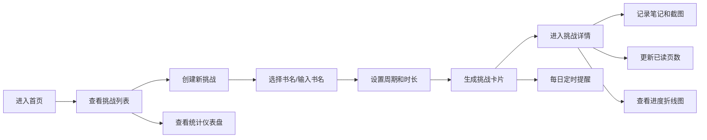

## 1. 产品概述

个人阅读挑战计划管理应用，帮助用户建立和坚持阅读习惯，通过目标设定、进度追踪、可视化反馈和定时提醒机制，解决用户在阅读过程中缺乏动力和成就感的问题。

- **目标用户**：希望建立阅读习惯、需要可视化进度追踪的个人读者
- **核心价值**：让阅读挑战可量化、可追踪、有反馈，持续激励用户完成阅读目标

## 2. 核心功能

### 2.1 用户角色

| 角色 | 注册方式 | 核心权限 |
|------|----------|----------|
| 普通用户 | 无需注册，本地存储 | 创建挑战、记录笔记、查看统计、接收提醒 |

### 2.2 功能模块

1. **首页**：挑战卡片列表、创建挑战入口、导航栏
2. **创建挑战**：书名选择（手动/预置书单）、时间周期设置、每日阅读时长设置
3. **挑战详情**：笔记记录、截图上传、页数更新、进度折线图
4. **统计仪表盘**：挑战总数、完成率、日均阅读时长、连续阅读天数、粒子动画背景
5. **提醒系统**：Notification API推送、铃铛图标呼吸动画、未读提醒列表

### 2.3 页面详情

| 页面名称 | 模块名称 | 功能描述 |
|----------|----------|----------|
| 首页 | 挑战卡片网格 | 2列自适应CSS Grid，卡片hover上浮4px+阴影加深，展示书名、进度条、状态标签 |
| 首页 | 导航栏 | 页面导航、提醒铃铛（橙色呼吸动画）、未读提醒弹窗 |
| 创建挑战页 | 表单区域 | 书名输入/选择器、时间周期（周/月/季度）、每日时长（15/30/60分钟） |
| 创建挑战页 | 预置书单 | 20本经典文学作品快速选择 |
| 挑战详情页 | 笔记区域 | 左右分栏，左侧文本输入（最多500字），右侧图片预览 |
| 挑战详情页 | 进度更新 | 数字输入框调整已读页数，自动更新进度条 |
| 挑战详情页 | 折线图 | 日期-累计页数曲线，数据点悬停显示数值 |
| 统计仪表盘 | 统计卡片 | 响应式网格布局，4项核心指标展示 |
| 统计仪表盘 | 粒子动画 | 40个粒子，1-3px大小，极缓浮动 |

## 3. 核心流程

用户进入首页 → 点击创建挑战 → 填写挑战信息（书名/周期/时长） → 提交生成挑战卡片 → 进入详情页记录笔记和更新页数 → 查看进度折线图 → 在仪表盘查看综合统计 → 每日定时收到阅读提醒

## 4. 用户界面设计

### 4.1 设计风格

- **主色系**：莫兰迪色系
  - 主色：#8B9EB7（柔灰蓝）
  - 辅色：#C9B6A6（淡米黄）
  - 强调色：#D48363（珊瑚橙）
- **按钮风格**：圆角设计，hover有颜色过渡
- **字体**：优雅的衬线/无衬线组合，中文优先
- **布局风格**：卡片式布局，顶部导航
- **图标风格**：简洁线性图标

### 4.2 页面设计概览

| 页面名称 | 模块名称 | UI元素 |
|----------|----------|--------|
| 首页 | 挑战卡片 | 圆角卡片、渐变进度条、状态标签（绿/灰/红）、0.3s cubic-bezier过渡动画 |
| 挑战详情 | 笔记区域 | 浅米色圆角背景输入区、图片预览网格、字数计数器 |
| 挑战详情 | 折线图 | Recharts折线图、悬停Tooltip、平滑曲线 |
| 仪表盘 | 统计卡片 | 大号数据展示、副标题说明、莫兰迪配色渐变边框 |
| 导航栏 | 提醒铃铛 | #D48363橙色、1s周期scale呼吸动画、点击弹窗展示3条未读 |

### 4.3 响应式设计

- Desktop优先设计
- 断点：768px
- 手机端：单列堆叠布局，按钮尺寸增大适配触摸操作
- 卡片最小宽度：320px

### 4.4 性能要求

- 折线图渲染响应时间：< 200ms
- 动画帧率：≥ 55FPS
- 粒子动画：CSS/Canvas优化，不影响页面性能
