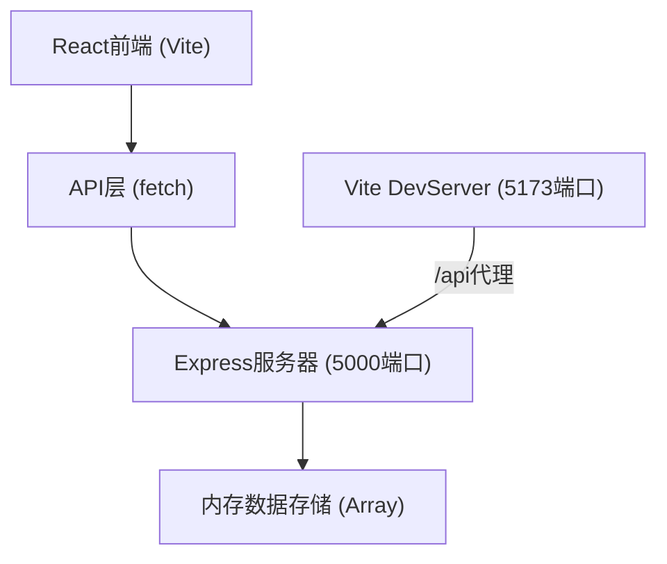
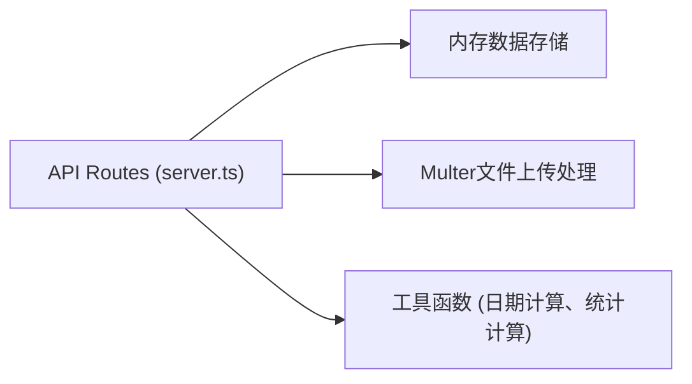

## 1. 架构设计



## 2. 技术说明

- **前端**：React@18 + TypeScript + Vite
- **UI**：纯CSS（莫兰迪色系变量）+ CSS Grid
- **图表**：Recharts
- **路由**：React Router DOM v6
- **状态管理**：React Hooks (useState, useEffect)
- **后端**：Express@4 + TypeScript
- **文件上传**：Multer
- **数据存储**：内存数组（无需数据库）

## 3. 路由定义

| 前端路由 | 用途 |
|----------|------|
| / | 首页 - 挑战卡片列表 |
| /create | 创建新挑战 |
| /challenge/:id | 挑战详情页 |
| /dashboard | 统计仪表盘 |

| 后端API路由 | 方法 | 用途 |
|-------------|------|------|
| /api/challenges | GET | 获取所有挑战 |
| /api/challenges | POST | 创建新挑战 |
| /api/challenges/:id | GET | 获取单个挑战详情 |
| /api/challenges/:id | PUT | 更新挑战（页数等） |
| /api/challenges/:id | DELETE | 删除挑战 |
| /api/challenges/:id/notes | POST | 添加阅读笔记 |
| /api/challenges/:id/notes | GET | 获取挑战笔记列表 |
| /api/challenges/:id/progress | POST | 记录每日进度（用于折线图） |
| /api/notifications | GET | 获取最近提醒列表 |
| /api/notifications/:id/read | PUT | 标记提醒已读 |
| /api/stats | GET | 获取统计数据 |
| /api/books | GET | 获取预置经典书单 |
| /api/upload | POST | 上传笔记截图 |

## 4. API类型定义

```typescript
// 挑战状态
type ChallengeStatus = 'in_progress' | 'completed' | 'expired';

// 时间周期
type TimePeriod = 'week' | 'month' | 'quarter';

// 每日阅读时长（分钟）
type DailyDuration = 15 | 30 | 60;

// 阅读挑战
interface Challenge {
  id: string;
  bookTitle: string;
  bookAuthor?: string;
  totalPages: number;
  currentPages: number;
  period: TimePeriod;
  dailyDuration: DailyDuration;
  dailyReminderTime: string; // HH:mm 格式
  startDate: string;
  endDate: string;
  status: ChallengeStatus;
  createdAt: string;
}

// 阅读笔记
interface Note {
  id: string;
  challengeId: string;
  chapter: string;
  content: string; // 最多500字
  imageUrl?: string;
  createdAt: string;
}

// 每日进度记录
interface ProgressLog {
  id: string;
  challengeId: string;
  date: string; // YYYY-MM-DD
  pagesRead: number; // 当天读的页数
  totalPages: number; // 当天累计页数
  minutesRead: number;
}

// 提醒
interface Notification {
  id: string;
  challengeId: string;
  challengeTitle: string;
  message: string;
  scheduledTime: string;
  isRead: boolean;
  createdAt: string;
}

// 统计数据
interface Stats {
  totalChallenges: number;
  completedChallenges: number;
  completionRate: number;
  avgDailyMinutes: number;
  consecutiveDays: number;
}

// 预置书籍
interface Book {
  title: string;
  author: string;
  totalPages: number;
}
```

## 5. 后端架构



后端采用单体架构，所有逻辑集中在 server.ts 中处理，数据全部存储在内存数组中。

## 6. 文件结构

```
auto1/
├── package.json          # 前端依赖和脚本
├── index.html            # HTML入口
├── tsconfig.json         # TypeScript配置
├── vite.config.ts        # Vite配置（含API代理）
├── server/
│   ├── package.json      # 后端依赖
│   ├── tsconfig.json     # 后端TS配置
│   └── server.ts         # Express服务器
└── src/
    ├── main.tsx          # React入口
    ├── App.tsx           # 主组件（路由+导航+提醒）
    ├── styles/
    │   └── global.css    # 全局样式（莫兰迪色变量、响应式）
    ├── components/
    │   ├── Navbar.tsx        # 导航栏+提醒铃铛
    │   ├── ChallengeCard.tsx # 挑战卡片
    │   ├── ProgressBar.tsx   # 进度条组件
    │   ├── ParticleBackground.tsx # 粒子动画背景
    │   └── NotificationBell.tsx   # 提醒铃铛组件
    ├── pages/
    │   ├── Home.tsx          # 首页 - 挑战列表
    │   ├── CreateChallenge.tsx # 创建挑战页
    │   ├── ChallengeDetail.tsx # 挑战详情页
    │   └── Dashboard.tsx     # 统计仪表盘
    ├── hooks/
    │   ├── useNotifications.ts # 提醒相关Hook
    │   └── useApi.ts           # API请求封装
    ├── types/
    │   └── index.ts          # TypeScript类型定义
    └── utils/
        └── index.ts          # 工具函数
```
