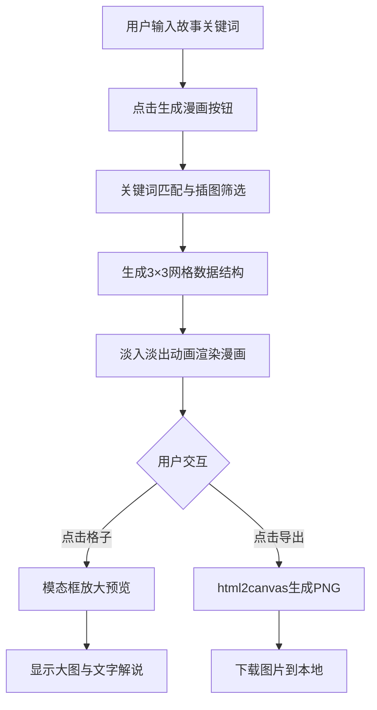

## 1. 产品概述

一款基于用户输入故事关键词自动生成连环画风格九格漫画的Web应用。用户输入简短故事梗概，系统自动提取关键场景，从预置手绘插图库中智能匹配，生成具有童话绘本风格的九格漫画，支持模态预览和PNG导出。

- 目标用户：故事创作者、教育工作者、儿童及家长、手工爱好者
- 核心价值：将文字创意快速视觉化，降低漫画创作门槛，呈现温馨治愈的手绘童话风格

## 2. 核心功能

### 2.1 功能模块
1. **输入区**：故事关键词输入框（带联想补全）、预设关键词标签、生成漫画按钮
2. **漫画展示区**：3×3九格漫画网格、手绘风格边框、格子悬停动效
3. **模态预览**：点击格子放大预览、显示该格文字解说
4. **导出功能**：一键导出带标题和边框的PNG图片

### 2.2 页面详情
| 页面名称 | 模块名称 | 功能描述 |
|---------|---------|---------|
| 主页 | 输入区 | 文本输入框支持10个预设关键词联想补全，点击标签自动填充 |
| 主页 | 漫画生成区 | 点击生成按钮后3秒内完成渲染，3×3网格布局展示九格漫画 |
| 主页 | 格子交互 | 悬停放大+阴影效果，点击弹出模态框显示大图和文字解说 |
| 主页 | 导出按钮 | 调用html2canvas导出整张漫画（含标题、边框）为PNG |

## 3. 核心流程

用户在输入框输入故事关键词（或点击预设标签）→ 点击"生成漫画"按钮 → 系统匹配关键词与插图库 → 生成3×3网格数据 → 淡入动画渲染九格漫画 → 用户可点击格子放大预览 → 点击"导出PNG"下载图片

## 4. 用户界面设计

### 4.1 设计风格
- **主色调**：米白色（#FAF6EE）打底，深棕色（#5D4E37）文字，柔和暖色调点缀（淡赭石、雾霾蓝、橄榄绿）
- **背景**：羊皮纸纹理背景，模拟打开的童话书质感
- **边框**：仿手绘虚线边框分隔九格，不规则边缘增加手绘感
- **字体**：标题使用圆润手写风格字体，正文使用易读的衬线/手写混合字体
- **按钮风格**：圆角矩形，柔和阴影，悬停时轻微上浮
- **图标**：手绘线条风格图标，水彩填充效果

### 4.2 页面设计概述
| 页面名称 | 模块名称 | UI元素 |
|---------|---------|---------|
| 主页 | 输入区 | 羊皮纸卡片容器、带放大镜图标的输入框、关键词标签云、生成按钮（水彩渐变） |
| 主页 | 漫画展示区 | 3×3网格、手绘虚线分隔、格子悬停缩放1.02倍+柔和阴影、淡入动画0.6秒 |
| 主页 | 模态框 | 半透明羊皮纸遮罩、居中大图、下方文字解说、关闭按钮、淡入动画 |
| 主页 | 导出区 | 右上角导出按钮、下载图标、加载状态提示 |

### 4.3 响应式设计
- **桌面端（≥1024px）**：3列网格布局，最大宽度1200px居中
- **平板端（768px-1023px）**：2列网格布局，字体和间距适当缩小
- **手机端（<768px）**：1列网格布局，输入区和导出按钮全宽，触摸区域≥44px

### 4.4 动效规范
- 格子切换淡入淡出：0.6秒 ease-in-out
- 悬停放大：scale(1.02) + box-shadow，0.2秒过渡
- 模态框弹出：scale(0.9→1) + opacity(0→1)，0.3秒
- 生成加载状态：骨架屏脉动动画
