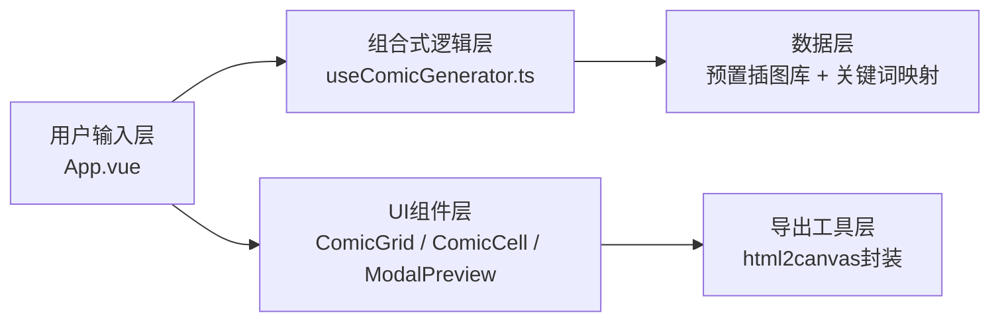

## 1. 架构设计



纯前端应用，无需后端服务，所有逻辑在浏览器端完成。

## 2. 技术选型

- **前端框架**：Vue 3.4.0（组合式API + `<script setup lang="ts">`）
- **开发语言**：TypeScript（严格模式，target ES2020）
- **构建工具**：Vite 5.x + @vitejs/plugin-vue
- **路由**：vue-router@4（单页应用，预留路由扩展）
- **图片导出**：html2canvas + @types/html2canvas
- **样式方案**：原生CSS + CSS Variables（不引入Tailwind，保持手绘风格定制化）
- **插图资源**：30张预置手绘水彩风PNG/SVG，存放在 `src/assets/illustrations/`

## 3. 目录结构

```
auto10/
├── index.html                          # 入口HTML
├── package.json                        # 依赖配置
├── tsconfig.json                       # TypeScript配置
├── vite.config.js                      # Vite配置（含路径别名@）
└── src/
    ├── main.ts                         # 应用入口
    ├── App.vue                         # 主布局组件
    ├── style.css                       # 全局样式（羊皮纸背景、字体、CSS变量）
    ├── composables/
    │   └── useComicGenerator.ts        # 漫画生成核心逻辑
    ├── components/
    │   ├── ComicGrid.vue               # 九格网格容器
    │   ├── ComicCell.vue               # 单格漫画组件
    │   ├── KeywordInput.vue            # 关键词输入框（含联想补全）
    │   └── ModalPreview.vue            # 模态框预览组件
    ├── utils/
    │   └── exportPng.ts                # html2canvas导出封装
    ├── data/
    │   ├── keywords.ts                 # 预设关键词库（10个）
    │   └── illustrations.ts            # 插图元数据与关键词映射
    ├── assets/
    │   └── illustrations/              # 30张手绘画像（img_01.png ~ img_30.png）
    └── router/
        └── index.ts                    # Vue Router配置
```

## 4. 核心数据模型

### 4.1 关键词与插图映射
```typescript
// 预设关键词
interface PresetKeyword {
  id: string;
  label: string;
  icon: string;
}

// 插图元数据
interface Illustration {
  id: string;
  path: string;           // assets路径
  keywords: string[];     // 关联关键词
  theme: 'forest' | 'robot' | 'magic' | 'city' | 'ocean' | 'mountain' | 'sky' | 'castle' | 'animal' | 'friendship';
}

// 漫画格子数据
interface ComicCell {
  index: number;          // 0-8 九格位置
  images: string[];       // 1-2张插图路径
  caption: string;        // 文字解说
}
```

### 4.2 组合式函数API
```typescript
function useComicGenerator() {
  // 输入关键词
  const inputText = ref('');
  // 生成的九格漫画数据
  const comicCells = ref<ComicCell[]>([]);
  // 加载状态
  const isGenerating = ref(false);
  // 当前预览格子
  const previewCell = ref<ComicCell | null>(null);

  // 核心方法：生成漫画
  function generateComic(keywords: string): Promise<void>;
  // 关键词匹配算法
  function matchIllustrations(keywords: string[]): Illustration[];
  // 生成九格叙事情节
  function buildNarrative(matchedImages: Illustration[]): ComicCell[];
  // 设置预览
  function setPreview(cell: ComicCell | null): void;

  return { inputText, comicCells, isGenerating, previewCell, generateComic, setPreview };
}
```

## 5. 性能保障策略

- **资源预加载**：应用启动时预加载所有30张插图，使用浏览器缓存
- **生成速度**：纯本地匹配算法，关键词→插图映射O(n)复杂度，确保≤3秒渲染
- **动画帧率**：使用CSS transform/opacity实现动画，触发GPU合成，保持≥40fps
- **响应式图片**：插图按需显示，切换时使用Vue TransitionGroup实现淡入淡出
- **防抖优化**：输入框联想补全添加150ms防抖

## 6. 关键词匹配算法

1. 将用户输入分词，过滤停用词
2. 与预设10个主题关键词匹配，计算匹配度得分
3. 从30张插图中按关联关键词权重筛选18张（每格1-2张）
4. 按九格漫画叙事结构（起-承-转-合）分配到9个格子
5. 根据匹配主题生成对应的文字解说文案
