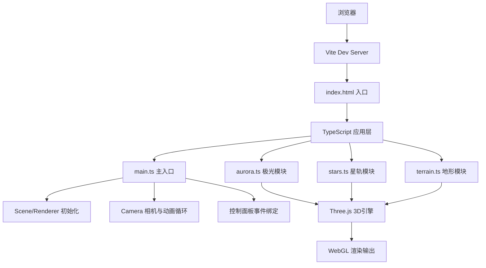

## 1. 架构设计


## 2. 技术说明
- 前端框架：纯TypeScript + Three.js@0.160.0
- 构建工具：Vite 最新版
- 类型支持：@types/three
- 无后端服务端，纯前端渲染

## 3. 模块划分与文件结构
| 文件路径 | 职责 |
|-----------|------|
| package.json | 项目依赖与脚本配置 |
| tsconfig.json | TypeScript 严格模式编译配置（ES2022） |
| vite.config.js | Vite 构建配置，路径解析 |
| index.html | 页面入口，canvas 与控制面板 DOM |
| src/main.ts | 应用主入口，场景/相机/渲染器初始化，动画循环，共享配置对象管理，滑块事件绑定 |
| src/aurora.ts | 三层极光粒子系统，位置/颜色/透明度矩阵更新 |
| src/stars.ts | 500个星点位置与拖尾线段管理 |
| src/terrain.ts | 锯齿山脉网格生成 + 大气辉光粒子层 |

## 4. 核心数据模型与共享状态
```typescript
interface AppConfig {
  auroraIntensity: number;    // 极光强度 0.5-2.0
  colorSaturation: number;     // 色彩饱和度 0.0-1.5
  starSpeed: number;        // 星轨速度 0.0-2.0
}

interface AuroraLayerConfig {
  particleCount: number;    // 2000 per layer
  sizeRange: [number, number]; // 2-4px
  colorStart: string;
  colorEnd: string;
  frequencyRange: [number, number]; // 0.3-0.6
  amplitudeRange: [number, number]; // 3-8
}
```

## 5. 关键实现要点
### 5.1 相机控制
- 球面坐标系：theta（水平角）、phi（垂直角）、radius（距离）
- 目标值与当前值分离，每帧 lerp(0.08) 插值实现阻尼
- 鼠标拖拽更新目标值，滚轮限制 radius ∈ [10, 50]

### 5.2 极光粒子系统
- 三层 Points 叠加，AdditiveBlending 混合模式
- 顶点着色器或CPU端每帧更新 position/color attribute
- 透明度由粒子到中心距离衰减（1.0 → 0.2）
- 自定义简化 Perlin 噪声每帧步进 0.01

### 5.3 星轨拖尾
- 每个星点维护历史位置数组（30-60段）
- LineSegments + BufferGeometry，顶点颜色实现透明度渐变
- 每帧沿圆形轨道更新位置，历史数组 shift/push

### 5.4 性能优化
- 使用 BufferGeometry 而非 Geometry
- 粒子大小通过 PointsMaterial.size 与 sizeAttenuation
- requestAnimationFrame 原生循环，避免重复计算
