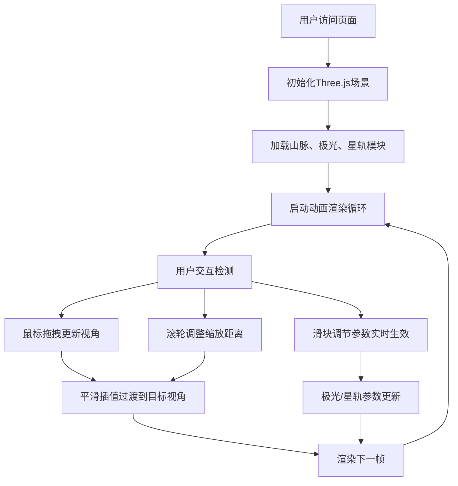

## 1. 产品概述
一个基于WebGL的沉浸式三维夜空可视化应用，用户可通过鼠标交互探索极光与星轨交织的壮丽天文景象。
- 主要用途：天文摄影艺术体验、沉浸式场景展示、创意视觉作品生成
- 目标用户：天文爱好者、视觉艺术创作者、交互体验探索者

## 2. 核心功能

### 2.1 用户角色
| 角色 | 注册方式 | 核心权限 |
|------|----------|----------|
| 访客用户 | 无需注册 | 自由探索场景、调节参数、体验交互 |

### 2.2 功能模块
1. **三维夜空场景**：星空背景、锯齿山脉剪影、大气辉光粒子层
2. **极光粒子系统**：三层彩色粒子绸缎，使用正弦波与Perlin噪声驱动飘动效果
3. **星轨旋转系统**：围绕北极星旋转的星点与渐隐拖尾轨迹
4. **用户交互控制**：鼠标拖拽旋转视角、滚轮缩放、参数滑块实时调节
5. **控制面板UI**：半透明操作面板，提供极光强度、色彩饱和度、星轨速度滑块

### 2.3 页面详情
| 页面名称 | 模块名称 | 功能描述 |
|----------|----------|----------|
| 主场景页 | 3D渲染画布 | 全屏WebGL渲染，展示夜空、山脉、极光、星轨 |
| 主场景页 | 控制面板 | 右下角悬浮半透明面板，包含三个参数滑块与数值显示 |
| 主场景页 | 视角控制器 | 鼠标拖拽旋转（半径30单位）、滚轮缩放（10-50范围）、平滑阻尼（0.08） |

## 3. 核心流程
用户打开页面即进入沉浸式夜空场景，可通过鼠标拖拽环顾四周，滚轮调整视距，拖动右下角滑块实时改变极光与星轨视觉效果，形成独一无二的天文摄影画面。

## 4. 用户界面设计

### 4.1 设计风格
- 主色调：深邃夜空渐变（顶部#0a0a2e → 底部#1a1a4e）
- 强调色：极光绿#00ff88、极光粉#ff66aa、星轨白#ffffff
- 地形色：山脉剪影#1a2a3a→#2a3a4a渐变，大气辉光淡蓝色
- 面板风格：半透明深色玻璃拟态（rgba(10,10,30,0.7)，12px圆角，白色细边框）
- 字体风格：简洁现代无衬线字体，白色半透明标签

### 4.2 页面设计概览
| 页面名称 | 模块名称 | UI元素 |
|----------|----------|--------|
| 主场景页 | 3D画布 | 全屏WebGL视口，深邃星空背景，山脉地平线，极光粒子，星轨弧线 |
| 主场景页 | 控制面板 | 220px宽悬浮面板，三个带标签滑块（绿/粉/灰轨道色），右侧实时数值显示 |
| 主场景页 | 交互反馈 | 鼠标指针变为抓取手型，参数调整时即时视觉反馈 |

### 4.3 响应式
- 桌面端优先设计，canvas自适应窗口尺寸
- 控制面板固定右下角，保证在各分辨率下位置稳定

### 4.4 3D场景指导
- 环境：无外部HDRI，使用自定义线性渐变背景色营造夜空氛围
- 光照：不使用传统光源，依赖粒子自发光与材质颜色呈现视觉效果
- 相机：PerspectiveCamera，初始半径30单位，球面坐标旋转，阻尼平滑
- 构图：山脉位于地平线下半部分，极光在中低空舞动，星轨占据整个上半球
- 交互：OrbitControls风格但自定义实现，支持阻尼平滑过渡
- 后处理：无需额外后处理，通过粒子透明度与叠加混合模式实现发光感
- 性能预算：粒子总数≤6500，目标FPS≥30
