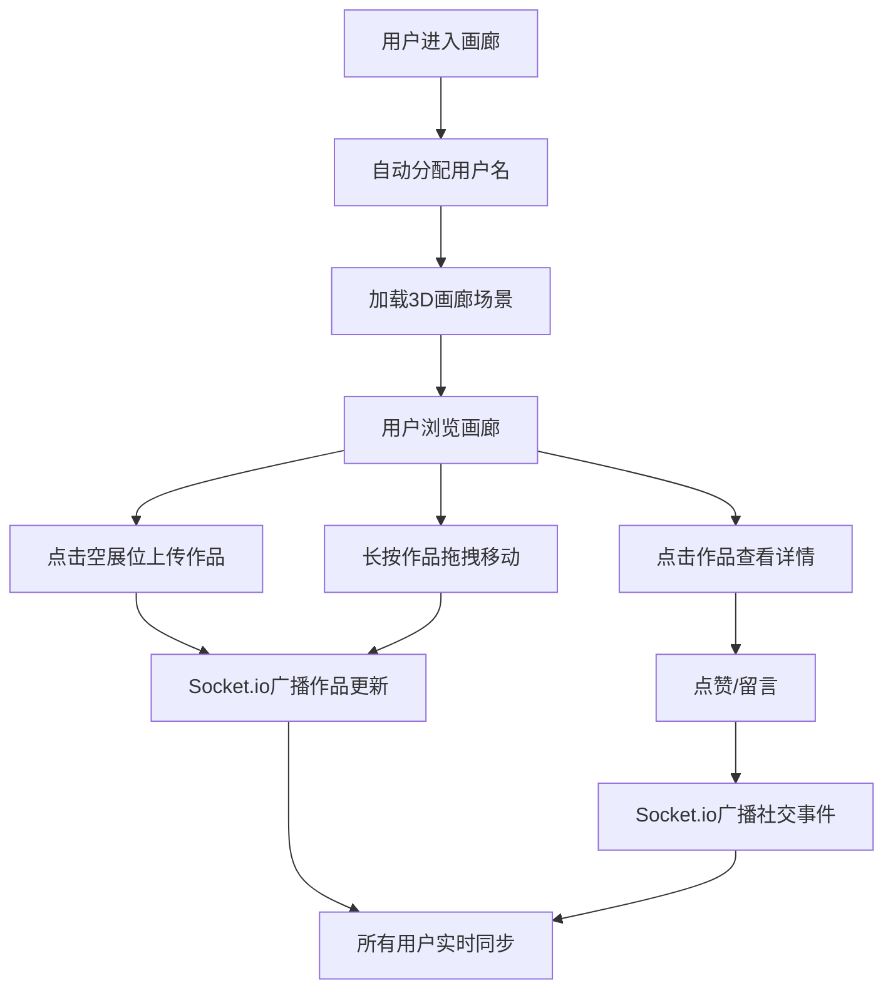

## 1. 产品概述
ArtVerse是一个在线虚拟画廊策展与社交应用，让用户可以在3D画廊空间中上传、展示数字艺术作品，并与其他艺术爱好者进行社交互动。
- 主要目的：提供沉浸式的虚拟艺术展览体验，支持作品策展、社交互动
- 目标用户：数字艺术家、艺术爱好者、策展人
- 市场价值：突破物理空间限制，为数字艺术提供全新的展示与社交平台

## 2. 核心功能

### 2.1 用户角色
| 角色 | 注册方式 | 核心权限 |
|------|----------|----------|
| 普通用户 | 自动分配用户名 | 浏览画廊、上传作品、拖拽布置展位、点赞、留言评论 |

### 2.2 功能模块
1. **3D画廊场景**：沉浸式房间式画廊空间，包含四面墙壁、24个预设展位、3D交互控制
2. **作品上传系统**：点击空展位上传图片，自动适配展位尺寸
3. **展位拖拽布置**：长按激活拖拽模式，支持作品在展位间移动
4. **作品详情面板**：展示作品信息、点赞数、留言列表
5. **社交互动系统**：点赞动画、实时通知、留言评论
6. **在线用户系统**：显示在线用户列表和数量

### 2.3 页面详情
| 页面名称 | 模块名称 | 功能描述 |
|-----------|-------------|---------------------|
| 主画廊页面 | 3D场景渲染 | Three.js渲染画廊空间，支持视角旋转、缩放、平移 |
| 主画廊页面 | 顶部导航栏 | 显示Logo、用户名、在线用户数 |
| 主画廊页面 | 作品详情面板 | 右侧弹出，显示图片、信息、点赞、留言 |
| 主画廊页面 | 底部工具栏 | 重置视角、全屏按钮 |
| 主画廊页面 | 实时通知 | 左下角显示点赞通知，淡入淡出动画 |

## 3. 核心流程
用户进入应用后自动分配用户名，系统加载3D画廊场景。用户可以：
1. 通过鼠标拖拽旋转视角、滚轮缩放、右键平移浏览画廊
2. 点击空展位的加号图标上传数字艺术作品
3. 长按已上传作品激活拖拽模式，移动到其他空展位
4. 点击作品查看详情，进行点赞和留言
5. 所有互动通过Socket.io实时同步给所有在线用户

## 4. 用户界面设计
### 4.1 设计风格
- 主色调：深灰色#1a1a2e（背景）、金色#d4a84b（强调色/边框）、浅灰色#e8e8e8（墙面）
- 按钮风格：圆角设计，底部工具栏半透明背景rgba(26,26,46,0.8)，圆角20px
- 字体：Arial Black用于Logo，系统字体用于正文
- 布局风格：沉浸式3D场景为主，UI元素浮层覆盖
- 图标风格：简洁线性图标，心形、眼睛、方框等

### 4.2 页面设计概述
| 页面名称 | 模块名称 | UI元素 |
|-----------|-------------|-------------|
| 主画廊页面 | 3D场景 | 房间式画廊、浅灰墙面带细微网格纹理、暖色点光源照明、金色展位边框 |
| 主画廊页面 | 顶部导航 | 左上角ArtVerse金色Logo、用户名，右上角在线用户数带绿色闪烁圆点 |
| 主画廊页面 | 详情面板 | 右侧300px宽白色面板、圆角12px、阴影rgba(0,0,0,0.15)、缩略图、作品信息、点赞按钮、留言列表 |
| 主画廊页面 | 底部工具栏 | 居中浮动、半透明背景、重置视角按钮、全屏按钮 |
| 主画廊页面 | 通知 | 左下角淡入淡出、半透明深色背景、白色文字、小爱心图标 |

### 4.3 响应式
- Desktop优先设计
- 3D画布自适应窗口大小
- UI面板固定定位

### 4.4 3D场景指导
- 环境：封闭房间式画廊，浅灰墙面#e8e8e8带细微网格纹理
- 光照：天花板中央暖色点光源，强度0.8，色温3500K
- 相机：初始位置(0,2,6)，看向原点，支持Y轴旋转、距离缩放2-10、水平±2/垂直±1平移
- 构图：四面墙壁各6个展位（2行3列），总计24个展位
- 交互：鼠标左键旋转、滚轮缩放、右键平移、点击选择、长按拖拽
- 动画：拖拽移动0.3秒ease-out、点赞脉冲0.2秒、通知淡入淡出3秒
- 性能：100件作品时保持40FPS以上，Socket.io消息延迟<200ms
