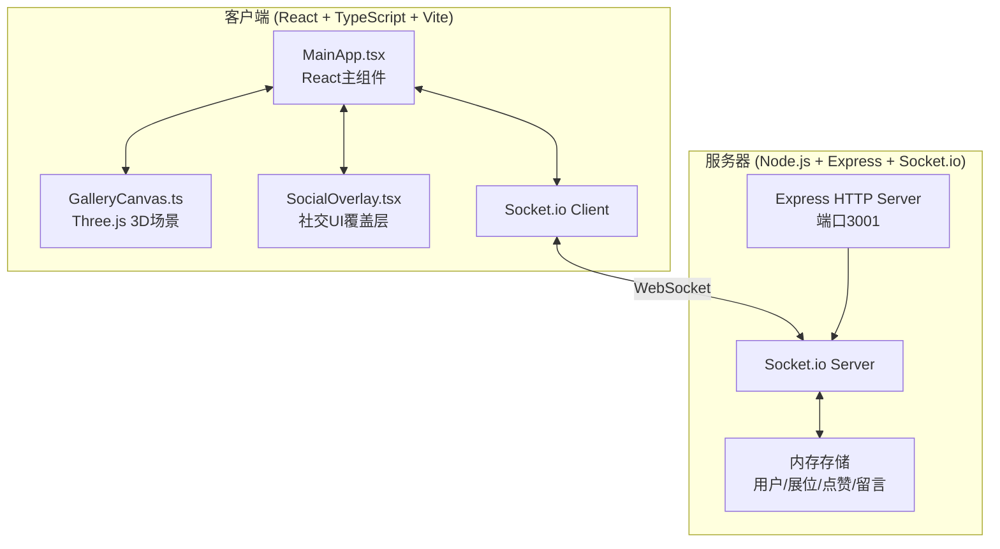
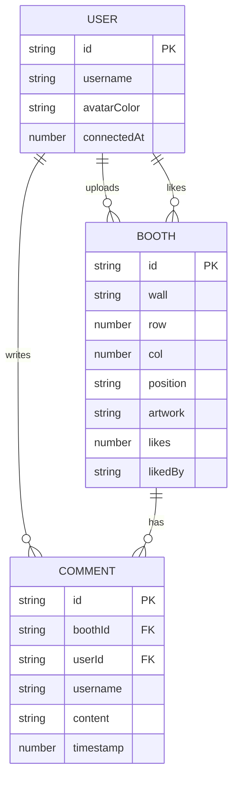

## 1. 架构设计



## 2. 技术描述
- 前端：React@18.2.0 + TypeScript@5.5.0 + Vite@5.4.0
- 3D渲染：three@0.160.0 + @types/three
- 实时通信：socket.io-client@4.6.2
- UI框架：纯CSS实现，无需额外UI库
- 后端：Node.js + Express@4.18.2 + Socket.io@4.6.2 + TypeScript
- 构建工具：Vite，配置React和TypeScript支持
- 数据库：内存存储（开发阶段）

## 3. 目录结构
```
.
├── package.json
├── index.html
├── vite.config.js
├── tsconfig.json
├── src/
│   ├── client/
│   │   ├── MainApp.tsx
│   │   ├── GalleryCanvas.ts
│   │   └── SocialOverlay.tsx
│   └── server/
│       └── server.ts
```

## 4. API / Socket事件定义

### Socket.io事件

| 事件名 | 方向 | 数据类型 | 描述 |
|--------|------|----------|------|
| `connection` | C→S | - | 用户连接 |
| `disconnect` | C→S | - | 用户断开 |
| `user_joined` | S→C | { userId, username, users: User[] } | 新用户加入广播 |
| `user_left` | S→C | { userId, users: User[] } | 用户离开广播 |
| `init_state` | S→C | { booths: Booth[], users: User[] } | 初始化状态 |
| `update_booth` | C→S | { boothId, data: Partial\<Booth\> } | 更新展位 |
| `booth_updated` | S→C | { boothId, data: Booth } | 展位更新广播 |
| `move_artwork` | C→S | { fromBoothId, toBoothId } | 移动作品 |
| `artwork_moved` | S→C | { fromBoothId, toBoothId, data: Booth } | 作品移动广播 |
| `like_artwork` | C→S | { boothId, userId } | 点赞作品 |
| `artwork_liked` | S→C | { boothId, userId, username, title, likes: number } | 点赞广播 |
| `add_comment` | C→S | { boothId, userId, username, content } | 添加留言 |
| `comment_added` | S→C | { boothId, comment: Comment } | 留言广播 |

### 类型定义

```typescript
interface User {
  id: string;
  username: string;
  avatarColor: string;
  connectedAt: number;
}

interface Comment {
  id: string;
  userId: string;
  username: string;
  content: string;
  timestamp: number;
}

interface Booth {
  id: string;
  wall: 'front' | 'back' | 'left' | 'right';
  row: number;
  col: number;
  position: { x: number; y: number; z: number };
  artwork?: {
    imageUrl: string;
    title: string;
    authorId: string;
    authorName: string;
    uploadedAt: number;
  };
  likes: number;
  likedBy: string[];
  comments: Comment[];
}
```

## 5. 数据模型


