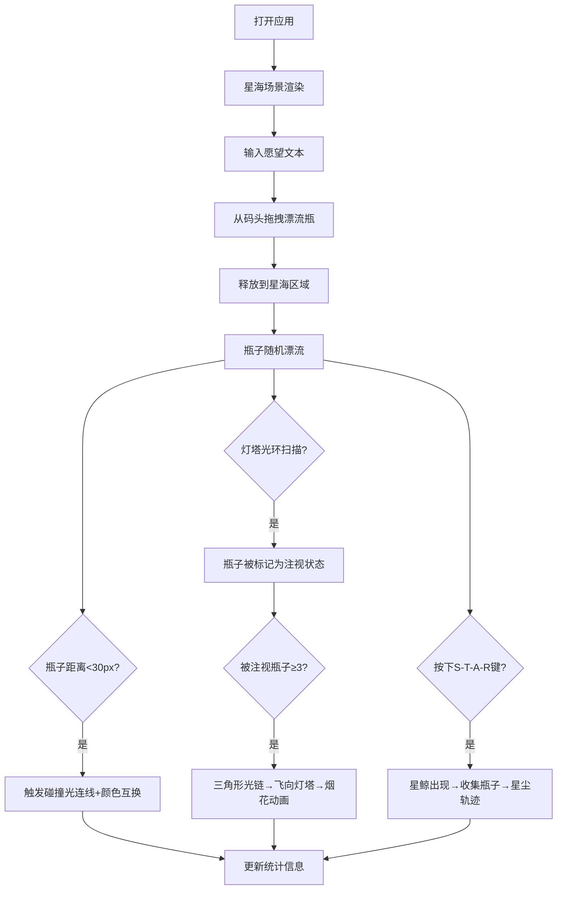

## 1. 产品概述

星海漂流瓶是一款沉浸式的浏览器虚拟梦境浮岛应用，让用户在充满星光粒子的深蓝星海中拖拽、放飞写有愿望的漂流瓶，观察瓶子漂流、碰撞、被灯塔捕获，甚至召唤星鲸收集瓶子，营造梦幻唯美的交互体验。

- 主要解决用户在虚拟梦境中无法以诗意方式收集与放飞愿望的痛点，提供沉浸式情感寄托体验
- 目标用户：追求浪漫体验、喜欢梦幻美学的年轻用户

## 2. 核心功能

### 2.1 用户角色

| 角色 | 注册方式 | 核心权限 |
|------|----------|----------|
| 访客用户 | 无需注册，直接访问 | 体验所有漂流瓶交互功能 |

### 2.2 功能模块

1. **主画布页面**: 星海粒子背景、浮岛码头、灯塔、漂流瓶交互
2. **状态显示模块**: 漂流瓶总数、碰撞次数统计
3. **特殊交互模块**: 星鲸召唤、灯塔注视与烟花动画

### 2.3 页面详情

| 页面名称 | 模块名称 | 功能描述 |
|-----------|-------------|---------------------|
| 主画布 | 星海粒子系统 | 数千个流动星光粒子，点击生成彩色漩涡 |
| 主画布 | 浮岛码头 | 左下角发光圆形平台，提供漂流瓶源 |
| 主画布 | 漂流瓶拖拽 | 从码头拖拽瓶子到星海，瓶子随波漂流 |
| 主画布 | 碰撞交互 | 瓶子近距离触发光连线和颜色互换 |
| 主画布 | 灯塔系统 | 右上角发光灯塔，发射光环注视瓶子 |
| 主画布 | 三角形光链 | 三个被注视瓶子形成光链后飞向灯塔触发烟花 |
| 主画布 | 星鲸召唤 | 按顺序按下S-T-A-R召唤星鲸收集瓶子 |
| 状态显示 | 统计信息 | 左上角显示漂流瓶总数与碰撞次数 |

## 3. 核心流程

用户打开应用 → 看到流动的星海与浮岛码头 → 输入愿望文本 → 从码头拖拽漂流瓶到星海释放 → 瓶子随波漂流并可能与其他瓶子碰撞 → 灯塔周期性发射光环注视瓶子 → 三个被注视瓶子形成光链后飞向灯塔触发烟花 → 用户可按S-T-A-R召唤星鲸收集沿途瓶子 → 实时显示瓶子总数和碰撞次数

## 4. 用户界面设计

### 4.1 设计风格

- **主色调**: 深蓝(#0a0a2a)、紫黑(#1a0a2a)、金色(#ffdd88)、蓝白渐变
- **视觉风格**: 梦幻、浪漫、沉浸式的星空美学
- **字体**: 无衬线现代字体，数字16px，提示文字16px
- **动画**: 所有元素均有平滑过渡(0.3-0.8秒)和渐变透明度效果
- **发光效果**: 大量使用外发光、光晕、光链等视觉元素营造梦境感

### 4.2 页面设计概述

| 页面名称 | 模块名称 | UI元素 |
|-----------|-------------|-------------|
| 主画布 | 星海背景 | 深蓝到紫黑垂直渐变，数千个流动白/蓝光点 |
| 主画布 | 浮岛码头 | 左下角直径80px发光圆盘，蓝紫渐变 |
| 主画布 | 漂流瓶 | 椭圆形容器，绿蓝渐变，边缘光晕 |
| 主画布 | 灯塔 | 右上角直径40px发光体，顶部旋转光柱 |
| 主画布 | 交互效果 | 彩色漩涡、闪烁光连线、扩散光环、粒子烟花 |
| 状态显示 | 统计面板 | 左上角白色数字，显示总数与碰撞数 |

### 4.3 响应式

- 画布自适应窗口尺寸，最小800x600
- 鼠标操作：拖拽瓶子、悬停放大、点击生成漩涡
- 键盘操作：S-T-A-R按键序列召唤星鲸

### 4.4 视觉性能

- 60FPS流畅运行
- 最多30个漂流瓶同时存在
- 最多1000个星海粒子同时渲染
- 所有动画使用平滑过渡与透明度渐变
