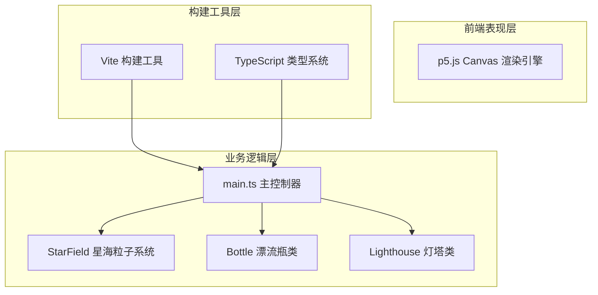

## 1. 架构设计



## 2. 技术描述

- **前端渲染**: p5.js@1.9.0 - 2D Canvas渲染与交互处理
- **编程语言**: TypeScript@5.5.0 - 严格模式，目标ES2020
- **构建工具**: Vite@5.4.0 - 开发服务器与生产构建
- **项目初始化**: 手动配置，不使用React/Vue框架，保持轻量Canvas应用

## 3. 项目文件结构

| 文件路径 | 用途 |
|---------|------|
| /package.json | 项目依赖与npm脚本 |
| /vite.config.js | Vite构建配置，开发服务器自动打开浏览器 |
| /tsconfig.json | TypeScript严格模式配置 |
| /index.html | 入口HTML，设置viewport与标题"星海漂流瓶" |
| /src/main.ts | 主入口，p5 sketch初始化，全局状态管理 |
| /src/bottle.ts | 漂流瓶类：位置、速度、颜色、愿望文本、碰撞处理 |
| /src/starfield.ts | 星海粒子系统：粒子流动、漩涡、星尘轨迹 |
| /src/lighthouse.ts | 灯塔类：光环发射、注视标记、光链、烟花动画 |

## 4. 核心数据模型与类定义

### 4.1 Bottle 漂流瓶类

```typescript
interface BottleState {
  x: number;
  y: number;
  vx: number;
  vy: number;
  color: { r: number; g: number; b: number };
  id: number;        // 1-999随机序号
  wish: string;      // 愿望文本(≤100字)
  gazed: boolean;    // 是否被灯塔注视
  gazedTimer: number;
  lastCollision: number;
  scale: number;     // 悬停放大50%
}
```

### 4.2 StarField 星海粒子系统

```typescript
interface Particle {
  x: number;
  y: number;
  size: number;      // 0.5-2px
  vx: number;        // 0.2-0.8px/帧
  vy: number;
  color: string;     // 白色或淡蓝色
}

interface Vortex {
  x: number;
  y: number;
  radius: number;    // 30-50px
  color: string;
  life: number;      // 1.5秒生命周期
  maxLife: number;
}

interface StarDust {
  x: number;
  y: number;
  size: number;      // 2-4px
  color: string;
  life: number;
  maxLife: number;
}
```

### 4.3 Lighthouse 灯塔类

```typescript
interface LightRing {
  x: number;
  y: number;
  radius: number;
  alpha: number;
}

interface CollisionLine {
  x1: number;
  y1: number;
  x2: number;
  y2: number;
  life: number;
  maxLife: number;
  color: string;
}

interface FireworkParticle {
  x: number;
  y: number;
  vx: number;
  vy: number;
  size: number;
  color: string;
  life: number;
}
```

## 5. 性能优化策略

- **粒子池**: 星海粒子最多1000个，复用对象避免GC
- **帧率控制**: requestAnimationFrame驱动，目标60FPS
- **碰撞检测**: 空间划分优化，每5秒最多一次碰撞防抖
- **渲染分层**: 背景粒子→光效→前景元素分层绘制
- **透明度动画**: 纯Canvas绘制，避免DOM操作开销
