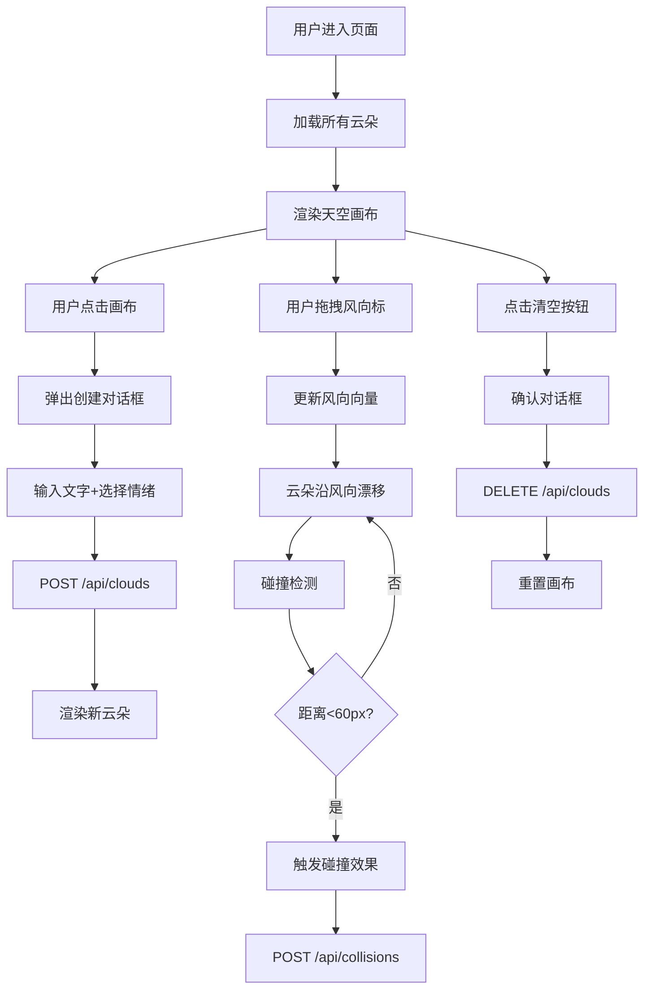

## 1. 产品概述

情绪气象站是一个用户共同维护的数字情绪交互平台，访客可以在天空画布上创建"情绪云"，通过拖拽风向标控制云朵漂流，观察不同情绪云朵碰撞产生的颜色融合现象。

- 主要目的：为用户提供一个可视化的情绪表达与分享空间，通过趣味的气象隐喻将抽象情绪具象化
- 目标用户：所有希望以创意方式表达和分享情绪的互联网用户
- 产品价值：将情绪转化为可交互的视觉艺术，创造社群共鸣与情绪连接

## 2. 核心功能

### 2.1 用户角色

| 角色 | 注册方式 | 核心权限 |
|------|----------|----------|
| 访客用户 | 无需注册 | 创建情绪云、浏览云朵、拖拽风向标、查看碰撞效果 |

### 2.2 功能模块

1. **天空画布主页**：渐变背景画布、云朵渲染、风向标控制、清空按钮
2. **情绪云创建**：点击画布弹窗、文字输入、情绪标签选择、云朵生成
3. **云朵交互**：风向漂流、拖尾效果、悬停显示文字、点击查看详情
4. **碰撞系统**：碰撞检测、颜色混合光波、云朵弹开动画、碰撞事件记录

### 2.3 页面详情

| 页面名称 | 模块名称 | 功能描述 |
|----------|----------|----------|
| 天空画布主页 | 渐变背景 | 浅蓝(#87CEEB)到淡紫(#D8BFD8)垂直渐变背景 |
| 天空画布主页 | 云朵渲染 | 多圆形重叠云朵、柔和阴影、呼吸动画(0.95-1.05倍/2秒周期) |
| 天空画布主页 | 风向标控制 | 金色(#FFD700)箭头图标、拖拽旋转(0-360°)、金属质感渐变 |
| 天空画布主页 | 清空按钮 | 红色圆形按钮、确认对话框、重置画布 |
| 情绪云创建 | 创建弹窗 | 50字文本框、5种情绪标签选择(快乐/悲伤/愤怒/平静/惊喜) |
| 情绪云创建 | 颜色映射 | 快乐#FFA500、悲伤#4169E1、愤怒#FF4500、平静#32CD32、惊喜#FF69B4 |
| 云朵交互 | 风向漂流 | 20px/s速度沿风向移动、半透明拖尾(透明度0.1-0.2，长度40px) |
| 云朵交互 | 信息展示 | 悬停显示完整文字、点击显示详情(情绪、创建时间、碰撞次数) |
| 碰撞系统 | 碰撞检测 | 中心距离<60px触发、最小间隔100ms防重复 |
| 碰撞系统 | 视觉效果 | 缩小到70%、彩色混合光波(1.5秒消散)、相反方向弹开30px |
| 碰撞系统 | 事件记录 | 记录两云id与混合色至后端 |

## 3. 核心流程

### 3.1 创建情绪云流程

用户点击天空画布 → 弹出创建对话框 → 输入文字(≤50字) → 选择情绪标签 → 确认提交 → 调用后端API创建云朵 → 在画布对应位置渲染云朵

### 3.2 云朵漂流与碰撞流程

用户拖拽风向标 → 更新风向角度 → 所有云朵沿风向以20px/s漂移 → 持续碰撞检测 → 距离<60px触发碰撞 → 显示混合色光波 → 云朵弹开 → 记录碰撞事件

### 3.3 Mermaid 流程图

## 4. 用户界面设计

### 4.1 设计风格

- **主色调**：浅蓝#87CEEB、淡紫#D8BFD8（背景渐变）
- **情绪色**：暖橙#FFA500、深蓝#4169E1、红#FF4500、绿#32CD32、粉#FF69B4
- **强调色**：金色#FFD700（风向标）、红#FF6347（清空按钮）
- **文字色**：深灰#333333
- **按钮风格**：圆角设计，平滑过渡(transition 0.3s ease)
- **字体**：无衬线字体，清晰易读
- **整体风格**：清新、柔和、自然色系，富有呼吸感和生命力

### 4.2 页面设计概述

| 页面名称 | 模块名称 | UI元素 |
|----------|----------|--------|
| 天空画布主页 | 背景 | 垂直渐变、全屏铺满、柔和过渡 |
| 天空画布主页 | 云朵 | 多圆形叠加、柔和阴影、呼吸动画、悬停放大 |
| 天空画布主页 | 风向标 | 金属质感渐变、箭头形状、旋转动画、右上角固定 |
| 天空画布主页 | 清空按钮 | 圆形、红色渐变、右下角固定、悬停变深 |
| 天空画布主页 | 创建弹窗 | 半透明遮罩、圆角卡片、输入框、情绪选择器、确认按钮 |
| 天空画布主页 | 云朵详情 | 悬浮卡片、情绪标签、创建时间、碰撞次数统计 |
| 天空画布主页 | 碰撞光波 | 径向渐变、闪烁效果、1.5秒淡出消散 |

### 4.3 响应式设计

- 桌面端优先设计，支持1280px及以上分辨率
- 画布自适应窗口大小，云朵坐标按比例缩放
- 移动端触屏支持：点击创建、拖拽风向标
- 按钮最小触控区域44×44px

### 4.4 动画与交互细节

- **云朵呼吸**：scale在0.95-1.05间正弦变化，周期2秒
- **拖尾效果**：云朵移动时叠加半透明历史位置，长度40px
- **风向标旋转**：拖拽时实时更新角度，带旋转阻尼
- **碰撞光波**：径向渐变从中心向外扩散，opacity从1到0，1.5秒完成
- **按钮交互**：hover状态颜色加深，scale微放大(1.05倍)，transition 0.3s
