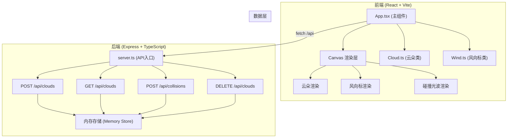
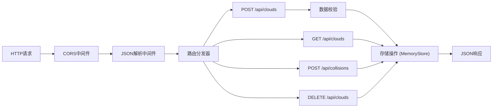
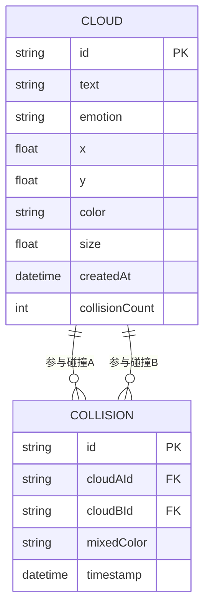

## 1. 架构设计



## 2. 技术描述

- **前端框架**：React@18.2.0 + TypeScript@5.5.0
- **构建工具**：Vite@5.4.0 + @vitejs/plugin-react@4.0.0
- **后端框架**：Express@4.18.0 + ts-node
- **HTTP通信**：原生 fetch API + CORS@2.8.5
- **ID生成**：uuid@9.0.0
- **渲染方式**：HTML5 Canvas API（非Three.js，按用户指定的API和实际需求优化）
- **数据存储**：后端内存存储（无需数据库，简化部署）

## 3. 文件结构与调用关系

```
项目根目录/
├── package.json              # 前后端统一依赖管理
├── vite.config.js            # Vite构建配置 + /api代理
├── tsconfig.json             # TypeScript严格模式配置
├── index.html                # 应用入口HTML
└── src/
    ├── server.ts             # Express后端，RESTful API
    ├── main.tsx              # React入口，挂载App
    ├── App.tsx               # 前端主组件，Canvas渲染+事件处理
    ├── Cloud.ts              # 云朵类：数据结构+碰撞检测+颜色混合
    └── Wind.ts               # 风向标类：风向管理+速度计算+渲染
```

**调用关系与数据流**：
- `main.tsx` → 引入并渲染 `App.tsx`
- `App.tsx` → 实例化 `Cloud` 云朵对象、实例化 `Wind` 风向标、调用 `fetch` 访问后端API
- `Cloud.ts` → 被 `App.tsx` 调用，云朵间碰撞检测互相调用
- `Wind.ts` → 被 `App.tsx` 调用，为云朵提供漂移速度向量
- `server.ts` → 接收前端请求，操作内存数据，返回JSON

## 4. API 定义

### 4.1 数据类型定义

```typescript
type Emotion = 'happy' | 'sad' | 'angry' | 'calm' | 'surprised';

interface CloudData {
  id: string;
  text: string;
  emotion: Emotion;
  x: number;
  y: number;
  color: string;
  size: number;
  createdAt: string;
  collisionCount: number;
}

interface CollisionEvent {
  id: string;
  cloudAId: string;
  cloudBId: string;
  mixedColor: string;
  timestamp: string;
}
```

### 4.2 API 端点

| 方法 | 路径 | 用途 | 请求体 | 响应 |
|------|------|------|--------|------|
| POST | /api/clouds | 创建情绪云 | `{ text, emotion, x, y }` | `CloudData` |
| GET | /api/clouds | 获取所有云朵 | - | `CloudData[]` |
| DELETE | /api/clouds | 清除所有云朵 | - | `{ success: true }` |
| POST | /api/collisions | 记录碰撞事件 | `{ cloudAId, cloudBId, mixedColor }` | `CollisionEvent` |

## 5. 服务器架构



## 6. 数据模型

### 6.1 ER 图



### 6.2 内存数据结构

```typescript
interface MemoryStore {
  clouds: Map<string, CloudData>;
  collisions: CollisionEvent[];
}
```

## 7. 性能优化策略

### 7.1 前端性能

- **渲染帧率**：使用 `requestAnimationFrame` 循环，目标60fps，不低于30fps
- **对象池**：云朵数量超过50时启用对象池复用Canvas绘制资源
- **碰撞检测优化**：
  - 时间节流：最小检测间隔100ms，避免重复触发
  - 空间分区：将画布网格化，仅检测相邻网格内云朵
- **拖尾优化**：限制拖尾历史点数量（最多10个），使用半透明叠加

### 7.2 后端性能

- **内存存储**：直接内存操作，API响应时间<300ms
- **无持久化**：无需IO等待，纯内存读写
- **CORS预配置**：避免预检请求延迟

## 8. 颜色混合规则

| 情绪A | 情绪B | 混合色 |
|-------|-------|--------|
| 快乐(#FFA500) | 悲伤(#4169E1) | 灰紫(#8B6688) |
| 快乐(#FFA500) | 愤怒(#FF4500) | 深橙(#FF6B1A) |
| 快乐(#FFA500) | 平静(#32CD32) | 黄绿(#9CC855) |
| 快乐(#FFA500) | 惊喜(#FF69B4) | 粉橙(#FF875C) |
| 悲伤(#4169E1) | 愤怒(#FF4500) | 深紫(#7A3A55) |
| 悲伤(#4169E1) | 平静(#32CD32) | 青蓝(#3D9D89) |
| 悲伤(#4169E1) | 惊喜(#FF69B4) | 紫粉(#985A9B) |
| 愤怒(#FF4500) | 平静(#32CD32) | 褐绿(#7A8029) |
| 愤怒(#FF4500) | 惊喜(#FF69B4) | 深红(#CC4A55) |
| 平静(#32CD32) | 惊喜(#FF69B4) | 粉绿(#9DBA70) |
| 同色情绪 | 同色情绪 | 原色加深20% |

通用算法：两颜色RGB值取平均，作为默认混合色。
