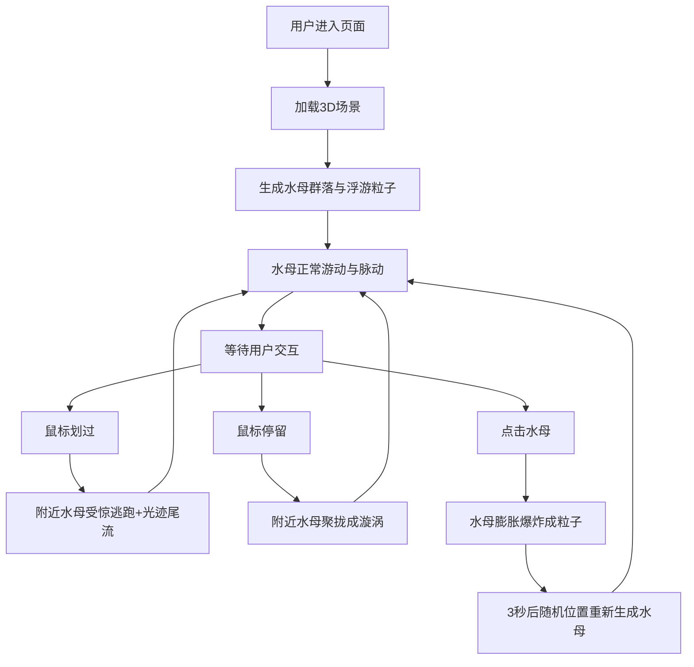

## 1. 产品概述

本项目是一个在浏览器中运行的虚拟深海发光水母群落3D交互体验，让用户化身深海探索者，沉浸于黑暗深海场景中观察发光水母群落的游动、脉动、交互。

- 目标：提供沉浸式深海探索体验，用户通过鼠标与水母群落进行丰富的交互，观赏水母的自然运动与发光效果
- 目标用户：对自然生物爱好者、数字艺术体验者、Web3D交互体验用户
- 市场价值：展示WebGL/Three.js在生物模拟与沉浸式体验领域的技术能力

## 2. 核心功能

### 2.1 功能模块
1. **深海场景背景**：深蓝到墨黑渐变背景，动态浮游粒子模拟深海雪景
2. **水母群落系统**：12只发光水母，伞盖脉动，触须摆动
3. **鼠标划过交互**：鼠标划过水母群时，水母受惊散开并留下光迹尾流
4. **鼠标停留交互**：鼠标停留时，附近水母聚拢形成发光漩涡
5. **鼠标点击交互**：点击水母触发爆炸粒子效果，3秒后重新生成
6. **UI信息显示**：左上角水母统计信息，右下角发光圆环指示器

### 2.2 页面详情
| 页面名称 | 模块名称 | 功能描述 |
|-----------|-------------|---------------------|
| 主场景 | 海洋背景 | 深蓝到墨黑渐变（#001133到#000a1a），200个浮动粒子 |
| 主场景 | 水母群落 | 12只水母，伞盖脉动、触须摆动、缓慢游动 |
| 主场景 | 鼠标划过交互 | 距离<3单位时受惊逃跑+光迹尾流 |
| 主场景 | 鼠标停留交互 | 附近水母聚拢成发光漩涡 |
| 主场景 | 点击爆炸交互 | 水母膨胀爆炸成彩色粒子 |
| 主场景 | UI信息层 | 左上角统计文字，右下角发光圆环指示器 |

## 3. 核心流程

用户进入页面后自动进入全屏沉浸式3D场景，可通过鼠标与场景交互：

## 4. 用户界面设计

### 4.1 设计风格
- **主色调**：深蓝#001133 到 墨黑#000a1a 渐变背景
- **强调色**：水母调色板 #88ddff（青蓝）、#ff88dd（粉紫）、#ddff88（嫩绿）等
- **字体**：Arial
- **布局**：全屏沉浸式设计，无传统UI元素
- **视觉风格**：有机/自然，深海发光生物的幽深感

### 4.2 页面设计概述
| 页面名称 | 模块名称 | UI元素 |
|-----------|-------------|-------------|
| 主场景 | 海洋背景 | 渐变色，半透明浮动粒子 |
| 主场景 | 水母群落 | 半透明伞盖、发光核心、飘动触须 |
| 主场景 | 光迹尾流 | 跟随水母颜色的渐隐光点 |
| 主场景 | 爆炸粒子 | 彩色渐变粒子消散效果 |
| 主场景 | UI信息层 | 左上角小号半透明文字统计；右下角发光圆环指示器 |

### 4.3 响应性
- 桌面端优先，全屏自适应显示
- 鼠标交互优化

### 4.4 3D场景指导
- **环境**：深蓝到墨黑渐变背景，深海雪景粒子效果
- **光照**：环境光弱光，水母自发光为主光源
- **相机**：PerspectiveCamera，固定视角观察场景
- **构图**：水母分布在视野中心区域
- **交互**：鼠标移动、悬停、点击三种交互模式
- **后处理**：水母发光效果（发光核心与半透明材质
- **性能目标**：≥30fps，20只水母流畅运行
