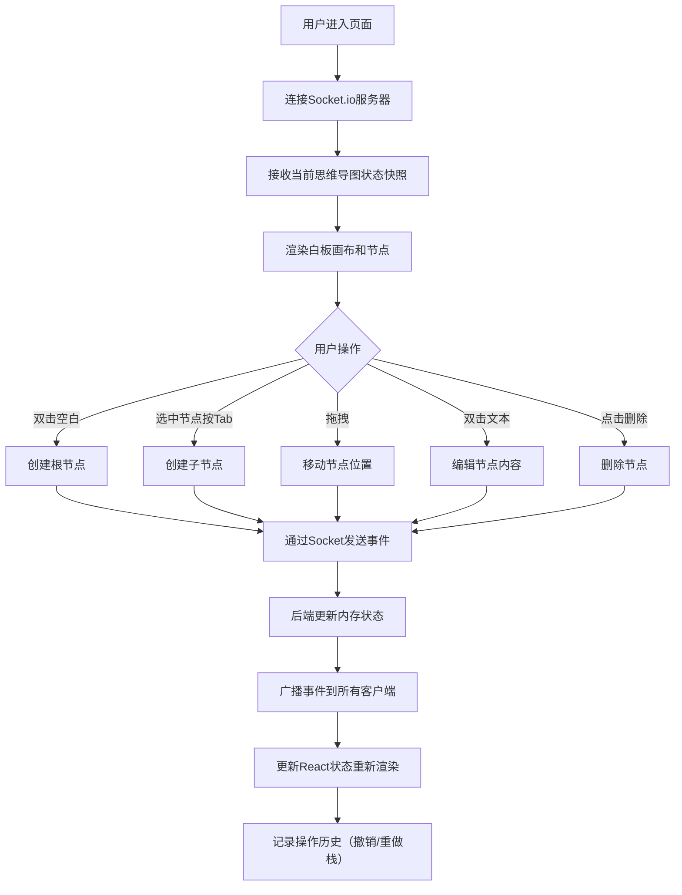

## 1. 产品概述

在线协作白板思维导图应用，供老师和学生在在线教育社区中实时协作构建思维导图，记录修改历史。

- 主要用途：多人实时协作构建思维导图，支持节点创建、编辑、移动、删除
- 目标用户：在线教育场景下的教师和学生
- 产品价值：提供高效、直观的协作式头脑风暴工具，记录完整的修改历史

## 2. 核心功能

### 2.1 用户角色
无需登录，所有连接用户均为协作者，拥有相同权限。

### 2.2 功能模块
1. **白板画布**：全屏SVG画布，支持节点创建、拖拽、贝塞尔曲线连接线
2. **节点管理**：根节点/子节点创建、文本编辑、拖拽移动、删除
3. **实时协作**：Socket.io实时广播所有节点变更
4. **历史记录**：最近5次修改历史展示，支持撤销/重做（最多20步）
5. **在线用户**：实时显示在线用户数量

### 2.3 页面详情
| 页面名称 | 模块名称 | 功能描述 |
|---------|---------|---------|
| 主页面 | 顶部导航栏 | 显示应用标题、在线人数按钮、历史记录按钮 |
| 主页面 | 白板画布 | 全屏SVG区域，支持双击创建根节点、拖拽移动节点 |
| 主页面 | 节点组件 | 圆角矩形节点，支持文本编辑、删除、Tab创建子节点 |
| 主页面 | 右侧悬浮面板 | 展示在线用户数、最近5次修改历史 |

## 3. 核心流程

用户进入页面 → 连接Socket.io → 接收当前思维导图状态 → 双击空白创建根节点/Tab键创建子节点/拖拽移动/双击编辑/删除 → 通过Socket发送事件 → 后端广播到所有客户端 → 更新本地状态重新渲染 → 记录操作历史支持撤销/重做

## 4. 用户界面设计

### 4.1 设计风格
- **主色调**：导航栏#2C3E50，根节点#4A90D9，子节点8色循环（#E74C3C、#2ECC71等）
- **背景色**：白板#FFFFFF，面板#34495E
- **按钮风格**：圆角8px，简洁扁平
- **字体**：系统无衬线字体，标题22px加粗，节点文字16px（移动端14px），白色
- **布局**：全屏白板，顶部固定导航栏（高50px，移动端60px），右侧悬浮面板
- **阴影**：节点柔和阴影rgba(0,0,0,0.15)，偏移2px
- **连接线**：贝塞尔曲线，#BDC3C7，线宽2px

### 4.2 页面设计概述
| 页面名称 | 模块名称 | UI元素 |
|---------|---------|--------|
| 主页面 | 顶部导航栏 | 深色背景(#2C3E50)，左侧加粗标题，右侧在线人数/历史按钮 |
| 主页面 | 白板画布 | 纯白背景，无边框，全屏展示，SVG绘制节点和连接线 |
| 主页面 | 节点组件 | 圆角矩形，柔和阴影，平滑过渡动画(0.15s)，淡入淡出(0.3s) |
| 主页面 | 悬浮面板 | 深色背景(#34495E)，圆角8px，展示在线人数和修改历史列表 |

### 4.3 响应式
- 桌面优先，移动端适配
- 屏幕宽度<768px时：导航栏高度60px，节点字体14px

### 4.4 动画与过渡
- 节点拖拽：平滑transform过渡（0.15s easing）
- 节点创建/删除：淡入淡出动画（0.3s）
