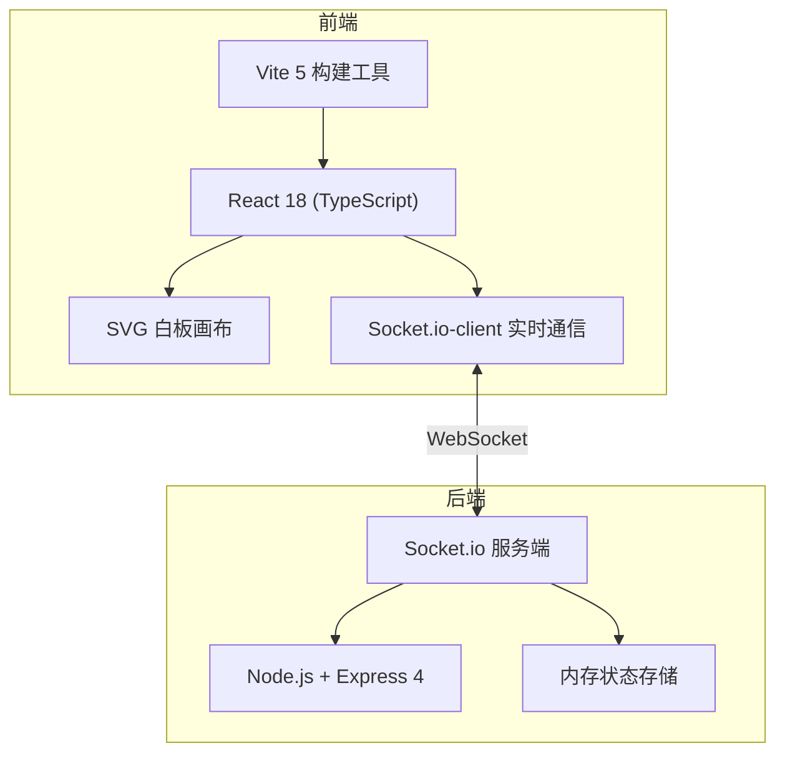
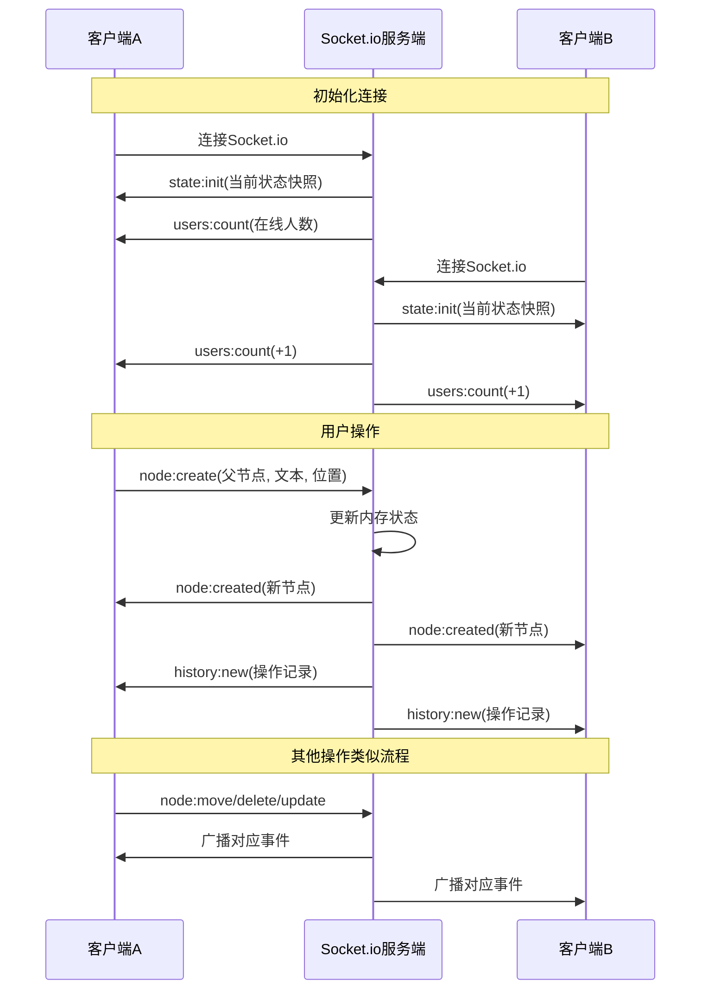

## 1. 架构设计



## 2. 技术描述

- **前端**：React@18.2.0 + TypeScript@5.5.0 + Vite@5.4.0 + @vitejs/plugin-react
- **实时通信**：socket.io-client@4.7.0
- **后端**：Node.js + Express@4.18.2 + Socket.io@4.7.0
- **数据存储**：内存存储思维导图状态快照（无需数据库）
- **包管理器**：npm

## 3. 目录结构

```
.
├── package.json
├── index.html
├── vite.config.js
├── tsconfig.json
└── src/
    ├── server.ts          # 后端服务（Express + Socket.io）
    ├── App.tsx            # 前端入口组件
    └── components/
        ├── Board.tsx      # 白板核心组件
        └── Node.tsx       # 节点组件
```

## 4. Socket.io事件定义

```typescript
// 服务端 → 客户端
type ServerToClientEvents = {
  'state:init': (state: MindMapState) => void;
  'node:created': (node: MindMapNode) => void;
  'node:moved': (nodeId: string, x: number, y: number) => void;
  'node:updated': (nodeId: string, text: string) => void;
  'node:deleted': (nodeId: string) => void;
  'users:count': (count: number) => void;
  'history:new': (record: HistoryRecord) => void;
};

// 客户端 → 服务端
type ClientToServerEvents = {
  'node:create': (data: { parentId: string | null; text: string; x: number; y: number }) => void;
  'node:move': (data: { nodeId: string; x: number; y: number }) => void;
  'node:update': (data: { nodeId: string; text: string }) => void;
  'node:delete': (data: { nodeId: string }) => void;
};

// 数据模型
interface MindMapNode {
  id: string;
  text: string;
  x: number;
  y: number;
  parentId: string | null;
  color: string;
  children: string[];
}

interface MindMapState {
  nodes: Record<string, MindMapNode>;
  rootId: string | null;
}

interface HistoryRecord {
  id: string;
  action: 'create' | 'move' | 'update' | 'delete';
  nodeText: string;
  timestamp: number;
}
```

## 5. 核心数据流



## 6. 性能优化策略

- 使用React.memo优化节点组件重渲染
- 拖拽操作使用节流(throttle)控制事件发送频率
- 文本编辑使用防抖(debounce)10秒后发送更新
- SVG路径计算缓存，避免重复计算
- 使用requestAnimationFrame处理动画帧
- 节点超过200个时，考虑虚拟化渲染（当前需求保证30fps+即可）
