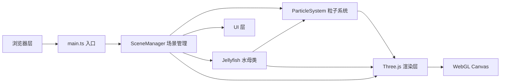

## 1. 架构设计



## 2. 技术说明

- **前端框架**：纯 TypeScript + Three.js，无 UI 框架
- **构建工具**：Vite@5.4.0
- **3D 渲染**：Three.js@0.160.0
- **编程语言**：TypeScript@5.5.0（严格模式，target ES2020）
- **字体**：Arial
- **性能优化**：共享几何体、复用材质、合理的粒子数量

## 3. 文件结构

```
e:\solo\VersionFast\tasks\auto107\
├── package.json
├── vite.config.js
├── tsconfig.json
├── index.html
└── src/
    ├── main.ts
    ├── Jellyfish.ts
    ├── ParticleSystem.ts
    └── SceneManager.ts
```

| 文件 | 职责 |
|------|------|
| package.json | 依赖声明与脚本配置 |
| vite.config.js | Vite 构建配置，自动打开浏览器 |
| tsconfig.json | TypeScript 严格模式配置 |
| index.html | 入口 HTML，全屏无滚动 |
| src/main.ts | 场景、相机、渲染器初始化，动画循环，事件绑定 |
| src/Jellyfish.ts | 水母类：伞盖、触须、发光核心、脉动、游动、受惊、爆炸逻辑 |
| src/ParticleSystem.ts | 粒子系统：深海雪、光迹尾流、爆炸粒子管理 |
| src/SceneManager.ts | 场景管理：背景、水母管理、鼠标交互、UI 更新 |

## 4. 核心数据结构与接口

### Jellyfish（水母类）
- **属性**：
  - `group: THREE.Group` - 水母总组
  - `bellMesh: THREE.Mesh` - 伞盖网格
  - `coreMesh: THREE.Mesh` - 发光核心
  - `tentacles: THREE.Line[]` - 触须线数组
  - `velocity: THREE.Vector3` - 游动速度
  - `color: THREE.Color` - 颜色
  - `isScared: boolean` - 是否受惊
  - `scaredTimer: number` - 受惊计时器
  - `pulsePhase: number` - 脉动相位
  - `pulseSpeed: number` - 脉动速度
  - `baseRadius: number` - 基础伞盖半径
- **方法**：
  - `update(delta: number, mouseWorld: THREE.Vector3 \| null)` - 更新动画
  - `scare()` - 受惊逃跑
  - `explode()` - 爆炸消失
  - `respawn()` - 重新生成

### ParticleSystem（粒子系统类）
- **属性**：
  - `snowParticles: THREE.Points` - 深海雪粒子
  - `trailParticles: THREE.Points[]` - 光迹尾流数组
  - `explosionParticles: THREE.Points[]` - 爆炸粒子数组
- **方法**：
  - `updateSnow(delta: number)` - 更新深海雪
  - `addTrail(position: THREE.Vector3, color: THREE.Color)` - 添加光迹
  - `addExplosion(position: THREE.Vector3, color: THREE.Color)` - 添加爆炸
  - `updateTrails(delta: number)` - 更新光迹
  - `updateExplosions(delta: number)` - 更新爆炸

### SceneManager（场景管理类）
- **属性**：
  - `scene: THREE.Scene`
  - `camera: THREE.PerspectiveCamera`
  - `renderer: THREE.WebGLRenderer`
  - `jellyfish: Jellyfish[]`
  - `particleSystem: ParticleSystem`
  - `mouse: THREE.Vector2` - 归一化鼠标坐标
  - `mouseWorld: THREE.Vector3 \| null` - 鼠标世界坐标
  - `isMouseHovering: boolean`
  - `hoverTimer: number`
  - `raycaster: THREE.Raycaster`
- **方法**：
  - `init()` - 初始化场景
  - `createJellyfish()` - 创建所有水母
  - `handleMouseMove(event)` - 鼠标移动处理
  - `handleClick(event)` - 点击处理
  - `updateUI()` - 更新 UI 显示
  - `animate()` - 动画循环

## 5. 性能优化策略

- **几何体复用**：同类水母使用共享的 SphereGeometry 和 TubeGeometry
- **材质优化**：水母伞盖使用共享材质模板，仅修改颜色和透明度
- **粒子合并**：使用 Points 而非多个独立 Mesh 来渲染粒子
- **帧率控制**：动画循环使用 requestAnimationFrame，delta time 计算
- **边界检查**：水母活动范围限制在可见区域内，超出时反弹
