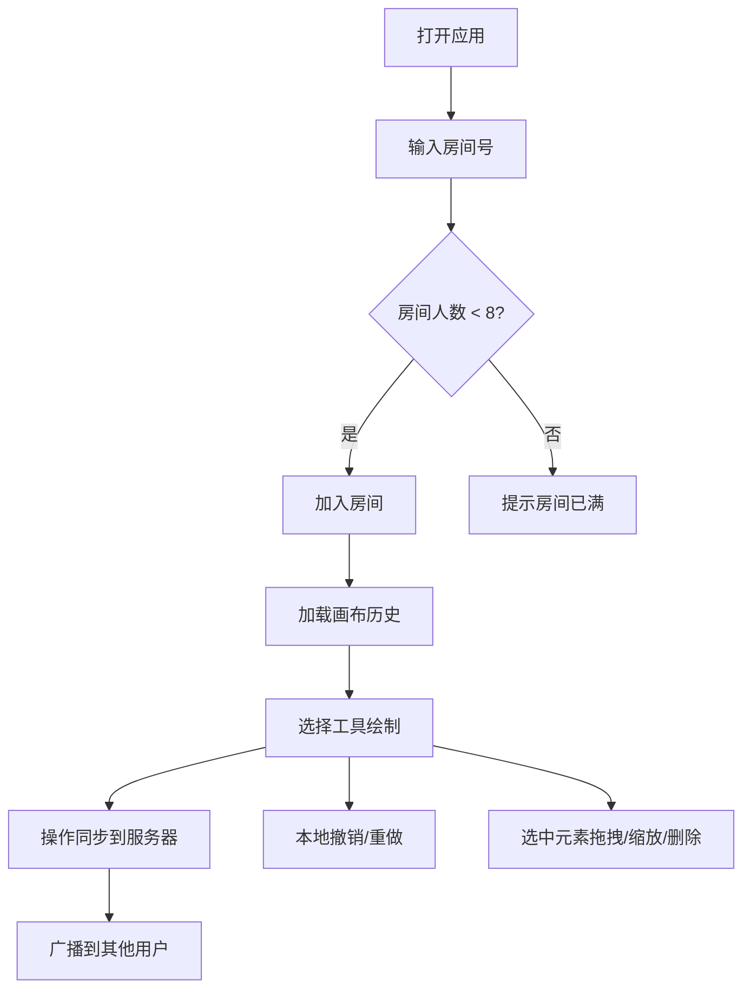

## 1. 产品概述

在线协同白板应用，支持多用户实时绘制、图形元素拖拽和文字批注。面向团队协作、头脑风暴、远程教学等场景，提供低延迟、高流畅度的协作绘制体验。

## 2. 核心功能

### 2.1 用户角色
| 角色 | 注册方式 | 核心权限 |
|------|----------|----------|
| 普通用户 | 输入房间号加入 | 绘制、编辑、删除元素，撤销/重做操作 |

### 2.2 功能模块
1. **画布主界面**：画布区域、网格背景、元素渲染
2. **工具条**：画笔、矩形、圆形、文字工具、颜色选择器、撤销/重做
3. **房间管理**：房间号输入、在线人数显示、房间列表
4. **元素管理**：选中、拖拽、缩放、删除、文字编辑

### 2.3 页面详情
| 页面名称 | 模块名称 | 功能描述 |
|----------|----------|----------|
| 白板主界面 | 画布区域 | 网格背景、实时绘制、元素渲染、拖拽缩放 |
| 白板主界面 | 左侧工具条 | 画笔、形状、文字、颜色选择、撤销/重做按钮 |
| 白板主界面 | 右上角房间信息 | 房间号显示、在线人数展示 |
| 白板主界面 | 底部状态栏 | 当前工具、操作提示 |
| 白板主界面 | 房间入口弹窗 | 输入房间号加入房间 |

## 3. 核心流程

用户打开应用后弹出房间号输入框，输入房间号后加入对应房间（最多8人）。进入房间后可选择工具进行绘制操作，所有操作通过Socket.IO实时同步到同房间其他用户。每个元素可被选中进行拖拽移动、调整大小或删除（需二次确认）。用户拥有独立的20步撤销/重做历史。

## 4. 用户界面设计

### 4.1 设计风格
- 主色调：#F0F4F8（浅灰蓝背景）、#2D3748（深灰文字）
- 强调色：#3B82F6（蓝色选中锚点）、#E2E8F0（悬停背景）
- 按钮样式：圆角4px，图标+文字标签，悬停过渡0.2秒
- 字体：使用现代无衬线字体，标题16px，正文14px
- 布局：左侧工具条 + 主体画布区域，桌面端固定布局

### 4.2 页面设计概览
| 页面名称 | 模块名称 | UI元素 |
|----------|----------|----------|
| 白板主界面 | 左侧工具条 | 垂直排列按钮，图标+文字，悬停背景#E2E8F0，过渡0.2s |
| 白板主界面 | 画布区域 | 网格背景，蓝色虚线锚点（8个），拖拽缓动0.1s |
| 白板主界面 | 右上角 | 房间号标签 + 在线人数徽章 |
| 白板主界面 | 底部状态栏 | 当前工具名称提示 |
| 白板主界面 | 房间入口弹窗 | 居中卡片，输入框+确认按钮 |

### 4.3 响应式适配
- 桌面端（≥768px）：左侧垂直工具条，画布自适应
- 移动端（<768px）：顶部横向工具条，画布高度自适应窗口
- 所有交互元素过渡动画：0.2-0.3秒平滑过渡
