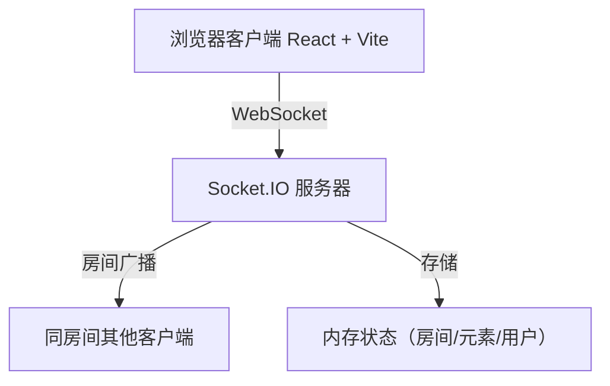

## 1. 架构设计



## 2. 技术说明
- 前端：React 18 + TypeScript + Vite 5 + socket.io-client
- 后端：Node.js + Express 4 + Socket.IO 4 + uuid + cors
- 通信：WebSocket（Socket.IO），前端开发通过Vite代理/api到后端

## 3. 文件结构
```
auto11/
├── package.json          # 前端依赖与脚本
├── index.html            # HTML入口
├── tsconfig.json         # TypeScript配置（严格模式）
├── vite.config.js        # Vite配置（代理）
├── src/
│   ├── App.tsx           # 主组件，状态管理与Socket连接
│   ├── Canvas.tsx        # 画布组件，绘制/拖拽/缩放
│   ├── Toolbar.tsx       # 工具条组件
│   └── types.ts          # 类型定义
└── server/
    └── index.js          # Socket.IO服务器
```

## 4. 核心类型定义

```typescript
type ToolType = 'pen' | 'rect' | 'circle' | 'text' | 'select';

interface Point { x: number; y: number; }

interface BaseElement {
  id: string;
  type: 'pen' | 'rect' | 'circle' | 'text';
  color: string;
  strokeWidth: number;
}

interface PenElement extends BaseElement {
  type: 'pen';
  points: Point[];
}

interface RectElement extends BaseElement {
  type: 'rect';
  x: number; y: number; width: number; height: number;
}

interface CircleElement extends BaseElement {
  type: 'circle';
  x: number; y: number; radiusX: number; radiusY: number;
}

interface TextElement extends BaseElement {
  type: 'text';
  x: number; y: number;
  text: string;
  fontSize: number;
}

type CanvasElement = PenElement | RectElement | CircleElement | TextElement;

interface RoomState {
  roomId: string;
  users: Map<string, { id: string; name: string }>;
  elements: CanvasElement[];
}
```

## 5. Socket.IO 事件定义

| 事件名 | 方向 | 数据 | 说明 |
|--------|------|------|------|
| `join-room` | C→S | `{ roomId, userName }` | 加入房间 |
| `room-joined` | S→C | `{ roomId, elements, users }` | 加入成功，返回当前状态 |
| `room-full` | S→C | - | 房间已满 |
| `user-joined` | S→C | `{ users }` | 有新用户加入 |
| `user-left` | S→C | `{ users }` | 有用户离开 |
| `element-added` | C→S / S→C | `{ element }` | 新增元素 |
| `element-updated` | C→S / S→C | `{ element }` | 更新元素（拖拽/缩放/编辑） |
| `element-deleted` | C→S / S→C | `{ elementId }` | 删除元素 |

## 6. 性能优化策略
- Canvas 2D 渲染，使用 requestAnimationFrame 批量绘制
- 拖拽操作节流 16ms（60fps），只广播最终位置
- Pen 工具使用增量点广播，减少数据包大小
- 本地操作优先渲染，服务端广播作为同步确认
- 房间元素按层级排序，命中检测使用空间分区
