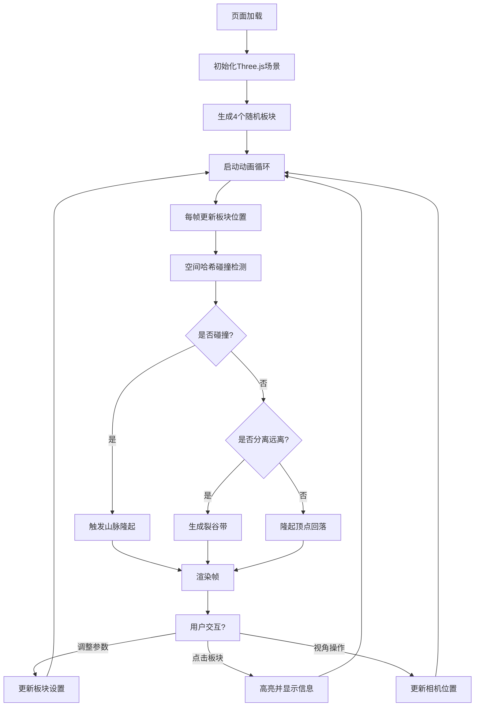

## 1. 产品概述
本产品是一款基于 WebGL 的浏览器端地壳板块运动模拟器，面向数字地质学家和教育工作者，用于可视化模拟数百万年间的地壳板块漂移、碰撞、山脉隆起与裂谷形成等宏观地质变迁过程。
- 核心目的：提供交互式的地质演化可视化工具，帮助用户直观理解板块构造理论
- 目标用户：数字地质学家、地理教师、学生及地学爱好者
- 产品价值：将数百万年的地质过程压缩为可交互的实时动画，支持多角度观察和参数调节

## 2. 核心功能

### 2.1 用户角色
| 角色 | 注册方式 | 核心权限 |
|------|----------|----------|
| 访客用户 | 无需注册，直接访问 | 完整使用所有模拟功能，调整参数，观察模拟过程 |

### 2.2 功能模块
1. **三维场景渲染模块**：Three.js 场景初始化、相机控制、光照系统
2. **板块生成与管理模块**：随机生成4个不规则多边形板块，管理位置、颜色、漂移方向
3. **碰撞检测与变形模块**：空间哈希网格优化的碰撞检测，山脉隆起与回落算法
4. **裂谷生成模块**：板块分离时生成裂谷带与碎石效果
5. **UI 交互控制模块**：悬浮控制面板、参数滑块、加速按钮、板块信息展示
6. **自定义着色器模块**：斑点纹理、碰撞区域颜色渐变、高亮轮廓效果

### 2.3 页面详情
| 页面名称 | 模块名称 | 功能描述 |
|----------|----------|----------|
| 主模拟页面 | 3D 画布容器 | 全屏 Three.js 渲染区域，纯黑背景 #0a0a0a |
| 主模拟页面 | 悬浮控制面板 | 右下角毛玻璃面板，包含3个参数滑块和2个加速按钮 |
| 主模拟页面 | 信息展示区 | 控制面板上方显示选中板块信息，角落显示模拟时间和碰撞次数 |
| 主模拟页面 | 视角控制 | 鼠标左键旋转、右键平移、滚轮缩放 |

## 3. 核心流程
用户进入页面后，系统自动初始化4个随机分布的板块并开始漂移动画。用户可通过滑块调整漂移速度、隆起幅度和透明度，通过加速按钮控制时间流逝速度。当板块碰撞时自动生成山脉，分离时生成裂谷。点击板块可查看详情并高亮显示。

## 4. 用户界面设计

### 4.1 设计风格
- **主色调**：纯黑背景 #0a0a0a，6种地质色调（红#d9534f、绿#5cb85c、蓝#428bca、黄#f0ad4e、青#5bc0de、橙#f5a623），饱和度70%，明度60%
- **辅助色**：深红褐色裂谷 #3a1a0a，棕红色山脉 #8B4513，白色高亮轮廓
- **控制面板**：半透明深灰色毛玻璃 rgba(30,30,30,0.8)，圆角12px，2px细边框 rgba(255,255,255,0.1)
- **按钮样式**：圆角按钮，点击时缩放0.95倍，颜色闪烁0.2秒
- **字体**：现代无衬线字体，标题14px加粗，正文12px常规
- **动效**：所有过渡使用 ease-out 缓动，时长0.3秒；滑块手柄拖拽放大动画0.3秒；板块高亮淡入0.4秒

### 4.2 页面设计概览
| 页面名称 | 模块名称 | UI 元素 |
|----------|----------|---------|
| 主模拟页面 | 3D 画布 | 全屏渲染，黑色背景，板块带斑点纹理 |
| 主模拟页面 | 控制面板 | 右下角悬浮，3个滑块（漂移速度/隆起幅度/透明度），2个加速按钮 |
| 主模拟页面 | 信息显示 | 左上角显示模拟时间和总碰撞次数；选中时面板上方显示板块信息 |
| 主模拟页面 | 交互反馈 | 滑块圆形手柄18px，拖拽放大至24px带拖影；板块高亮白色轮廓 |

### 4.3 响应式设计
- **桌面端（≥768px）**：控制面板位于右下角，横向排列滑块
- **移动端（<768px）**：控制面板缩小并移至底部居中，滑块改为纵向排列，触控区域增大
- **触控优化**：支持单指旋转、双指缩放和平移手势

### 4.4 3D 场景指引
- **环境**：纯黑背景模拟太空视角，无 HDRI 环境贴图
- **光照**：主方向光（强度1.0，白色）+ 环境光（强度0.4，灰色），突出板块立体感
- **相机**：PerspectiveCamera，初始位置(0,25,40)，视场角60°，OrbitControls 控制
- **视角限制**：缩放距离10-60单位，旋转速度0.3，平移速度0.5
- **渲染优化**：BufferGeometry 合并减少 draw calls，空间哈希网格优化碰撞检测
- **性能目标**：稳定45FPS以上，顶点总数不超过5000个
