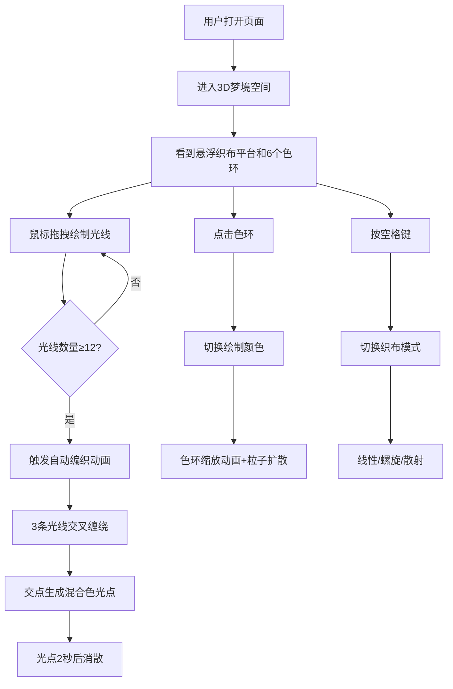

## 1. 产品概述

「梦境光织者」是一款在浏览器中运行的沉浸式3D艺术创作工具。用户化身光织者，在神秘的深紫色梦境空间中，通过鼠标拖拽绘制彩色光线，这些光线会自动编织成复杂的几何纹理，带来独特的视觉艺术体验。

- 主要用途：沉浸式艺术创作、冥想放松、视觉展示
- 目标用户：创意工作者、艺术爱好者、普通大众
- 产品价值：通过简单的交互创造精美绝伦的光织艺术作品

## 2. 核心功能

### 2.1 用户角色
| 角色 | 注册方式 | 核心权限 |
|------|----------|----------|
| 光织者（用户） | 无需注册，直接使用 | 绘制光线、切换模式、选择颜色、欣赏自动编织效果 |

### 2.2 功能模块
1. **3D织布场景**：深紫色渐变背景 + 悬浮织布平台 + 发光色环
2. **光线绘制系统**：鼠标拖拽生成彩色半透明光线，带呼吸发光效果
3. **自动编织引擎**：光线累积触发交叉缠绕动画，在交点生成混合色光点
4. **调色板交互**：6个悬浮色环，点击切换绘制颜色，带动画和粒子反馈
5. **织布模式切换**：空格键切换线性/螺旋/散射三种绘制模式

### 2.3 页面详情
| 页面名称 | 模块名称 | 功能描述 |
|----------|----------|----------|
| 主画布 | 3D织布场景 | 渲染深紫色渐变背景、浮动织布平台、6个色环 |
| 主画布 | 光线绘制 | 鼠标拖拽在平台上生成彩色光线，支持三种绘制模式 |
| 主画布 | 自动编织 | 12条光线触发3条光线交叉缠绕，生成混合色光点 |
| 主画布 | 颜色选择器 | 6个悬浮色环，点击切换颜色，带缩放动画和粒子扩散 |
| 主画布 | HUD信息 | 显示当前织布模式提示、操作说明 |

## 3. 核心流程

用户打开页面 → 进入深紫色3D梦境空间 → 中央悬浮发光织布平台 → 鼠标按住左键在平台上拖拽 → 生成彩色半透明光线（呼吸效果）→ 光线累积到12条 → 触发自动编织动画（最近3条交叉缠绕，交点发光）→ 点击色环切换颜色（缩放动画+粒子扩散）→ 按空格键切换织布模式（线性→螺旋→散射）

## 4. 用户界面设计

### 4.1 设计风格
- **主色调**：深紫色系渐变（#1a0a2a → #0a0a1a），营造神秘梦境氛围
- **强调色**：霓虹色系调色板（#ff6677 珊瑚粉、#66ff77 薄荷绿、#7766ff 薰衣草紫、#ffcc66 琥珀黄、#66ccff 天空蓝）
- **视觉风格**：深色霓虹、发光辉光(Bloom)、半透明质感、空间悬浮感
- **字体**：简洁无衬线字体，配合发光文字效果
- **动效风格**：呼吸脉动、平滑过渡、粒子扩散、优雅漂浮

### 4.2 页面设计概览
| 页面名称 | 模块名称 | UI元素 |
|----------|----------|--------|
| 主画布 | 织布平台 | 圆形半透明盘，紫蓝渐变(#4444aa→#aa44aa)，半径3单位，上下浮动0.05单位/3秒周期，表面光芒脉动 |
| 主画布 | 光线系统 | 半透明细线(宽0.03)，5种霓虹色，0.5秒延迟呼吸亮暗效果 |
| 主画布 | 光点效果 | 半径0.15，3条光线混合色，Bloom发光，2秒消散 |
| 主画布 | 色环选择器 | 6个圆环(外径0.4/内径0.2)，对应调色板颜色，点击时0.3秒缩放回弹+10个径向粒子 |
| 主画布 | HUD | 左上角显示当前模式名称和操作提示 |

### 4.3 响应式设计
- 桌面端优先，全屏Canvas渲染
- 自适应窗口尺寸变化
- 鼠标交互为主

### 4.4 3D场景指导
- **环境**：深紫色渐变背景，无HDRI，纯程序化氛围
- **光照**：AmbientLight基础照明 + PointLight配合平台脉动 + 自发光材质
- **相机**：PerspectiveCamera，位置(0, 4, 6)，lookAt原点，轻微视角跟随
- **构图**：平台居中，色环环绕平台边缘等距分布
- **交互**：Raycaster检测鼠标与平台、色环的相交
- **后处理**：UnrealBloomPass实现辉光效果，强度适中
- **性能**：维持45fps以上，光线和粒子使用BufferGeometry高效渲染
