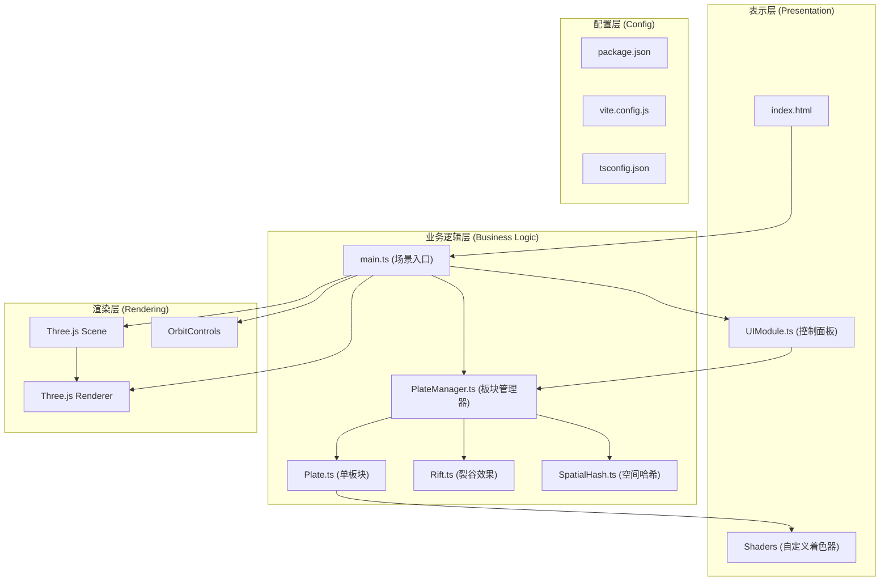

## 1. 架构设计


## 2. 技术描述
- **前端框架**：原生 TypeScript (无 React/Vue，用户明确指定)
- **构建工具**：Vite@5.4.0
- **3D 渲染**：Three.js@0.160.0
- **辅助库**：three-mesh-bvh@0.7.2（加速碰撞检测与射线投射）
- **类型系统**：TypeScript@5.5.0（严格模式）
- **后端**：无（纯前端应用）
- **数据库**：无

### 文件结构与调用关系
```
项目根目录/
├── index.html                    ← 入口页面，加载 main.ts
├── package.json                  ← 依赖与脚本配置
├── vite.config.js                ← Vite 构建配置
├── tsconfig.json                 ← TypeScript 配置
└── src/
    ├── main.ts                   ← 场景初始化，调用 PlateManager、UIModule
    ├── types/
    │   └── index.ts              ← 类型定义（PlateData, Settings, CollisionEvent）
    ├── core/
    │   ├── Plate.ts              ← 单板块类，被 PlateManager 调用
    │   ├── PlateManager.ts       ← 板块管理核心，被 main.ts 调用，调用 Plate/SpatialHash
    │   ├── SpatialHash.ts        ← 空间哈希网格，被 PlateManager 调用
    │   └── Rift.ts               ← 裂谷类，被 PlateManager 调用
    ├── rendering/
    │   ├── PlateShader.ts        ← 自定义着色器，被 Plate 调用
    │   └── SceneSetup.ts         ← 场景/相机/灯光初始化，被 main.ts 调用
    └── ui/
        └── UIModule.ts           ← UI 控制面板，被 main.ts 调用，调用 PlateManager.updateSettings
```

### 数据流向
1. **初始化流**：main.ts → SceneSetup → 创建 Scene/Camera/Renderer/Controls → PlateManager → 创建4个 Plate → 加入 Scene
2. **每帧更新流**：requestAnimationFrame → PlateManager.update(dt) → 每个 Plate.update(position, velocity) → SpatialHash 检测碰撞 → 触发隆起/裂谷 → BufferGeometry.attributes.position.needsUpdate = true
3. **参数更新流**：UIModule 滑块 input 事件 → PlateManager.updateSettings(settings) → 每个 Plate 应用新参数
4. **交互流**：Raycaster → 命中 Plate → Plate.setHighlighted(true) → UIModule.showPlateInfo(info)

## 3. 路由定义
无后端路由，单页面应用 (SPA)。

## 4. API 定义
无后端 API，纯前端。内部核心类型定义：

```typescript
// src/types/index.ts
export interface PlateSettings {
  driftSpeed: number;      // 漂移速度 0-0.05，默认 0.02
  upliftAmount: number;    // 隆起幅度 0-0.5，默认 0.2
  opacity: number;         // 透明度 0.2-1.0，默认 0.8
}

export interface PlateData {
  id: string;
  name: string;
  color: string;
  vertices: THREE.Vector3[];
  driftDirection: THREE.Vector2;
  collisionCount: number;
  currentSpeed: number;
}

export interface CollisionEvent {
  plateAId: string;
  plateBId: string;
  point: THREE.Vector3;
  timestamp: number;
}

export interface RiftData {
  id: string;
  plateAId: string;
  plateBId: string;
  startPoint: THREE.Vector3;
  endPoint: THREE.Vector3;
  width: number;
  debris: THREE.Vector3[];
}
```

## 5. 核心模块设计

### 5.1 Plate.ts (单板块类)
- **职责**：维护单个板块的几何体、材质、位置、变形状态
- **核心方法**：
  - `constructor(vertices, color, shaderMaterial)` —— 创建 BufferGeometry 和 Mesh
  - `update(dt, settings)` —— 按漂移向量更新顶点 x/z 坐标，应用隆起/回落
  - `setCollisionForce(point, force)` —— 在碰撞点周围半径1.5内叠加隆起高度
  - `setHighlighted(enabled)` —— 切换高亮轮廓效果
  - `getInfo()` —— 返回板块名称、速度、碰撞次数
- **变形算法**：每帧遍历顶点，若 collisionHeight > 0 则 y += upliftAmount，若无碰撞则 collisionHeight 每帧递减 0.005

### 5.2 PlateManager.ts (板块管理器)
- **职责**：管理所有板块、碰撞检测、裂谷生成、参数下发
- **核心方法**：
  - `constructor(scene)` —— 初始化4个随机板块和空间哈希
  - `update(dt, timeMultiplier)` —— 每帧更新所有板块，执行碰撞检测
  - `updateSettings(settings)` —— 下发参数到所有板块
  - `detectCollisions()` —— 基于 SpatialHash 检测板块间距 < 0.5 的碰撞对
  - `detectRifts()` —— 检测板块间距 > 2 且相对速度 > 0.02 的分离对，生成/更新裂谷
  - `getPlateByRay(raycaster)` —— 射线检测命中的板块
  - `on(event, callback)` —— 碰撞/选中事件订阅

### 5.3 SpatialHash.ts (空间哈希网格)
- **职责**：O(1) 时间复杂度的空间查询，优化碰撞检测
- **核心方法**：
  - `constructor(cellSize=1)` —— 网格单元大小1单位
  - `clear()` —— 清空哈希表
  - `insert(point, data)` —— 将顶点/点插入对应网格单元
  - `queryRadius(point, radius)` —— 查询半径范围内的所有邻近点
- **实现**：`Map<string, Array<{point, data}>>`，key = `${floor(x)},${floor(z)}`

### 5.4 UIModule.ts (UI 控制模块)
- **职责**：生成悬浮控制面板，监听输入事件，显示信息
- **DOM 结构**：
  - `#control-panel` div —— 毛玻璃容器
  - 3 个 `<input type="range">` —— 漂移速度/隆起幅度/透明度
  - 2 个 `<button>` —— 加速2x / 加速5x
  - `#plate-info` div —— 选中板块信息
  - `#simulation-stats` div —— 模拟时间和碰撞总数
- **样式**：内联 CSS 或 style 标签，毛玻璃效果 `backdrop-filter: blur(10px)`

### 5.5 PlateShader.ts (自定义着色器)
- **vertex shader**：接收 `aUplift` attribute，传递 `vUv`、`vUplift` 到片元
- **fragment shader**：
  - 基础色 uniform `uBaseColor`
  - 斑点噪声：`noise(vUv * 10.0)` 映射到 0.3-0.7 亮度倍率
  - 隆起渐变：当 `vUplift > 0` 时，向 #8B4513 棕红色插值，亮度降低 30%
  - 高亮 uniform `uHighlighted`：白色轮廓叠加

## 6. 性能优化策略
- **BufferGeometry 合并**：所有板块使用独立 BufferGeometry，但每帧仅更新 position attribute（而非重建几何体）
- **空间哈希优化**：碰撞检测从 O(n²) 降至 O(n)，网格单元大小=1单位
- **顶点数量控制**：4 板块 × 约 400 顶点 = 1600 顶点，远低于 5000 上限
- **材质复用**：同色板块共享 ShaderMaterial 实例（仅 uniform 不同）
- **按需更新**：仅当顶点位置变化时设置 `needsUpdate = true`

## 7. 构建与部署
- **开发**：`npm run dev` 启动 Vite 开发服务器
- **构建**：`npm run build` 输出到 dist/ 目录
- **预览**：`npm run preview` 预览生产构建
