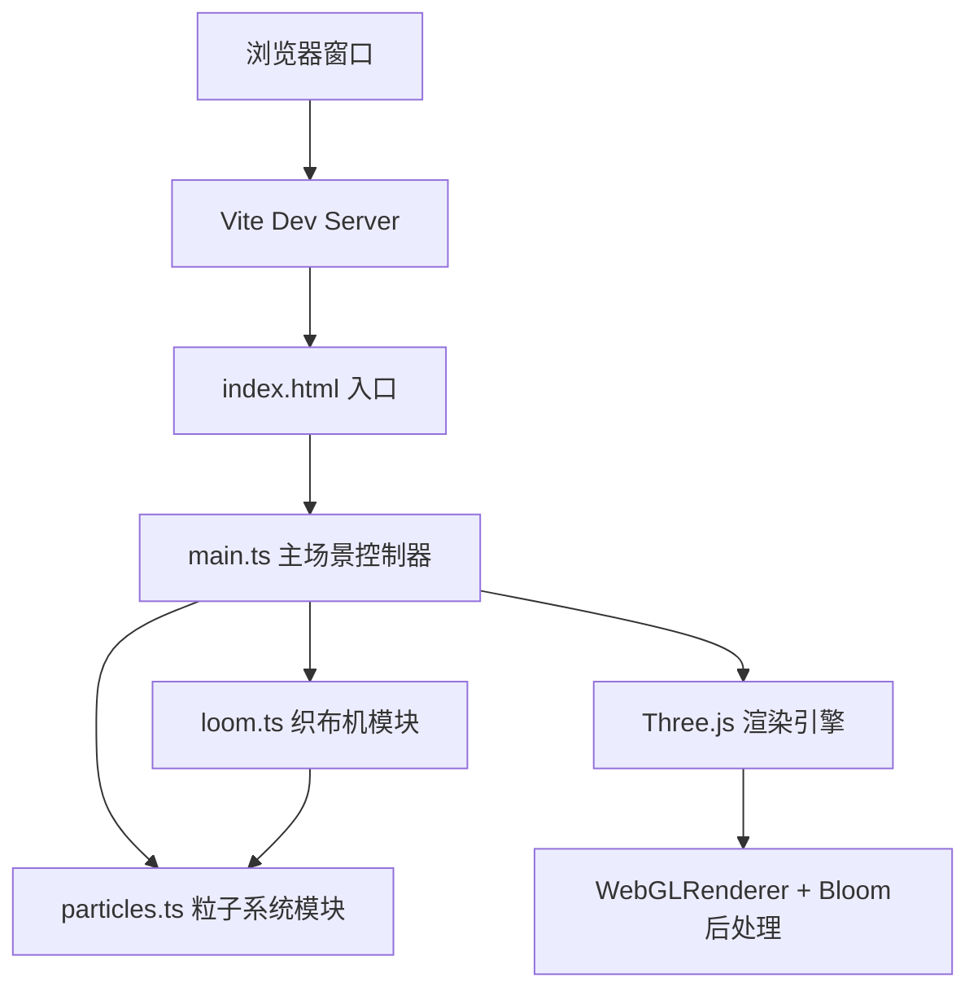

## 1. 架构设计



## 2. 技术描述

- **前端框架**：TypeScript 5.5.0（纯Three.js，无UI框架）
- **3D引擎**：Three.js 0.160.0
- **后处理**：three/examples/jsm/postprocessing 中的 EffectComposer + UnrealBloomPass + RenderPass
- **构建工具**：Vite 5.4.0
- **初始化工具**：手动配置（用户指定具体文件结构）
- **后端**：无，纯前端项目
- **数据库**：无

## 3. 路由定义
| 路由 | 用途 |
|------|------|
| / | 主画布页面（唯一页面，全屏Canvas） |

## 4. 文件结构

```
auto110/
├── package.json          # 项目依赖和脚本
├── vite.config.js        # Vite构建配置（开启自动打开浏览器）
├── tsconfig.json         # TypeScript配置（严格模式，ES2020）
├── index.html            # 入口HTML页面
└── src/
    ├── main.ts           # 场景初始化、相机控制、渲染循环、Bloom后处理
    ├── loom.ts           # 织布平台逻辑：光线生成/更新/删除、模式切换、交互处理
    └── particles.ts      # 粒子系统：光点粒子、色环点击粒子、生命周期管理
```

## 5. 核心类与模块设计

### 5.1 main.ts - 主场景控制器
- 职责：Three.js场景初始化、渲染循环、后处理管线、窗口事件、全局协调
- 主要对象：
  - `Scene`、`PerspectiveCamera`、`WebGLRenderer`
  - `EffectComposer`、`RenderPass`、`UnrealBloomPass`
  - `Loom`（织布机实例）
  - `ParticleSystem`（粒子系统实例）
  - 时钟`Clock`用于动画时间计算

### 5.2 loom.ts - 织布机模块
- 职责：管理织布平台、光线、色环、绘制交互、编织动画
- 导出类：`Loom`
- 主要属性：
  - `platform: Mesh` - 织布平台（圆形，ShaderMaterial实现渐变和脉动）
  - `colorRings: Mesh[]` - 6个色环（TorusGeometry）
  - `rays: Ray[]` - 当前活跃光线数组
  - `currentColor: string` - 当前绘制颜色
  - `weaveMode: 'linear' | 'spiral' | 'scatter'` - 当前织布模式
  - `rayCount: number` - 已生成光线计数
- 主要方法：
  - `constructor(scene: Scene)` - 初始化平台和色环
  - `update(delta: number, time: number)` - 每帧更新：平台浮动、光线动画、检测编织触发
  - `handlePointerDown(position: Vector3)` - 鼠标按下开始绘制
  - `handlePointerMove(position: Vector3)` - 鼠标移动绘制光线
  - `handlePointerUp()` - 鼠标抬起结束绘制
  - `handleColorRingClick(ringIndex: number)` - 色环点击处理
  - `toggleWeaveMode()` - 切换织布模式
  - `triggerWeaveAnimation()` - 触发3条光线编织动画
  - `dispose()` - 清理资源

### 5.3 particles.ts - 粒子系统模块
- 职责：管理所有粒子效果（光点消散、色环点击粒子）
- 导出类：`ParticleSystem`
- 主要属性：
  - `particles: Particle[]` - 活跃粒子数组
- 主要方法：
  - `constructor(scene: Scene)`
  - `update(delta: number)` - 每帧更新粒子位置、透明度、生命周期
  - `emitGlowPoint(position: Vector3, color: Color, duration: number)` - 发射编织光点
  - `emitColorBurst(position: Vector3, color: Color, count: number)` - 发射色环点击径向粒子
  - `dispose()` - 清理资源

## 6. 关键算法与实现要点

### 6.1 光线绘制
- 使用`BufferGeometry`+`LineBasicMaterial`(transparent, opacity动画)
- 线性模式：沿鼠标拖拽直线路径添加顶点
- 螺旋模式：以鼠标位置为中心，按时间生成螺旋线顶点
- 散射模式：以鼠标位置为中心，向多个方向生成星芒状光线

### 6.2 呼吸效果
- 光线透明度：`opacity = baseOpacity * (0.5 + 0.5 * sin((time - birthTime) * π / 0.5))`
- 0.5秒周期，sin函数实现平滑亮暗

### 6.3 自动编织检测
- 每新增1条光线计数+1
- 当`rayCount % 12 === 0`时，取最近3条光线
- 计算光线之间的交点，在交点处生成混合色光点
- 3条光线颜色平均混合

### 6.4 色环点击动画
- 缩放：`scale.lerp(targetScale, 1 - exp(-delta * 20))`
- 0.15秒缩小到0.7，0.15秒弹回1.0
- 粒子：10个，方向随机径向分布，速度0.5-1.5单位/秒，寿命0.8秒

### 6.5 Bloom后处理
- `UnrealBloomPass`参数：threshold=0.2, strength=0.8, radius=0.5
- 发光材质emissive设置较高值触发Bloom

### 6.6 性能优化
- 光线使用`BufferGeometry`，动态更新position attribute
- 粒子对象池复用，避免频繁GC
- 定期清理已消散的光线和粒子
- 目标帧率：45fps以上
