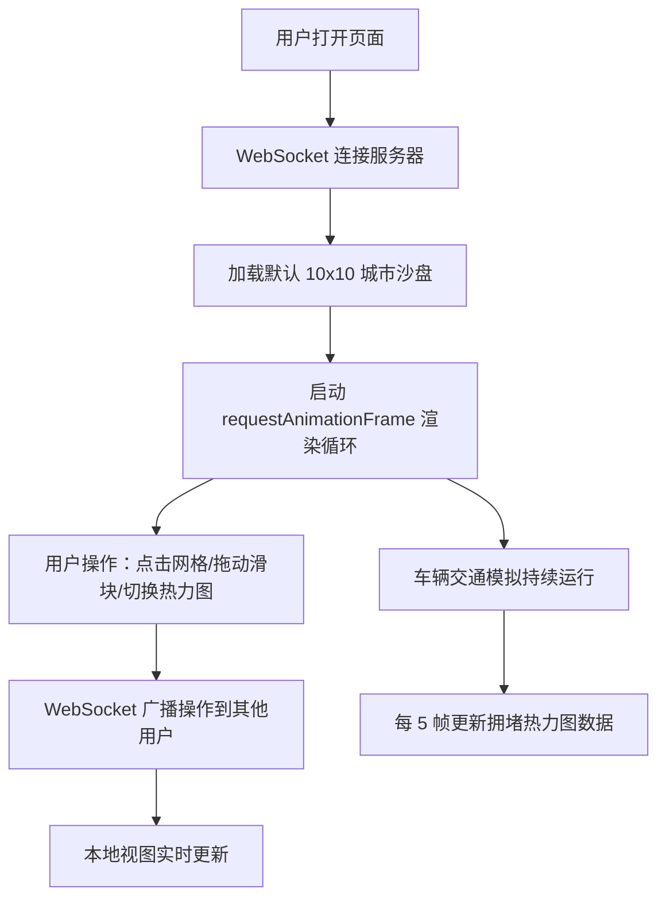

## 1. 产品概述
CityFlow Sandbox 是一个基于 Web 的城市光影与交通流多用户协作沙盘应用，帮助城市规划爱好者和教育工作者直观观察不同建筑布局、光照条件和交通规则对城市运行效率的影响。
- 核心价值：通过 3D 可视化与实时模拟，将抽象的城市规划概念转化为可交互、可观察的动态沙盘
- 目标用户：城市规划爱好者、教育工作者、学生

## 2. 核心功能

### 2.1 功能模块
1. **城市沙盘主界面**：3D 网格城市地图、建筑放置、车辆交通模拟、光照动态效果、拥堵热力图叠加
2. **控制面板**：时间滑块、色轮选择器、热力图切换按钮、在线用户列表
3. **多用户协作**：WebSocket 实时同步所有用户操作（添加建筑、调整光照）

### 2.2 页面详情
| 页面名称 | 模块名称 | 功能描述 |
|-----------|-------------|---------------------|
| 沙盘主界面 | 3D 城市网格 | 10x10 网格化地图，中央 2 单位宽主干道，十字路口红绿灯（30 帧切换周期） |
| 沙盘主界面 | 建筑系统 | 住宅(#8fa3b0, 高2)、商业(#c9a96e, 高3)、公园(#7cb342, 高1)，点击空白格弹出菜单选择类型 |
| 沙盘主界面 | 交通模拟 | 20 辆车（6 种颜色随机），速度 1.5 单位/秒，红灯/前车减速，转向概率：右转 40%、直行 35%、左转 25% |
| 沙盘主界面 | 光照系统 | 时间滑块 0-24 小时控制平行光角度与颜色，夜间无阴影，阴影随时间变化 |
| 沙盘主界面 | 热力图叠加 | 红色半透明渐变，按格子车辆密度渲染，每 5 帧更新一次 |
| 控制面板 | 时间控制 | 水平滑块 0-24，初始值 12（正午） |
| 控制面板 | 色轮选择 | 6 种预设色相：正午白#ffffff、黄昏橙#ff8c00、夜晚蓝#1a1a4a 等 |
| 控制面板 | 在线用户 | 左上角彩色圆点列表，最多 4 人，颜色随机分配 |

## 3. 核心流程
用户打开应用后自动连接 WebSocket 服务，加载默认城市沙盘。用户可通过点击网格添加建筑、拖动滑块调整光照、点击按钮显示热力图，所有操作实时同步给其他在线用户。车辆持续在道路上行驶模拟交通流，用户可直观观察拥堵情况。

## 4. 用户界面设计

### 4.1 设计风格
- 主色调：深灰#1a1a2e 背景，营造专业沙盘氛围
- 建筑按钮：圆角矩形 120x40px，背景#34495e，白色文字 14px
- 控制面板：半透明深色 rgba(0,0,0,0.7/0.8)，圆角 12px
- 按钮悬停：translateY(-2px) 上浮 + 阴影加深 box-shadow: 0 4px 8px rgba(0,0,0,0.3)
- 字体：使用现代无衬线字体，清晰易读

### 4.2 页面设计概述
| 页面名称 | 模块名称 | UI 元素 |
|-----------|-------------|-------------|
| 主界面 | 3D 沙盘 | 居中 800x600px Three.js 渲染画布，车辆 requestAnimationFrame 驱动 60fps |
| 主界面 | 建筑生成弹窗 | 圆角按钮，背景#2c3e50，白色文字，缩放动画 300ms ease-out |
| 主界面 | 热力图按钮 | 左侧固定，背景#e74c3c，圆角 6px，白色文字 |
| 右上角控制面板 | 时间滑块 | 水平滑块，0-24 范围，色轮选择器，12px 控件间距 |
| 左上角用户列表 | 在线用户 | 彩色圆点 + 用户标识 |
| 页脚 | 版权信息 | #7f8c8d 灰色 12px 文字 |

### 4.3 响应式适配
- 桌面端（≥1000px）：左侧控制面板完整展开（宽 200px，高 400px），沙盘居中 800x600px
- 移动端（<1000px）：左侧控制面板收缩为图标（点击展开），沙盘宽度填满剩余空间

### 4.4 3D 场景指引
- **环境**：深色背景，网格化地面，中央十字主干道
- **光照**：顶部平行光随时间滑块变化角度与色温，支持阴影投射（夜间除外）
- **相机**：透视相机，45° 俯视角度，可通过鼠标调整视角
- **交互**：左键点击空白格弹出建筑菜单，滚轮缩放场景
- **动画**：建筑生成 0.5→1 缩放 300ms ease-out；热力图出现透明度渐变 500ms；车辆平滑移动
- **性能目标**：4 用户 + 40 辆车场景下 ≥50fps，热力图更新延迟 ≤50ms，WebSocket 延迟 ≤100ms
