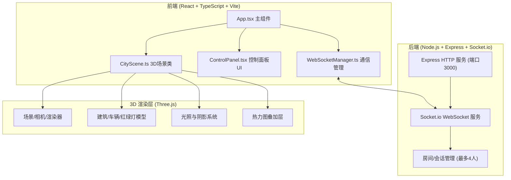

## 1. 架构设计



## 2. 技术说明
- **前端**：React@18.2.0 + TypeScript@5.5.0 + Vite@5.4.0 + Three.js@0.160.0
- **后端**：Node.js + Express@4.18.2 + Socket.io@4.7.0
- **通信**：Socket.io-client@4.7.0 实现 WebSocket 实时同步
- **构建工具**：Vite@5.4.0，配置 React + TypeScript 支持，代理到后端端口 3000

## 3. 文件结构
```
auto111/
├── package.json
├── index.html
├── tsconfig.json
├── vite.config.js
├── server.js                  # Express + Socket.io 后端服务
└── src/
    ├── App.tsx                # 主应用组件
    ├── CityScene.ts           # 3D 城市沙盘场景类
    ├── ControlPanel.tsx       # 控制面板组件
    ├── WebSocketManager.ts    # WebSocket 通信管理
    ├── types.ts               # 共享类型定义
    └── index.css              # 全局样式
```

## 4. WebSocket API 定义

### 4.1 事件类型
| 事件名 | 方向 | 数据类型 | 说明 |
|--------|------|----------|------|
| `user_join` | Client→Server | `{ userId: string }` | 用户加入房间 |
| `user_list` | Server→Client | `User[]` | 广播在线用户列表 |
| `add_building` | Client→Server | `{ gridX: number, gridZ: number, type: BuildingType }` | 放置建筑 |
| `building_added` | Server→Client | `{ gridX: number, gridZ: number, type: BuildingType, userId: string }` | 广播建筑已添加 |
| `update_lighting` | Client→Server | `{ hour: number, color: string }` | 更新光照参数 |
| `lighting_updated` | Server→Client | `{ hour: number, color: string, userId: string }` | 广播光照已更新 |
| `sync_state` | Server→Client | `CityState` | 新用户加入时同步完整状态 |

### 4.2 TypeScript 类型定义
```typescript
type BuildingType = 'residential' | 'commercial' | 'park';

interface Building {
  gridX: number;
  gridZ: number;
  type: BuildingType;
}

interface User {
  id: string;
  color: string;
}

interface CityState {
  buildings: Building[];
  lighting: { hour: number; color: string };
  users: User[];
}
```

## 5. 核心数据模型

### 5.1 建筑配置
```typescript
const BUILDING_CONFIG = {
  residential: { height: 2, color: '#8fa3b0' },
  commercial: { height: 3, color: '#c9a96e' },
  park: { height: 1, color: '#7cb342' },
} as const;
```

### 5.2 车辆配置
```typescript
const VEHICLE_COLORS = ['#e74c3c', '#3498db', '#f1c40f', '#9b59b6', '#1abc9c', '#e67e22'];
const VEHICLE_SIZE = 0.6;
const VEHICLE_SPEED = 1.5; // 单位/秒
const DECELERATION_FACTOR = 0.3;
const MIN_GAP = 1.0;
```

### 5.3 光照预设色
```typescript
const LIGHT_PRESETS = [
  '#ffffff', // 正午白
  '#ff8c00', // 黄昏橙
  '#1a1a4a', // 夜晚蓝
  '#87ceeb', // 清晨蓝
  '#ff69b4', // 日落粉
  '#ffa500', // 日出橙
];
```

## 6. 性能优化策略
- **渲染**：使用 requestAnimationFrame，Three.js 阴影映射优化（PCFSoftShadowMap）
- **车辆**：对象池复用，批量更新矩阵，避免每帧创建新对象
- **热力图**：每 5 帧更新一次，使用 CanvasTexture 动态更新纹理
- **WebSocket**：消息节流，批量同步，避免高频消息导致网络拥塞
