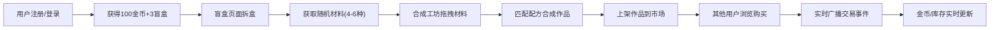

## 1. 产品概述

创意手工艺品电商平台的线上"材料盲盒交易所"，用户可购买虚拟材料包、拆解获取随机材料，用材料合成虚拟手工作品并上架交易，形成"买包-拆料-合成-上架-交易"的完整闭环玩法。

- 核心目标：打造沉浸式的虚拟手工艺品交易体验，通过盲盒随机性、合成策略性和交易社交性提升用户粘性
- 目标用户：手作爱好者、收集控、虚拟物品交易者

## 2. 核心功能

### 2.1 用户角色

| 角色 | 注册方式 | 核心权限 |
|------|---------|---------|
| 普通用户 | 账号密码注册 | 购买盲盒、合成作品、上架交易、购买他人作品 |

### 2.2 功能模块

1. **用户认证模块**：注册/登录模态框、JWT鉴权、记住登录状态
2. **盲盒开箱模块**：3D盲盒模型、拆盒动画、随机材料生成、库存更新
3. **合成工坊模块**：材料拖拽、3x3合成网格、配方匹配、作品生成
4. **交易市场模块**：瀑布流展示、作品卡片、购买交互、实时更新
5. **状态栏模块**：金币显示、材料/作品数量、增减动画

### 2.3 页面详情

| 页面名称 | 模块名称 | 功能描述 |
|---------|---------|---------|
| 盲盒页面 | 3D盲盒展示 | CSS 3D旋转立方体，六面不同纹理，呼吸光效 |
| 盲盒页面 | 拆盒动画 | 盒子打开动画 + 粒子飞散效果 |
| 盲盒页面 | 材料结果展示 | 显示4-6种随机材料，含名称、稀有度徽章、图标 |
| 合成工坊 | 材料库存区 | 展示用户所有材料，支持拖拽 |
| 合成工坊 | 3x3合成网格 | 拖放目标区，高亮提示、错误抖动反馈 |
| 合成工坊 | 合成交互 | 合成按钮、成功金色涟漪、失败红色震动 |
| 交易市场 | 瀑布流网格 | 展示所有上架作品，响应式布局 |
| 交易市场 | 作品卡片 | Canvas缩略图、作者、价格、悬停上浮、购买按钮 |
| 通用 | 顶部状态栏 | 金币数(滚动动画)、材料数、作品数 |
| 通用 | 侧边导航 | 盲盒/工坊/市场切换，下划线滑动动画 |
| 通用 | 登录注册 | JWT鉴权模态框，注册赠100金币+3盲盒 |

## 3. 核心流程

### 3.1 主流程描述

用户注册登录后获得初始金币和盲盒。在盲盒页面点击拆盒获得随机材料，前往合成工坊拖拽材料到合成网格匹配配方生成作品，将作品上架到交易市场，其他用户可浏览并购买作品，卖家获得金币，整个过程通过Socket.io实时同步所有客户端状态。

## 4. 用户界面设计

### 4.1 设计风格

- **主色调**：#6b5b95（紫色）和 #f7c948（金色）的轻奢配色
- **设计语言**：卡片式玻璃态（Glassmorphism）设计
- **按钮风格**：圆角按钮，悬停有光泽效果，紫色渐变到金色
- **字体**：标题使用装饰性衬线字体，正文使用现代无衬线字体
- **布局风格**：左右两栏布局，左栏固定200px侧边导航，右栏动态内容区
- **图标风格**：使用 lucide-react 线性图标

### 4.2 页面设计概览

| 页面名称 | 模块名称 | UI元素 |
|---------|---------|--------|
| 盲盒页面 | 整体背景 | 深色渐变 #1a1a2e → #16213e |
| 盲盒页面 | 盲盒模型 | CSS 3D立方体，六面纹理，居中pulse呼吸光效2s周期 |
| 盲盒页面 | 材料结果 | 卡片式布局，稀有度颜色编码（普通灰色、稀有蓝色、史诗金色） |
| 合成工坊 | 合成网格 | 3x3格子，柔和圆角12px，拖拽高亮边框 |
| 合成工坊 | 材料卡片 | 拖拽放大1.1倍+投影，半透明玻璃态 |
| 合成工坊 | 成功特效 | 从中心向外扩散的金色涟漪动画 |
| 合成工坊 | 失败特效 | 合成槽变红 + shake震动动画 |
| 交易市场 | 瀑布流卡片 | 悬停上浮5px，显示"立即购买"按钮 |
| 通用 | 侧边导航 | 图标标签切换，选中项下划线滑动动画 |
| 通用 | 状态栏 | 金币增减数字滚动动画，实时刷新 |

### 4.3 响应式设计

- 桌面端优先设计
- 768px以下切换为单列布局，侧边栏改为顶部横向导航
- 触摸设备优化拖拽交互

### 4.4 性能指标

- 首次加载时间(TTI) ≤ 2秒
- 拖拽操作帧率 ≥ 55fps
- Socket.io广播延迟 < 200ms
