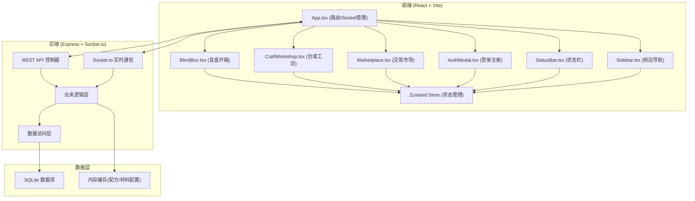
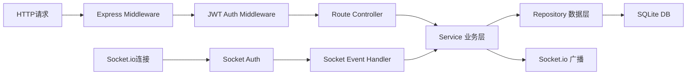

## 1. 架构设计



## 2. 技术描述

- **前端**：React@18.2.0 + TypeScript@5.5.0 + Vite@5.4.0 + Zustand（状态管理） + lucide-react（图标）
- **构建工具**：Vite@5.4.0，启用 @vitejs/plugin-react@4.2.1
- **后端**：Express@4.18.2 + Socket.io@4.7.0 + TypeScript
- **实时通信**：Socket.io@4.7.0（客户端socket.io-client@4.7.0）
- **数据库**：SQLite@5.1.6
- **工具库**：uuid@9.0.0（ID生成）
- **鉴权**：JWT（jsonwebtoken）+ bcryptjs（密码加密）

## 3. 路由定义

| 前端路由 | 页面组件 | 用途 |
|---------|---------|------|
| / | BlindBox | 盲盒开箱页面（默认首页） |
| /blindbox | BlindBox | 盲盒开箱页面 |
| /workshop | CraftWorkshop | 合成工坊页面 |
| /market | Marketplace | 交易市场页面 |

## 4. API 定义

### 4.1 REST API

```typescript
// 用户认证
POST /api/auth/register
Request: { username: string, password: string }
Response: { token: string, user: { id, username, coins } }

POST /api/auth/login
Request: { username: string, password: string }
Response: { token: string, user: { id, username, coins } }

GET /api/user/me
Headers: Authorization: Bearer <token>
Response: { id, username, coins, materialCount, artworkCount }

// 盲盒
POST /api/open-box
Headers: Authorization: Bearer <token>
Request: { boxCount?: number }  // 默认为1
Response: { materials: Material[], remainingBoxes: number }

// 材料与库存
GET /api/materials
Headers: Authorization: Bearer <token>
Response: Material[]

GET /api/artworks
Headers: Authorization: Bearer <token>
Response: Artwork[]

// 合成
POST /api/craft
Headers: Authorization: Bearer <token>
Request: { materialIds: string[] }  // 最多9个
Response: { success: boolean, artwork?: Artwork, message?: string }

// 交易市场
GET /api/market/listings
Response: MarketListing[]

POST /api/trade/list
Headers: Authorization: Bearer <token>
Request: { artworkId: string, price: number }
Response: { listing: MarketListing }

POST /api/trade/buy
Headers: Authorization: Bearer <token>
Request: { listingId: string }
Response: { success: boolean, artwork?: Artwork, message?: string }
```

### 4.2 Socket.io 事件

```typescript
// 客户端发送
client.emit('join', { userId: string })

// 服务端广播
server.emit('trade:new', { listing: MarketListing })      // 新上架
server.emit('trade:sold', { listingId: string, buyerId: string })  // 作品售出
server.emit('user:update', { userId: string, coins: number })  // 用户金币变化
```

### 4.3 类型定义

```typescript
interface Material {
  id: string;
  userId: string;
  templateId: string;
  name: string;
  rarity: 'common' | 'rare' | 'epic';
  icon: string;
  color: string;
  createdAt: Date;
}

interface Artwork {
  id: string;
  userId: string;
  name: string;
  description: string;
  thumbnailColors: string[];  // Canvas生成缩略图用
  materials: string[];  // 材料ID列表
  createdAt: Date;
  listed: boolean;
}

interface MarketListing {
  id: string;
  artworkId: string;
  sellerId: string;
  sellerName: string;
  artworkName: string;
  thumbnailColors: string[];
  price: number;
  createdAt: Date;
}

interface User {
  id: string;
  username: string;
  passwordHash: string;
  coins: number;
  remainingBoxes: number;
}
```

## 5. 服务器架构



## 6. 数据模型

### 6.1 ER图

```mermaid
erDiagram
    USERS ||--o{ MATERIALS : owns
    USERS ||--o{ ARTWORKS : creates
    USERS ||--o{ MARKET_LISTINGS : sells
    ARTWORKS ||--o| MARKET_LISTINGS : "listed as"
    ARTWORKS }o--o{ MATERIALS : "crafted from"
    
    USERS {
        string id PK
        string username UNIQUE
        string password_hash
        int coins
        int remaining_boxes
        datetime created_at
    }
    
    MATERIALS {
        string id PK
        string user_id FK
        string template_id
        string name
        string rarity
        string icon
        string color
        datetime created_at
    }
    
    ARTWORKS {
        string id PK
        string user_id FK
        string name
        string description
        string thumbnail_colors
        boolean listed
        datetime created_at
    }
    
    MARKET_LISTINGS {
        string id PK
        string artwork_id FK
        string seller_id FK
        string seller_name
        string artwork_name
        string thumbnail_colors
        int price
        datetime created_at
    }
```

### 6.2 DDL

```sql
CREATE TABLE users (
  id TEXT PRIMARY KEY,
  username TEXT UNIQUE NOT NULL,
  password_hash TEXT NOT NULL,
  coins INTEGER NOT NULL DEFAULT 100,
  remaining_boxes INTEGER NOT NULL DEFAULT 3,
  created_at DATETIME DEFAULT CURRENT_TIMESTAMP
);

CREATE TABLE materials (
  id TEXT PRIMARY KEY,
  user_id TEXT NOT NULL REFERENCES users(id),
  template_id TEXT NOT NULL,
  name TEXT NOT NULL,
  rarity TEXT NOT NULL CHECK (rarity IN ('common', 'rare', 'epic')),
  icon TEXT NOT NULL,
  color TEXT NOT NULL,
  created_at DATETIME DEFAULT CURRENT_TIMESTAMP
);
CREATE INDEX idx_materials_user ON materials(user_id);

CREATE TABLE artworks (
  id TEXT PRIMARY KEY,
  user_id TEXT NOT NULL REFERENCES users(id),
  name TEXT NOT NULL,
  description TEXT,
  thumbnail_colors TEXT NOT NULL,
  listed BOOLEAN NOT NULL DEFAULT 0,
  created_at DATETIME DEFAULT CURRENT_TIMESTAMP
);
CREATE INDEX idx_artworks_user ON artworks(user_id);

CREATE TABLE market_listings (
  id TEXT PRIMARY KEY,
  artwork_id TEXT NOT NULL UNIQUE REFERENCES artworks(id),
  seller_id TEXT NOT NULL REFERENCES users(id),
  seller_name TEXT NOT NULL,
  artwork_name TEXT NOT NULL,
  thumbnail_colors TEXT NOT NULL,
  price INTEGER NOT NULL,
  created_at DATETIME DEFAULT CURRENT_TIMESTAMP
);
CREATE INDEX idx_listings_seller ON market_listings(seller_id);
```

## 7. 文件结构

```
auto119/
├── package.json
├── vite.config.js
├── tsconfig.json
├── index.html
├── .trae/documents/
│   ├── prd.md
│   └── tech-architecture.md
├── src/
│   ├── App.tsx              # 主应用，路由/Socket管理
│   ├── main.tsx             # 入口文件
│   ├── index.css            # 全局样式
│   ├── store/
│   │   └── useStore.ts      # Zustand全局状态
│   ├── components/
│   │   ├── BlindBox.tsx     # 盲盒开箱组件
│   │   ├── CraftWorkshop.tsx# 合成工坊
│   │   ├── Marketplace.tsx  # 交易市场
│   │   ├── AuthModal.tsx    # 登录注册模态框
│   │   ├── StatusBar.tsx    # 顶部状态栏
│   │   ├── Sidebar.tsx      # 侧边导航
│   │   └── Toast.tsx        # 通知组件
│   ├── types/
│   │   └── index.ts         # 共享类型定义
│   ├── utils/
│   │   ├── api.ts           # API请求封装
│   │   └── socket.ts        # Socket.io客户端
│   └── hooks/
│       └── useAnimatedNumber.ts  # 数字滚动动画
└── server/
    ├── index.ts             # Express入口
    ├── db.ts                # SQLite初始化
    ├── socket.ts            # Socket.io服务端
    ├── middleware/
    │   └── auth.ts          # JWT鉴权中间件
    ├── routes/
    │   ├── auth.ts          # 认证路由
    │   ├── blindbox.ts      # 盲盒路由
    │   ├── craft.ts         # 合成路由
    │   └── trade.ts         # 交易路由
    ├── services/
    │   ├── materialService.ts
    │   ├── craftService.ts
    │   └── tradeService.ts
    ├── repositories/
    │   ├── userRepository.ts
    │   ├── materialRepository.ts
    │   ├── artworkRepository.ts
    │   └── listingRepository.ts
    └── data/
        ├── materialTemplates.ts  # 材料模板配置
        └── recipes.ts            # 合成配方
```
