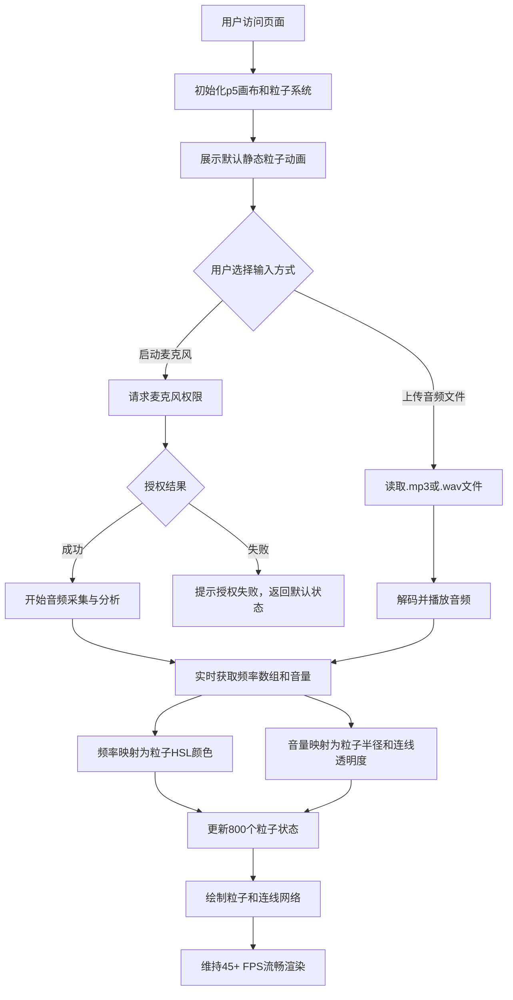

## 1. 产品概述
动态音律粒子画布是一款基于Web Audio API和p5.js的视听联觉艺术应用，将声音实时转化为动态粒子视觉艺术。
- 核心目标：让用户化身数字声音艺术家，通过麦克风或音频文件输入，将声音的频率与音量转化为屏幕上不断变化的抽象粒子画
- 目标用户：音乐爱好者、视觉艺术家、创意教育者、任何对视听联觉艺术感兴趣的人

## 2. 核心特性

### 2.1 用户角色
| 角色 | 注册方式 | 核心权限 |
|------|----------|----------|
| 访客用户 | 无需注册 | 使用全部功能（麦克风、文件上传、参数调节） |

### 2.2 功能模块
1. **主画布区域**：1024x768粒子画布、径向渐变背景、800个动态粒子、粒子连线网络
2. **音频输入模块**：麦克风输入、音频文件上传（.mp3/.wav）、拖拽上传
3. **控制面板**：音量阈值滑块、状态指示按钮、平滑交互动画

### 2.3 页面详情
| 页面名称 | 模块名称 | 功能描述 |
|----------|----------|----------|
| 主页面 | 粒子画布 | 1024x768画布，午夜蓝到深紫径向渐变背景，800个粒子实时渲染 |
| 主页面 | 音频输入控制 | "启动麦克风"按钮（激活变绿）、文件上传区域（支持拖拽）、音量阈值滑块（0-100，默认50） |
| 主页面 | 粒子系统 | 频率→颜色映射（低频暖色、中频绿蓝、高频紫品红）、音量→半径映射、粒子间距离<50px连线 |

## 3. 核心流程
用户打开页面后，画布展示默认粒子动画。用户可选择启动麦克风（需授权）或上传音频文件，音频数据实时驱动粒子颜色、大小和连线透明度变化。调节音量阈值滑块可控制粒子响应灵敏度。

## 4. 用户界面设计

### 4.1 设计风格
- **主色调**：午夜蓝(#0a0a23) → 深紫(#1a0a33)径向渐变背景
- **粒子配色**：
  - 低频(0-200Hz)：暖色红橙（HSL 0-60°）
  - 中频(200-2000Hz)：绿蓝（HSL 60-240°）
  - 高频(2000Hz+)：紫品红（HSL 240-300°）
- **控制面板**：半透明毛玻璃效果（rgba(255,255,255,0.08)），圆角12px，内边距16px
- **按钮样式**：圆角按钮，悬停时背景变为rgba(255,255,255,0.2)并上移2px
- **滑块样式**：渐变色从#6b5b95到#ff6b6b

### 4.2 页面设计概览
| 页面名称 | 模块名称 | UI元素 |
|----------|----------|--------|
| 主页面 | 粒子画布 | 1024x768居中显示、径向渐变背景、发光粒子、半透明连线网络 |
| 主页面 | 控制面板 | 左下角悬浮、fadeIn(0.5s ease-in-out)淡入、麦克风按钮、上传区域、阈值滑块 |

### 4.3 响应性
桌面端优先设计，画布固定1024x768像素居中显示。控制面板悬浮于左下角，不受画布尺寸影响。

### 4.4 动效设计
- 控制面板加载：fadeIn 0.5s ease-in-out
- 按钮悬停：背景变为rgba(255,255,255,0.2) + 上移2px（0.2s过渡）
- 粒子：根据音频数据呼吸、脉动、扩散
- 连线：透明度随音量动态变化（0.1 + 音量×0.3）
