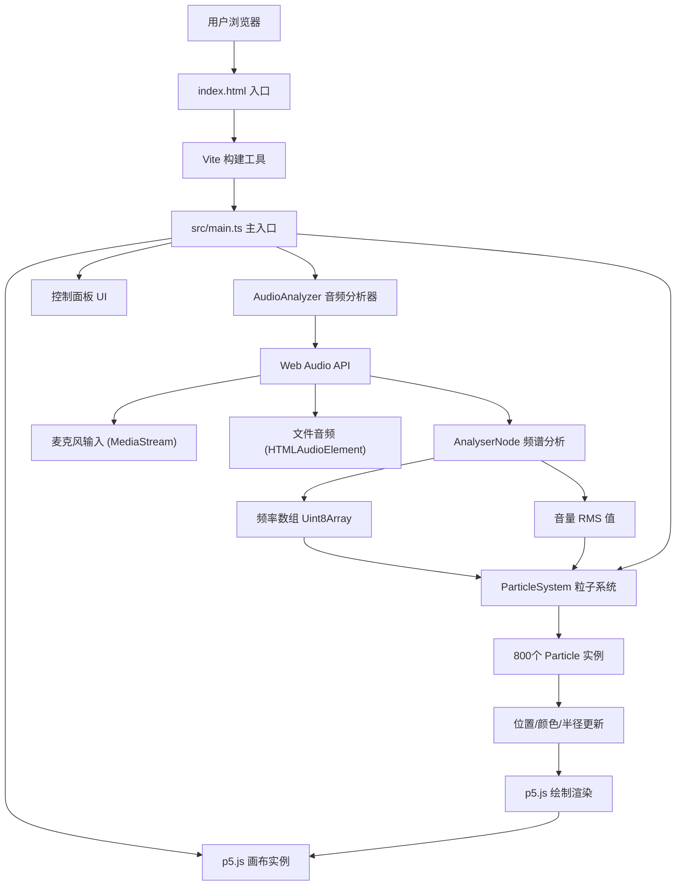

## 1. 架构设计



## 2. 技术说明
- **前端框架**：p5.js@1.9.0（用于Canvas绘制和动画循环）
- **编程语言**：TypeScript@5.5.0（严格模式，ES2020目标）
- **构建工具**：Vite@5.4.0
- **音频处理**：原生 Web Audio API（AnalyserNode、AudioContext、MediaStreamSource、MediaElementSource）
- **后端**：无，纯前端应用

## 3. 目录结构

```
auto120/
├── package.json              # 项目依赖和脚本
├── tsconfig.json             # TypeScript配置
├── vite.config.js            # Vite构建配置
├── index.html                # HTML入口
└── src/
    ├── main.ts               # 主入口：p5实例、UI协调、数据流
    ├── audioAnalyzer.ts      # Web Audio API封装
    └── particleSystem.ts     # 粒子系统管理
```

## 4. 模块定义

### 4.1 AudioAnalyzer 类

```typescript
class AudioAnalyzer {
  private audioContext: AudioContext | null;
  private analyser: AnalyserNode | null;
  private source: MediaStreamAudioSourceNode | MediaElementAudioSourceNode | null;
  private frequencyData: Uint8Array;
  private volumeThreshold: number;

  constructor();
  async startMicrophone(): Promise<boolean>;
  async uploadFile(file: File): Promise<boolean>;
  stop(): void;
  getFrequencyData(): Uint8Array;
  getVolume(): number;  // 0~1
  setVolumeThreshold(value: number): void;  // 0~100
  isActive(): boolean;
}
```

**职责**：
- 管理AudioContext生命周期
- 处理麦克风权限请求和MediaStream
- 解码和播放上传的音频文件
- 通过AnalyserNode获取实时频率数据
- 计算RMS音量值
- 管理音量阈值参数

### 4.2 ParticleSystem 类

```typescript
interface Particle {
  x: number;
  y: number;
  vx: number;
  vy: number;
  baseHue: number;
  radius: number;
  targetRadius: number;
}

class ParticleSystem {
  private particles: Particle[];
  private canvasWidth: number;
  private canvasHeight: number;
  private connectionDistance: number;  // 50px

  constructor(width: number, height: number, count: number);
  update(frequencyData: Uint8Array, volume: number): void;
  draw(p: p5): void;
  private mapFrequencyToHue(frequencyBin: number, totalBins: number): number;
  private mapVolumeToRadius(volume: number): number;
}
```

**职责**：
- 初始化800个随机位置的粒子
- 根据频率数据更新粒子颜色（HSL映射）
- 根据音量更新粒子半径（1-3px → 3-10px）
- 粒子微运动（布朗运动风格）
- 计算粒子间距离，绘制半透明连线
- 连线透明度 = 0.1 + 音量 × 0.3

### 4.3 main.ts 主入口

```typescript
// 1. 创建p5实例（实例模式，避免全局污染）
// 2. setup(): 初始化1024x768画布、径向渐变背景、粒子系统
// 3. draw(): 每帧获取音频数据 → 更新粒子系统 → 绘制
// 4. 初始化控制面板UI并绑定事件：
//    - 麦克风按钮点击事件
//    - 文件上传（点击+拖拽）事件
//    - 滑块input事件
// 5. 控制面板CSS样式：毛玻璃效果、淡入动画、悬停交互
```

## 5. 性能优化策略

### 5.1 粒子连线优化
- 空间网格划分（Grid Spatial Partitioning）：将画布划分为50px×50px的网格，每个粒子只检查相邻9个格子内的粒子，将O(n²)降为O(n)
- 每帧最多检查：800粒子 × 平均每格约4粒子 = ~3200次距离计算，而非640000次

### 5.2 渲染优化
- 使用p5.js实例模式而非全局模式
- 避免在draw()中创建新对象（重用Uint8Array、Particle数组）
- 连线使用低级stroke/path批量绘制
- 粒子发光通过draw()中p5的blendMode(ADD)实现，避免逐粒子shadowBlur

### 5.3 帧率目标
- 目标：45 FPS 以上
- 监控：使用p5.frameRate在控制台输出帧率（调试用，可移除）

## 6. 关键算法

### 6.1 频率到HSL色相映射
```
输入：frequencyBinIndex (0~1023), totalBins (1024)
计算：normalizedFreq = binIndex / totalBins * 22050  (奈奎斯特频率)
映射：
  0-200Hz     → HSL 0°-60°   (红橙暖色)
  200-2000Hz  → HSL 60°-240° (绿蓝)
  2000-22050Hz → HSL 240°-300° (紫品红)
```

### 6.2 音量计算（RMS）
```
volume = sqrt(sum(frequencyData[i]^2) / N) / 255
归一化到 0~1 范围
```

### 6.3 粒子半径映射
```
安静(volume→0): radius ∈ [1, 3] px
响亮(volume→1): radius ∈ [3, 10] px
radius = lerp(1 + random(0,2), 3 + random(0,7), volume)
```
