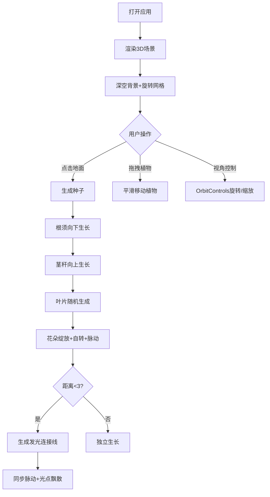

## 1. 产品概述
光之园丁是一款在浏览器中运行的三维互动植物培养应用，用户可在深空背景下播种、培育发光植物群落，并欣赏动态生长的视觉效果。
- 解决用户在数字世界中缺乏沉浸式三维植物种植体验的问题
- 打造治愈系、科幻美学的数字花园互动体验

## 2. 核心功能

### 2.1 用户角色
| 角色 | 注册方式 | 核心权限 |
|------|---------|----------|
| 用户 | 无需注册，直接使用 | 播种、拖拽植物、视角控制 |

### 2.2 功能模块
1. **主场景**：深空渐变背景、旋转网格地面、轨道视角控制
2. **植物系统**：种子播种、根须生长、茎秆生长、叶片生成、花朵绽放与脉动
3. **连接系统**：植物间发光连接、同步脉动、光点飘散
4. **交互系统**：鼠标播种、拖拽移动植物
5. **UI界面**：植物数量显示、连接数显示、播种按钮

### 2.3 页面详情
| 页面名称 | 模块名称 | 功能描述 |
|---------|---------|---------|
| 主页面 | 3D场景 | 深空蓝紫渐变背景、旋转半透明网格地面、Bloom发光后处理 |
| 主页面 | 植物播种 | 点击地面生成种子，种子向下扎根、向上生长茎秆、叶片、花朵 |
| 主页面 | 植物连接 | 距离小于3单位的植物间生成发光连接线，混合色脉动、同步花朵脉动、飘散光点 |
| 主页面 | 植物拖拽 | 拖拽植物平滑移动（0.5秒），连接线弹性拉伸 |
| 主页面 | UI面板 | 左上：植物数量+播种按钮；右下：连接数 |

## 3. 核心流程
用户打开应用 → 看到深空背景和旋转网格 → 点击地面或播种按钮 → 种子生根发芽 → 茎秆叶片花朵依次生长 → 植物间自动连接发光 → 可拖拽移动植物 → 可旋转/缩放视角欣赏花园

## 4. 用户界面设计

### 4.1 设计风格
- 主色：深空蓝#0a0a2a、紫黑#1a0a1a
- 辅助色：网格#334466、种子#88ddff、茎秆#88ffaa→#66dd88、叶片#44ff88→#88ff44
- 花朵调色板：#ff66aa、#ffaa66、#66ffaa、#aa66ff
- 按钮风格：半透明背景#224466，悬停#446688，过渡0.3s
- 字体：Arial 20px（数字）、科幻UI风格
- 整体氛围：深空科幻、治愈发光、柔和Bloom效果

### 4.2 页面设计概览
| 页面名称 | 模块名称 | UI元素 |
|---------|---------|---------|
| 主页面 | 3D场景 | 深空渐变背景、缓慢旋转网格、Bloom后处理（强度0.3，阈值0.6） |
| 主页面 | 左上角UI | 白色数字20px显示植物数量，半透明"播种"按钮 |
| 主页面 | 右下角UI | 植物连接数显示 |
| 主页面 | 视角控制 | OrbitControls缩放范围3-10单位 |

### 4.3 响应性
- 桌面端全屏显示3D画布
- 自适应窗口大小
- 鼠标交互优先

### 4.4 3D场景指导
- 环境/氛围：深空蓝紫渐变，无外部光源，植物自发光
- 光照设置：环境光+点光源辅助植物发光效果
- 相机设置：PerspectiveCamera，初始位置适中，OrbitControls控制
- 构图焦点：网格中心区域为主要种植区
- 交互动画：种子生长动画（requestAnimationFrame）、花朵自转脉动、连接线亮度脉动
- 后处理：UnrealBloomPass强度0.3，阈值0.6
- 性能：40株植物稳定40FPS以上
