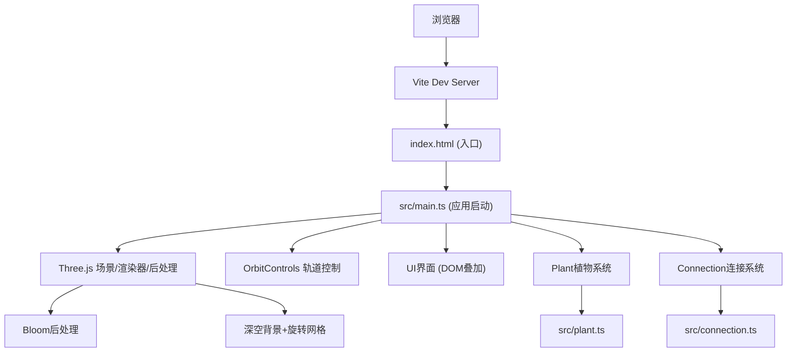

## 1. 架构设计



## 2. 技术描述
- 前端：Three.js@0.160.0 + TypeScript@5.5.0
- 构建工具：Vite@5.4.0
- 后处理：EffectComposer + RenderPass + UnrealBloomPass
- 交互控制：OrbitControls
- 无后端，纯前端3D应用

## 3. 路由定义
| 路由 | 用途 |
|-----|------|
| / | 主应用页面（3D花园场景） |

## 4. 文件结构
```
auto122/
├── package.json
├── vite.config.js
├── tsconfig.json
├── index.html
└── src/
    ├── main.ts          # 场景初始化、渲染循环、UI、交互处理
    ├── plant.ts         # Plant类：种子、根、茎、叶、花的生成与动画
    └── connection.ts    # ConnectionManager：植物间连接线、光点、同步脉动
```

## 5. 核心类设计

### 5.1 Plant 类 (src/plant.ts)
```typescript
class Plant {
  group: THREE.Group           // 植物根节点
  position: THREE.Vector3      // 植物位置
  targetPosition: THREE.Vector3 // 拖拽目标位置
  isMoving: boolean
  stemHeight: number           // 茎秆最终高度
  flowerColor: THREE.Color     // 花朵颜色
  pulsePhase: number           // 脉动相位
  pulseSpeed: number           // 脉动频率（弧度/秒）
  rotationSpeed: number        // 花朵自转角速度

  constructor(position: THREE.Vector3)
  update(delta: number)        // 生长动画、脉动、移动插值
  moveTo(target: THREE.Vector3, duration: number) // 平滑移动
  getFlowerWorldPosition(): THREE.Vector3
  dispose()
}
```

### 5.2 ConnectionManager 类 (src/connection.ts)
```typescript
type Connection = {
  line: THREE.Line
  plantA: Plant
  plantB: Plant
  particles: Particle[]
}

type Particle = {
  mesh: THREE.Mesh
  t: number  // 0-1 沿连接线位置
  speed: number
}

class ConnectionManager {
  scene: THREE.Scene
  connections: Map<string, Connection>

  constructor(scene: THREE.Scene)
  updateConnections(plants: Plant[])  // 根据距离增删连接
  update(delta: number)               // 连接线脉动、粒子飘动
  dispose()
}
```

## 6. 性能优化策略
- 使用 BufferGeometry 批量渲染相似物体
- requestAnimationFrame 高效循环，避免冗余计算
- 植物生长分阶段完成后停止插值计算
- 连接距离检测采用 O(n²) 但限制最多40株
- 复用材质和几何体实例
