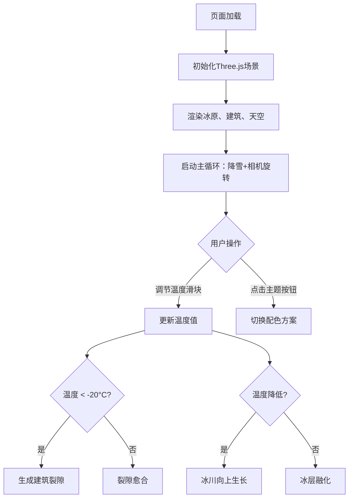

## 1. 产品概述

冰封古城末日模拟器是一款基于浏览器的3D交互式可视化应用，让古气候学家在虚拟环境中重现最后冰河期冰川吞噬古城的末日场景。通过实时温度控制，用户可以观察冰川生长、建筑裂隙扩展、降雪等动态自然过程。

- 目标用户：古气候学家、环境科学研究者、历史爱好者
- 产品价值：提供沉浸式的冰河期环境模拟，辅助气候变迁研究和科普教育

## 2. 核心特性

### 2.1 用户角色
| 角色 | 注册方式 | 核心权限 |
|------|----------|----------|
| 访客用户 | 无需注册 | 浏览3D场景、调节温度、切换主题 |

### 2.2 功能模块
1. **3D场景渲染**：冰原地面、古城建筑群、天空环境、雾气效果
2. **冰川模拟系统**：冰层动态生长/融化、冰裂纹理、颜色渐变
3. **建筑裂隙系统**：温度骤降触发裂隙生成、裂隙延伸与愈合
4. **粒子降雪系统**：500个雪花粒子持续飘落、噪声驱动飘移
5. **温度控制面板**：HTML温度计UI、-30°C~0°C滑块调节
6. **主题切换系统**：复古暖色与寒冰冷色双主题、平滑过渡

### 2.3 页面详情
| 页面名称 | 模块名称 | 功能描述 |
|----------|----------|----------|
| 主页 | 3D渲染容器 | 全屏Three.js渲染冰封古城场景，支持鼠标拖拽旋转、滚轮缩放 |
| 主页 | 温度计控制面板 | 左下角HTML/CSS温度计，滑块调节温度，实时显示数值 |
| 主页 | 主题切换按钮 | 右上角双按钮切换冷暖配色主题，带悬停和点击动画 |

## 3. 核心流程

用户打开页面 → 场景自动加载并开始缓慢旋转 → 自动开始降雪 → 用户通过温度计滑块调节温度 → 温度降低触发冰川生长和建筑裂隙 → 用户可切换主题配色 → 温度回升触发冰层融化和裂隙愈合

## 4. 用户界面设计

### 4.1 设计风格
- **主色调**：极地冷色调 - 深蓝黑渐变(#1a1a2e → #0a0a1a)，冰蓝色(#8ab4f8)
- **辅助主题**：复古暖色调 - 棕褐色(#4a3a2a)，暖黄色(#c4a46a)
- **按钮风格**：圆角8px，半透明背景，悬停变亮，点击缩放动画
- **字体**：无衬线字体 Arial, Helvetica, sans-serif
- **滑块设计**：轨道宽6px，滑块圆形直径20px，蓝白渐变

### 4.2 页面设计概览
| 页面名称 | 模块名称 | UI元素 |
|----------|----------|--------|
| 主页 | 3D场景 | 全屏黑色背景，雾灰色环境，自动缓慢旋转，鼠标交互 |
| 主页 | 温度计 | 左下角，圆角设计，温度数字18px，滑块蓝白渐变 |
| 主页 | 主题按钮 | 右上角，60×30px，间距10px，半透明背景，缩放动画 |

### 4.3 响应式设计
桌面端优先，窗口宽度 < 768px 时：
- 温度计移至顶部
- 主题按钮移至温度计下方
- 所有UI元素纵向堆叠

### 4.4 3D场景指导
- **环境与氛围**：雾灰色雾气(#2a2a3a)，深蓝黑背景渐变，营造冰河末日氛围
- **光照设置**：环境光 + 方向光模拟极地日光
- **相机参数**：初始位置(0, 30, 60)，FOV 60°，自动绕Y轴旋转(0.2 rad/s)，旋转阻尼0.95
- **交互方式**：鼠标左键拖拽旋转视角，滚轮缩放(10-100单位)
- **动画效果**：冰川生长动画、裂隙延伸动画、雪花飘落、主题颜色平滑过渡(2秒)
- **性能预算**：帧率 ≥ 50FPS，粒子系统使用BufferGeometry合并，冰层顶点 ≤ 10000个
