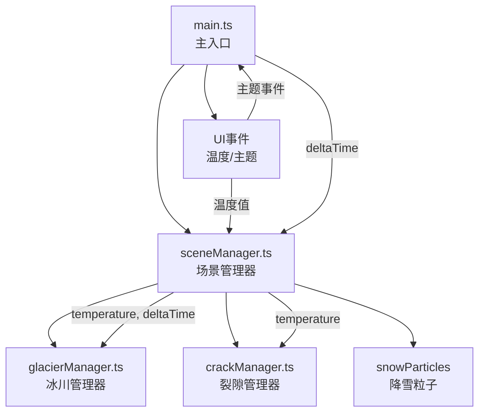

## 1. 架构设计



## 2. 技术说明

- **前端框架**：TypeScript 5.5.0 (纯TS，无React/Vue)
- **3D引擎**：Three.js 0.160.0
- **构建工具**：Vite 5.4.0
- **噪声库**：simplex-noise 3.0.0
- **后端**：无 (纯前端应用)
- **数据库**：无

## 3. 文件结构与职责

| 文件路径 | 职责描述 | 数据流向 |
|----------|----------|----------|
| package.json | 依赖管理、启动脚本 | npm run dev → Vite |
| vite.config.js | Vite构建配置，TS支持，路径别名 | 构建时读取 |
| tsconfig.json | TypeScript严格模式配置，ES2020目标 | tsc编译时读取 |
| index.html | 入口HTML，渲染容器、UI占位、样式 | 浏览器加载入口 |
| src/main.ts | 初始化场景/相机/渲染器，主循环，UI事件分发 | main → sceneManager.update() |
| src/sceneManager.ts | 场景构建与更新：地面冰原、5座建筑、天空球、雾气 | sceneManager → glacierManager.simulate() + crackManager.update() |
| src/glacierManager.ts | 冰层网格动态生长/融化，冰裂纹理，颜色渐变，噪声扰动 | 接收temperature + deltaTime |
| src/crackManager.ts | 建筑表面裂隙生成、延伸、愈合，LineSegments渲染 | 接收temperature |

## 4. 关键数据结构

### 4.1 温度数据
```typescript
type Temperature = number; // 范围: -30 ~ 0 (摄氏度)
```

### 4.2 主题数据
```typescript
interface ThemeColors {
  fogColor: string;      // 雾颜色
  iceColor: string;      // 冰颜色
  snowColor: string;     // 雪花颜色
  backgroundTop: string; // 背景顶部色
  backgroundBottom: string; // 背景底部色
}
```

### 4.3 建筑数据
```typescript
interface BuildingData {
  mesh: THREE.Mesh;
  cracks: THREE.LineSegments[];
  crackCount: number;
}
```

### 4.4 裂隙数据
```typescript
interface CrackData {
  startPoint: THREE.Vector3;
  length: number;
  maxLength: number;
  width: number;
  growing: boolean;
}
```

## 5. 核心算法

### 5.1 冰川生长速率
```
growthRate = (0 - temperature) / 30 * maxGrowthRate
其中 maxGrowthRate = 0.02 单位/帧 (生长时)
融化速率 = 2 * growthRate
冰层高度范围: 0.2 ~ 2.0 单位
```

### 5.2 裂隙生成逻辑
```
IF temperature < -20°C:
    每3秒为每栋建筑尝试生成1条新裂隙 (最多5条/栋)
    已有裂隙宽度从0.05扩展至0.15
ELSE:
    裂隙逐渐缩回原宽度 (不消失)
裂隙延伸速度: 0.1 单位/帧
最大总长: 2 单位
```

### 5.3 相机控制
```
自动旋转速度: 0.2 rad/s 绕Y轴
旋转阻尼: 0.95
缩放范围: 10 ~ 100 单位
```

## 6. 性能优化策略

1. **粒子系统合并**：500个雪花使用单个BufferGeometry + PointsMaterial，避免逐个Mesh
2. **冰层顶点限制**：冰层网格使用100×100分段(10201顶点)，每帧仅更新高度相关顶点
3. **裂隙优化**：使用LineSegments批量渲染，避免过多独立对象
4. **材质复用**：建筑共享同一材质实例，冰层共享噪声纹理
