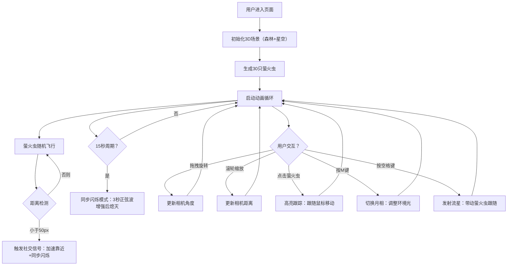

## 1. 产品概述

萤火虫森林模拟器是一款基于WebGL的沉浸式3D交互应用，旨在为用户提供在浏览器中观察数百只萤火虫夜间飞行、同步闪烁与社交通信行为的体验。解决用户无法在真实环境中大规模观察萤火虫生态行为的问题。

- 目标用户：自然爱好者、教育工作者、交互艺术体验者
- 产品价值：通过科学模拟与艺术化呈现，让用户在任意设备上体验萤火虫森林的奇幻夜景

## 2. 核心功能

### 2.1 功能模块

1. **森林场景渲染模块**：3D松树森林、深绿色渐变地面、半透明发光栖息点、星空背景
2. **萤火虫行为系统**：随机路径飞行、社交信号检测（近距离加速靠近+同步闪烁）、个体发光强度管理
3. **用户交互控制**：鼠标拖拽视角旋转、滚轮缩放、点击捕获萤火虫、键盘月相切换与流星发射
4. **同步闪烁模式**：周期性全局同步闪烁（正弦波缓动呼吸效果）、聚集减速效果
5. **动态环境反馈**：月相切换影响环境光照与萤火虫亮度、流星粒子带动萤火虫短暂跟随

### 2.2 页面详情

| 页面名称 | 模块名称 | 功能描述 |
|----------|----------|----------|
| 主场景页面 | 3D森林场景 | 宽1000px高700px的3D渲染区域，包含20棵随机分布松树、深绿渐变地面、30只萤火虫 |
| 主场景页面 | 底部信息栏 | 左侧显示萤火虫数量，右侧显示操作提示，半透明圆角设计 |
| 主场景页面 | 星空背景 | 随机分布白色半透明星点，3-5秒随机闪烁周期 |
| 主场景页面 | 交互反馈 | 点击萤火虫时圆形波纹扩散，月相切换时亮度平滑过渡 |

## 3. 核心流程

用户进入页面后，自动加载3D森林场景与30只萤火虫，萤火虫开始随机飞行并产生社交互动。用户可通过鼠标旋转缩放视角，点击捕获单只萤火虫控制其移动，按M键切换月相，按空格键发射流星。每隔15秒触发一次全局同步闪烁。

## 4. 用户界面设计

### 4.1 设计风格

- **主色调**：深蓝黑背景（#050a10），深绿森林地面（#0d2a1a→#1a3a2a），暖黄萤火虫（#ffdd44），亮绿选中态（#00ff88），暖白文字（#e6d9b8）
- **UI元素**：圆角矩形、无边框设计、半透明信息栏（#102030，透明度0.7）
- **字体**：字号14px，暖白色（#e6d9b8）
- **视觉氛围**：夜间森林沉浸感，径向渐变柔光模拟萤火虫发光，微弱星点闪烁背景

### 4.2 页面设计概述

| 页面名称 | 模块名称 | UI元素 |
|----------|----------|--------|
| 主场景页面 | 3D渲染画布 | 全屏Three.js画布，居中渲染森林场景 |
| 主场景页面 | 底部信息栏 | 固定底部40px高度（移动端60px），左右对齐文字，半透明背景 |
| 主场景页面 | 交互效果 | 点击波纹（半径0→20px，0.3秒衰减），亮度平滑过渡（1秒） |

### 4.3 响应式设计

- 桌面端（≥768px）：信息栏高度40px，单行显示
- 移动端（<768px）：信息栏高度60px，两行堆叠显示
- 场景区域自适应容器尺寸，保持渲染性能

### 4.4 3D场景指引

- **环境**：夜间森林，深蓝黑色调，微弱星空背景
- **光照**：环境光强度随月相变化（0.05-0.5），萤火虫自发光作为点缀光源
- **相机**：透视相机，围绕场景中心轨道控制，俯仰角-30°至60°，距离5-30单位
- **构图**：场景中心为松树林，萤火虫围绕树冠飞行，视觉焦点集中在中景区域
- **动画**：萤火虫持续飞行，同步闪烁时全局呼吸效果，流星斜向划过
- **性能**：空间哈希网格优化近距离检测，保持帧率≥55FPS
