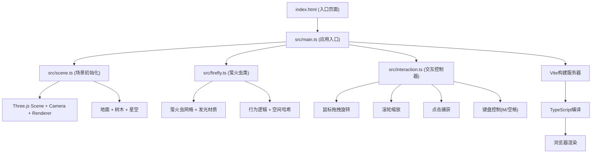

## 1. 架构设计



## 2. 技术描述

- **前端框架**：无框架，原生TypeScript
- **3D引擎**：Three.js@0.160.0
- **构建工具**：Vite@5.4.0
- **语言**：TypeScript@5.5.0（严格模式，ES2020目标）
- **后端**：无（纯前端应用）
- **数据库**：无

## 3. 文件结构

| 文件路径 | 用途 |
|----------|------|
| package.json | 项目依赖与脚本配置 |
| tsconfig.json | TypeScript编译配置（严格模式） |
| vite.config.js | Vite构建配置 |
| index.html | 入口HTML页面，包含画布容器与信息栏 |
| src/scene.ts | 场景初始化：创建Three.js场景、相机、渲染器、地面、20棵松树、星空背景 |
| src/firefly.ts | Firefly类：萤火虫创建、位置更新、社交信号检测、闪烁、选中状态、流星跟随 |
| src/interaction.ts | InteractionController类：鼠标拖拽旋转、滚轮缩放、点击捕获、月相切换、流星发射 |
| src/main.ts | 应用入口：初始化场景、生成30只萤火虫、启动交互、动画循环、同步闪烁管理 |

## 4. 核心数据结构

### 4.1 Firefly 类属性

| 属性名 | 类型 | 说明 |
|--------|------|------|
| mesh | THREE.Mesh | 萤火虫3D网格（球体+光晕） |
| glow | THREE.Mesh | 外层发光球体 |
| x, y, z | number | 当前位置 |
| velocity | THREE.Vector3 | 飞行速度向量 |
| speed | number | 基础飞行速度（0.3-0.8） |
| baseColor | THREE.Color | 基础颜色（暖黄#ffdd44） |
| selectedColor | THREE.Color | 选中颜色（亮绿#00ff88） |
| glowIntensity | number | 发光强度（0.1-1.0） |
| isSelected | boolean | 是否被用户选中跟踪 |
| directionChangeTimer | number | 方向改变计时器 |
| socialFlashTimer | number | 社交闪烁计时器 |
| meteorFollowTimer | number | 流星跟随计时器 |
| homePosition | THREE.Vector3 | 关联栖息位置（树冠） |

### 4.2 SceneState 全局状态

| 属性名 | 类型 | 说明 |
|--------|------|------|
| ambientLight | THREE.AmbientLight | 环境光 |
| moonPhase | number | 月相阶段（0-7） |
| targetAmbientIntensity | number | 目标环境光强度 |
| currentAmbientIntensity | number | 当前环境光强度 |
| syncFlashTimer | number | 同步闪烁周期计时器 |
| isSyncFlashing | boolean | 是否处于同步闪烁模式 |
| syncFlashProgress | number | 同步闪烁进度（0-1） |
| spatialHash | Map<string, Firefly[]> | 空间哈希网格 |
| cellSize | number | 哈希网格单元大小（50px） |
| meteors | Meteor[] | 当前活跃流星数组 |
| cameraAngle | {theta: number, phi: number, radius: number} | 相机轨道参数 |

## 5. 核心算法

### 5.1 空间哈希网格（Spatial Hash Grid）

用于优化萤火虫近距离检测，避免O(n²)全量配对：

```typescript
// 网格单元大小 = 社交检测距离（50px）
const CELL_SIZE = 50;

function hashKey(x: number, y: number, z: number): string {
  return `${Math.floor(x/CELL_SIZE)},${Math.floor(y/CELL_SIZE)},${Math.floor(z/CELL_SIZE)}`;
}

// 每帧重建哈希
function rebuildSpatialHash(fireflies: Firefly[]): Map<string, Firefly[]> {
  const hash = new Map<string, Firefly[]>();
  for (const f of fireflies) {
    const key = hashKey(f.x, f.y, f.z);
    if (!hash.has(key)) hash.set(key, []);
    hash.get(key)!.push(f);
  }
  return hash;
}

// 只检查相邻9个单元
function findNeighbors(f: Firefly, hash: Map<string, Firefly[]>): Firefly[] {
  const neighbors: Firefly[] = [];
  const cx = Math.floor(f.x / CELL_SIZE);
  const cy = Math.floor(f.y / CELL_SIZE);
  const cz = Math.floor(f.z / CELL_SIZE);
  for (let dx = -1; dx <= 1; dx++) {
    for (let dy = -1; dy <= 1; dy++) {
      for (let dz = -1; dz <= 1; dz++) {
        const key = `${cx+dx},${cy+dy},${cz+dz}`;
        const cell = hash.get(key);
        if (cell) neighbors.push(...cell.filter(other => other !== f));
      }
    }
  }
  return neighbors;
}
```

### 5.2 同步闪烁模式

每15秒触发一次，3秒正弦波缓动增强后瞬间熄灭：

```typescript
if (!isSyncFlashing) {
  syncFlashTimer += deltaTime;
  if (syncFlashTimer >= 15) {
    isSyncFlashing = true;
    syncFlashProgress = 0;
  }
} else {
  syncFlashProgress += deltaTime / 3; // 3秒增强期
  if (syncFlashProgress >= 1) {
    // 瞬间熄灭
    for (const f of fireflies) f.glowIntensity = 0.1;
    isSyncFlashing = false;
    syncFlashTimer = 0;
  } else {
    const intensity = 0.2 + 0.8 * Math.sin(syncFlashProgress * Math.PI / 2);
    for (const f of fireflies) f.glowIntensity = intensity;
  }
}
```

### 5.3 相机轨道控制

基于球坐标系的轨道相机控制：

```typescript
// theta: 水平角度（0-2π无限制）
// phi: 垂直角度（-30°到60°，即π/6到π/3）
// radius: 距离（5-30单位）
function updateCamera() {
  const x = radius * Math.sin(phi) * Math.cos(theta);
  const y = radius * Math.cos(phi);
  const z = radius * Math.sin(phi) * Math.sin(theta);
  camera.position.set(x, y, z);
  camera.lookAt(0, 0, 0);
}
```

## 6. 性能优化策略

- **空间哈希网格**：将萤火虫社交检测从O(n²)降至O(n)
- **对象池复用**：流星粒子对象复用，避免频繁GC
- **材质共享**：同类型萤火虫共享基础材质实例
- **帧率监控**：自适应降低渲染精度维持55FPS
- **几何体复用**：松树与萤火虫基础几何体共享BufferGeometry
