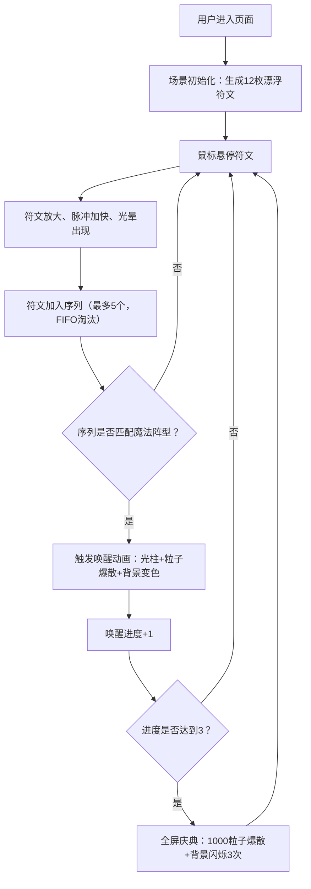

## 1. 产品概述

符文序列共鸣与魔法阵唤醒交互可视化应用——在漂浮发光符文的玄秘空间中，用户通过光标悬停选择符文序列，唤醒魔法阵并释放绚丽元素光芒。

- 主要目的：打造沉浸式魔法符文交互体验，通过视觉特效与序列解谜机制激发用户探索欲望
- 目标用户：对神秘学、视觉艺术、交互实验感兴趣的用户
- 产品价值：将抽象的魔法概念转化为可感知的三维交互体验，展示 Three.js 实时渲染与交互能力

## 2. 核心功能

### 2.1 功能模块

1. **符文系统**：12枚漂浮自转符文，含元素属性、发光纹路、悬停交互
2. **序列记录**：记录悬停过的符文序列（最多5个），实时展示
3. **魔法阵匹配**：3种预设阵型（火风阵、水土阵、四象阵），匹配后触发唤醒动画
4. **粒子特效系统**：爆散粒子、旋转光环、冲天光柱
5. **唤醒进度追踪**：右下角进度环，完成3次唤醒触发庆典
6. **自适应渲染**：窗口 resize 自动适配

### 2.2 页面详情

| 页面名称 | 模块名称 | 功能描述 |
|---------|---------|---------|
| 主场景 | 符文空间 | 12枚随机分布的发光符文在球形空间内漂浮自转 |
| 主场景 | 序列展示栏 | 左上角横向排列的小图标展示当前符文序列 |
| 主场景 | 进度环 | 右下角圆形进度环显示唤醒进度 |
| 主场景 | 魔法阵特效 | 阵型匹配成功后的光柱、粒子爆散、光晕动画 |
| 主场景 | 庆典效果 | 完成3次唤醒后全屏粒子与闪烁效果 |
| 主场景 | 星空背景 | 深空渐变背景 + 随机闪烁星点 |

## 3. 核心流程

用户进入页面 → 看到漂浮的12枚发光符文 → 鼠标悬停符文，符文放大高亮 → 系统按悬停顺序记录序列 → 序列匹配预设阵型 → 触发唤醒动画（光柱+粒子爆散+背景变色） → 唤醒进度+1 → 累计3次唤醒 → 触发全屏庆典效果。

## 4. 用户界面设计

### 4.1 设计风格

- **主色调**：深空蓝 `#0a0a2a` → 墨黑 `#05050a` 径向渐变背景
- **元素色**：火 `#ff4422`、水 `#2266ff`、土 `#66aa44`、风 `#aaddff`
- **阵型色**：火风阵 `#ff8844`、水土阵 `#44aaff`、四象阵 `#ffaaff`
- **UI风格**：半透明磨砂玻璃（backdrop-filter: blur(8px)，背景 rgba(255,255,255,0.06)，圆角 8px，边框 1px solid rgba(255,255,255,0.1)）
- **字体**：monospace，颜色 `#ccddff`，字号 14px
- **动效**：所有过渡使用 ease-in-out/ease-out，持续 0.3-0.8 秒

### 4.2 页面设计概述

| 页面名称 | 模块名称 | UI 元素 |
|---------|---------|---------|
| 主场景 | 符文空间 | 十二面体几何、半透明材质、发光纹路CanvasTexture、脉冲动画、自转 |
| 主场景 | 序列展示栏 | 左上角、30x30px圆角矩形小图标、元素色填充、发光边框、磨砂玻璃容器 |
| 主场景 | 进度环 | 右下角、半径40px、线宽4px、颜色#88aaff、中心数字"唤醒进度：0/3" |
| 主场景 | 星空背景 | 200颗静态星点、大小0.5-2px、闪烁周期1-3秒、透明度0.3-0.8随机 |
| 主场景 | 光柱特效 | 圆柱几何体、发光材质、向上延伸10单位、2秒后消散 |
| 主场景 | 粒子爆散 | 100/1000个彩色粒子、正弦扰动轨迹、渐隐消失 |

### 4.3 响应式

- 桌面端优先设计
- 窗口 resize 时自动更新相机 aspect 和渲染器尺寸
- 符文位置按相对坐标重新映射到新视口
- 粒子特效不重置

### 4.4 3D 场景指导

- **环境**：深空蓝径向渐变背景，200颗闪烁星点
- **光照**：环境光 + 符文自发光，无需额外光源
- **相机**：PerspectiveCamera，初始看向场景中心
- **交互**：光线投射（Raycaster）进行悬停检测，每帧一次
- **后处理**：符文纹路使用 CanvasTexture 自发光，光晕使用半透明球体
- **性能预算**：1920x1080 ≥ 45fps，同时存在粒子 ≤ 2000
