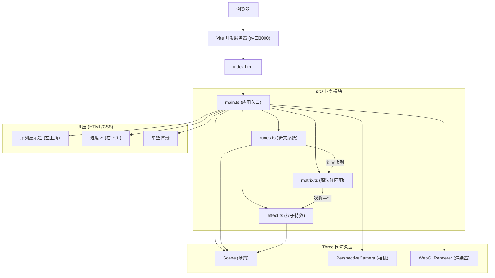

## 1. 架构设计



**模块调用关系与数据流向：**

```
main.ts
├── 初始化 Scene / Camera / Renderer / DOM UI
├── 创建 runes.ts 实例（传入 Scene 和 Raycaster）
├── 创建 effect.ts 实例（传入 Scene）
├── 创建 matrix.ts 实例（传入 runes 和 effect）
├── 注册鼠标 move 事件 → runes.checkHover(mouse)
├── 注册 resize 事件 → runes.onResize() + renderer.setSize()
└── 动画循环：runes.update(delta) → matrix.checkMatch() → effect.update(delta) → render

runes.ts (数据输出)
├── 接收: 鼠标归一化坐标 (NDC)
├── 处理: Raycaster 悬停检测 → 符文高亮动画 → 序列 FIFO
└── 输出: getSequence(): ElementType[] 给 matrix.ts

matrix.ts (逻辑处理)
├── 接收: runes.getSequence()
├── 处理: 对比 3 种预设阵型 → 匹配判定 → 唤醒进度计数
└── 输出: effect.awaken(阵型类型) + UI 更新

effect.ts (视觉反馈)
├── 接收: matrix.ts 的 awaken(type) 调用
├── 处理: 光柱生成/粒子爆散/背景渐变/庆典效果
└── 输出: 操作 Scene 对象，动画状态更新
```

## 2. 技术说明

- **前端框架**：Vanilla TypeScript 5.5.0（无 React/Vue，用户指定纯 Three.js）
- **3D 引擎**：Three.js 0.160.0 + @types/three 0.160.0
- **构建工具**：Vite 5.4.0（开发服务器端口 3000）
- **语言**：TypeScript，strict 模式，moduleResolution: bundler
- **样式**：内联 CSS（index.html 内），磨砂玻璃效果使用 backdrop-filter

## 3. 文件结构

| 文件路径 | 职责 |
|---------|------|
| `package.json` | 依赖声明（three 0.160.0, typescript 5.5.0, vite 5.4.0, @types/three 0.160.0）与启动脚本 |
| `vite.config.js` | Vite 构建配置，开发服务器端口 3000 |
| `tsconfig.json` | TypeScript 编译配置（strict, moduleResolution: bundler） |
| `index.html` | 入口页面，全屏深色背景，body margin 0，星空 canvas，UI 容器 |
| `src/main.ts` | 应用入口：初始化 Three.js 场景、相机、渲染器、事件监听、各模块实例 |
| `src/runes.ts` | 符文类：12枚十二面体、位置/旋转/脉冲动画、悬停检测、序列管理 |
| `src/matrix.ts` | 魔法阵匹配：3种阵型对比、唤醒判定、进度计数 |
| `src/effect.ts` | 粒子特效：光柱、粒子爆散、光环、背景渐变、庆典效果 |

## 4. 数据模型

### 4.1 元素类型

```typescript
type ElementType = 'fire' | 'water' | 'earth' | 'wind';

const ELEMENT_COLORS: Record<ElementType, string> = {
  fire: '#ff4422',
  water: '#2266ff',
  earth: '#66aa44',
  wind: '#aaddff',
};
```

### 4.2 魔法阵型

```typescript
type PatternType = 'fireWind' | 'waterEarth' | 'fourSymbols';

interface MagicPattern {
  type: PatternType;
  sequence: ElementType[];  // 顺序必须完全一致
  pillarColor: string;      // 光柱颜色
  bgColor: string;          // 背景过渡目标色
}

const PATTERNS: MagicPattern[] = [
  { type: 'fireWind',   sequence: ['fire', 'wind', 'fire', 'wind'],     pillarColor: '#ff8844', bgColor: '#1a0a00' },
  { type: 'waterEarth', sequence: ['water', 'earth', 'water', 'earth'], pillarColor: '#44aaff', bgColor: '#001a2a' },
  { type: 'fourSymbols',sequence: ['fire', 'water', 'earth', 'wind'],   pillarColor: '#ffaaff', bgColor: '#1a002a' },
];
```

### 4.3 符文数据

```typescript
interface RuneData {
  id: number;
  element: ElementType;
  position: THREE.Vector3;      // 初始位置（半径6球体内随机）
  angularVelocity: number;      // 自转角速度 0.01-0.03 rad/s
  isHovered: boolean;           // 当前是否悬停
  pulsePhase: number;           // 脉冲动画相位
  hoverProgress: number;        // 悬停过渡进度 0-1（ease-out）
}
```

### 4.4 粒子数据

```typescript
interface ParticleData {
  mesh: THREE.Mesh;
  velocity: THREE.Vector3;
  life: number;         // 剩余生命周期
  maxLife: number;      // 总生命周期
  wobblePhase: number;  // 正弦扰动相位
}
```

## 5. 性能约束实现方案

| 约束 | 实现方案 |
|------|---------|
| 1920x1080 ≥ 45fps | 使用 BufferGeometry，共享材质，避免每帧创建新对象 |
| 同时粒子 ≤ 2000 | 粒子对象池（Object Pool）模式，生命周期结束立即回收复用 |
| 光线投射开销 | 每帧仅调用一次 Raycaster.intersectObjects()，复用 Raycaster 实例 |
| 内存管理 | 纹理、几何体、材质在 dispose() 中手动释放，粒子 mesh 回收重用 |
