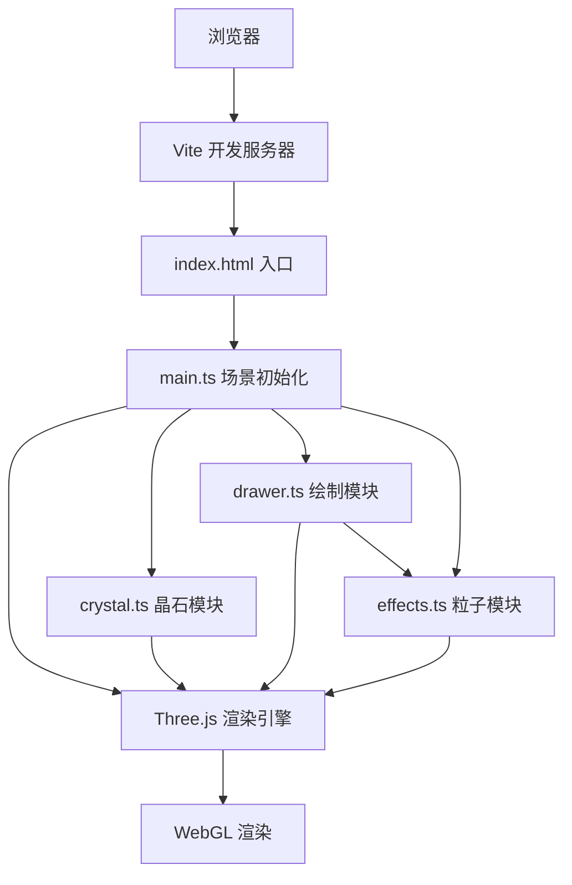

## 1. 架构设计



## 2. 技术说明

- **前端框架**：无（原生 TypeScript + Three.js）
- **3D 引擎**：Three.js @0.160.0
- **构建工具**：Vite @5.4.0
- **语言**：TypeScript @5.5.0（严格模式）
- **后端**：无，纯前端应用
- **UI 渲染**：Three.js CSS2DRenderer

## 3. 模块划分

| 文件 | 职责 | 导出 |
|------|------|------|
| src/main.ts | 场景初始化、灯光、相机、渲染循环、事件绑定、UI 面板创建 | 无（入口） |
| src/crystal.ts | 二十面体晶石几何体、材质、棱边、自转逻辑、棱边数据提取 | createCrystal(), updateCrystalRotation(), getEdges(), getFaces() |
| src/drawer.ts | 鼠标交互、射线检测、纹路点记录、平滑插值、碰撞检测、闭合回路判定、光粒/光球触发、纹路管理（最多3条+渐隐清除） | setupDrawer(), startDrawing(), updateDrawing(), stopDrawing(), isDrawing() |
| src/effects.ts | 粒子系统（光粒+光球粒子）、星点系统、生命周期管理、闪烁效果、发光后处理 | createStars(), addCollisionParticles(), addOrbParticles(), updateEffects(), setupPostProcessing() |

## 4. 关键数据结构

```typescript
// 纹路点
interface LinePoint {
  position: THREE.Vector3;  // 世界坐标
  faceIndex: number;        // 所在面索引
  timestamp: number;        // 记录时间戳
}

// 纹路对象
interface CrystalLine {
  id: number;
  points: LinePoint[];
  mesh: THREE.Line;
  hueOffset: number;        // 累计色相偏移
  isClosed: boolean;        // 是否闭合
  orb: THREE.Mesh | null;   // 关联的能量光球
  orbLifetime: number;      // 光球剩余时间
  fadeProgress: number;     // 渐隐进度（0-1，0=完全可见，1=完全透明）
  isFading: boolean;        // 是否处于渐隐状态
  flashProgress: number;    // 闭合闪烁进度
  isFlashing: boolean;      // 是否正在闪烁
}

// 粒子对象
interface Particle {
  position: THREE.Vector3;
  velocity: THREE.Vector3;
  color: THREE.Color;
  size: number;
  lifetime: number;         // 剩余生命周期（秒）
  maxLifetime: number;
  type: 'collision' | 'orb';
}

// 星点对象
interface Star {
  position: THREE.Vector3;
  size: number;
  baseOpacity: number;
  flashPhase: number;       // 闪烁相位
  flashPeriod: number;      // 闪烁周期（秒）
}
```

## 5. 核心算法

### 5.1 晶石表面点采样（射线检测）
1. 将鼠标屏幕坐标转为 NDC 坐标
2. 使用 THREE.Raycaster 发射射线
3. 与晶石二十面体求交，获取交点 position 和所在面 faceIndex

### 5.2 纹路点插值
1. 记录当前帧交点
2. 与上一点计算距离
3. 若距离 > 0.05，则沿两点连线按 0.05 步长线性插值生成中间点
4. 每个插值点需投影到晶石表面（归一化后乘晶石半径）

### 5.3 棱边碰撞检测
1. 从二十面体几何体提取所有唯一棱边（顶点对）
2. 对每个新绘制点，检测其所在面与上一点所在面是否不同
3. 若不同，说明跨越棱边，计算两个面的交界棱边中点为碰撞点
4. 计算棱边法线：两面法线叉积归一化

### 5.4 闭合回路判定
1. 当纹路点数 ≥ 3 时，取当前点与纹路起点
2. 计算两点在晶石表面的弧面距离（点积反余弦）
3. 若距离 < 阈值（如 0.1 弧度）且总点数足够，则判定为闭合

### 5.5 颜色渐变与色相偏移
1. 基础渐变：#ff3388 → #33ff88，按绘制总时间 t 归一化插值
2. 每次过棱边：将当前 HSL 色相 +15°，转换回 RGB

### 5.6 渐隐清除动画
1. 标记最早纹路 isFading = true
2. 每帧 fadeProgress += deltaTime / 0.5（0.5秒完成）
3. 将纹路材质透明度、关联光球透明度、关联粒子透明度乘以 (1 - fadeProgress)
4. fadeProgress ≥ 1 时从数组移除并 dispose() 资源
