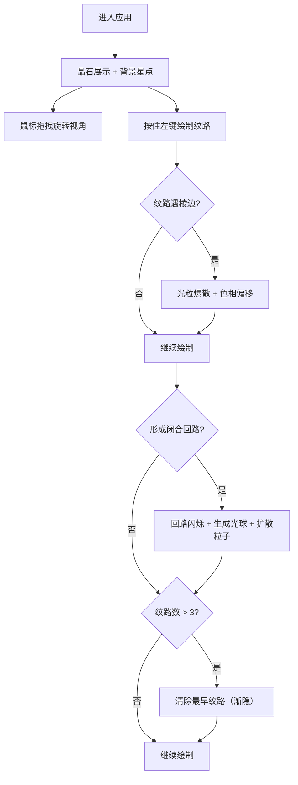

## 1. 产品概述

晶石纹路雕刻是一款在浏览器中运行的交互式 3D 艺术创作工具。用户可以像一位晶石雕刻师一样，在虚拟晶石表面通过鼠标拖拽刻划发光的能量纹路，观察纹路沿晶石棱面流动、碰撞并产生彩色光粒爆散的视觉效果。

- 主要目标：提供沉浸式的 3D 交互创作体验，让用户在数字世界中体验晶石雕刻的乐趣
- 目标用户：艺术爱好者、交互设计爱好者、普通用户
- 市场价值：展示 WebGL/Three.js 在创意交互领域的应用潜力

## 2. 核心功能

### 2.1 功能模块

1. **晶石展示模块**：二十面体晶石模型、棱边高亮、半透明填充、缓慢自转、可拖拽视角
2. **纹路绘制模块**：鼠标拖拽绘制发光纹路、颜色渐变、发光效果、平滑曲线插值
3. **碰撞效果模块**：纹路遇棱边检测、彩色光粒爆散、纹路过棱边色相偏移
4. **闭合回路模块**：闭合回路检测、回路闪烁、能量光球生成、光球粒子扩散
5. **纹路管理模块**：最多 3 条纹路、超出自动清除最早一条、渐隐清除动画
6. **场景与 UI 模块**：深空背景、星点效果、底部控制面板、纹路数量显示、闭合进度条

### 2.2 功能详情

| 模块名称 | 功能描述 |
|---------|---------|
| 晶石展示 | 二十面体几何体，棱边 #aaddff 半透明 2px，内部 #4488cc 透明度 0.3，自转 0.005 rad/s，OrbitControls 阻尼 0.1 |
| 纹路绘制 | 按住鼠标左键拖拽绘制，线宽 3px，颜色 #ff3388→#33ff88 渐变，GlowPass 强度 0.5，点间距≤0.05 |
| 碰撞效果 | 遇棱边生成 5-8 个彩色光粒（#ff88aa/#88ffaa/#88aaff），大小 0.1-0.3，速度沿棱边法线偏移 30°，生命周期 1.5s，纹路色相偏移 +15° |
| 闭合回路 | 首尾相连形成闭合时，回路亮度 1.0→2.0→1.0 闪烁 0.5s，中心生成 #ffcc00 光球（半径 0.5，透明度 0.6），每帧发射 10 粒子（0.05 大小，#ff3333→#33ff33 渐变），持续 3s |
| 纹路管理 | 最多 3 条，第 4 条开始清除最早一条，含纹路/光球/粒子，0.5s 渐隐动画 |
| 场景 UI | 深空背景径向渐变 #0a0a2a→#1a0a1a，100 颗白色星点随机闪烁，底部控制面板（位置 (0,-3,0)，宽 4 高 0.3），显示"纹路: X/3"和闭合进度条，CSS2DRenderer 实现 |

## 3. 核心流程

用户进入应用后，首先看到居中旋转的晶石和周围闪烁的星点。用户通过鼠标拖拽旋转视角观察晶石，然后按住鼠标左键在晶石表面开始绘制发光纹路。纹路沿晶石表面流动，遇到棱边时产生光粒爆散和色相偏移。当纹路形成闭合回路时，回路闪烁并在中心生成能量光球，光球持续扩散彩色粒子。当绘制超过 3 条纹路时，最早的一条带渐隐效果消失。底部控制面板实时显示当前纹路数量和闭合状态。

## 4. 用户界面设计

### 4.1 设计风格

- 主色调：深空蓝 #0a0a2a、紫黑 #1a0a1a、晶石蓝 #4488cc、棱边青 #aaddff
- 强调色：粉 #ff3388、绿 #33ff88、金 #ffcc00、红粉 #ff88aa、浅绿 #88ffaa、浅蓝 #88aaff
- 视觉风格：深邃神秘的宇宙晶石风格，半透明发光质感
- 字体：简洁无衬线字体，白色文字
- 动效：发光脉冲、粒子扩散、渐隐渐显、平滑自转

### 4.2 页面设计概览

| 模块 | UI 元素 |
|------|---------|
| 3D 场景 | 居中二十面体晶石、100 颗闪烁星点、径向渐变深空背景 |
| 交互控件 | OrbitControls 鼠标拖拽旋转视角、鼠标左键绘制纹路 |
| 底部面板 | 半透明控制面板、纹路数量文本"纹路: X/3"、闭合状态进度条（闭合时金色闪烁） |

### 4.3 响应式

桌面端全屏体验，自适应浏览器窗口大小，支持窗口 resize 事件。

### 4.4 3D 场景指导

- **环境与氛围**：深空宇宙氛围，径向渐变背景（中心蓝紫 #0a0a2a，边缘紫黑 #1a0a1a）
- **灯光设置**：环境光 + 点光源组合，突出晶石的半透明质感和棱边高光
- **相机设置**：PerspectiveCamera，位置 (0, 2, 5)，OrbitControls 控制旋转，阻尼 0.1
- **构图与焦点**：晶石位于场景中心，作为视觉焦点，底部 UI 面板固定
- **交互与动画**：晶石缓慢自转（0.005 rad/s），纹路发光流动，粒子爆散扩散，回路闪烁脉冲
- **后处理效果**：GlowPass 发光效果（强度 0.5），CSS2DRenderer 渲染 UI 文本
- **性能预算**：目标帧率 ≥ 30fps，合理控制粒子数量和纹路复杂度

## 5. 性能要求

- 拖拽绘制时帧率 ≥ 30fps
- 粒子系统高效更新，避免内存泄漏
- 纹路点合理采样，避免过密顶点
- 清除纹路时正确释放 Three.js 资源
