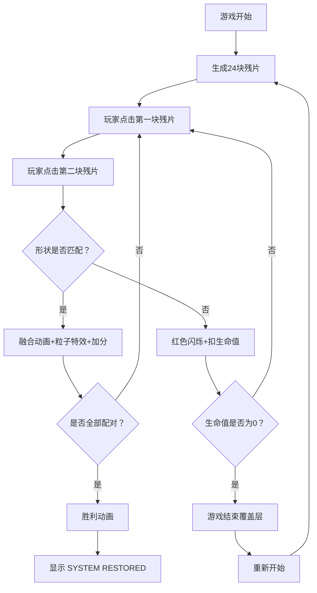

## 1. 产品概述

赛博废墟残片配对游戏是一款基于浏览器的休闲益智游戏，玩家扮演数据修复师，在赛博空间废墟中通过点击发光的数字残片进行配对，修复数据流并唤醒沉睡的霓虹光柱。

- 主要用途：休闲娱乐、记忆训练
- 目标用户：喜欢赛博朋克美学和记忆配对游戏的玩家
- 产品价值：提供沉浸式的赛博朋克视觉体验与经典记忆配对玩法的结合

## 2. 核心功能

### 2.1 功能模块
1. **游戏主界面**：废墟背景、残片网格、生命值显示、分数显示
2. **残片交互系统**：悬停反馈、点击高亮、配对检测、融合动画
3. **粒子特效系统**：配对成功时的粒子迸发效果
4. **生命与计分系统**：生命值管理、分数统计
5. **游戏状态管理**：游戏结束、胜利判定、重新开始

### 2.2 页面详情
| 页面名称 | 模块名称 | 功能描述 |
|----------|----------|----------|
| 游戏主界面 | 废墟背景 | 半透明网格线+暗色碎片+低频摆动动画+噪声纹理 |
| 游戏主界面 | 残片网格 | 6×4网格排列24块形状各异的发光残片 |
| 游戏主界面 | HUD面板 | 左上角心形生命值、右上角分数显示 |
| 游戏结束层 | 覆盖层 | "DATA CORRUPTED"文字抖动动画+RESTART按钮 |
| 胜利动画层 | 覆盖层 | 彩色光柱升起+白色渐变+"SYSTEM RESTORED"金色文字 |

## 3. 核心流程

玩家进入游戏后，24块残片随机排列在屏幕中央。玩家点击两块残片进行配对：
- 配对成功：残片融合消失，释放粒子和霓虹光柱，获得10分
- 配对失败：残片闪烁红色，扣除1点生命值
- 全部配对成功：触发胜利动画
- 生命值归零：显示游戏结束覆盖层，可重新开始

## 4. 用户界面设计

### 4.1 设计风格
- **主色调**：深灰黑背景（#1a1a1a→#0a0a0a渐变），霓虹色残片（#ff3366、#33ff66、#3366ff、#ffcc33、#aa66ff）
- **视觉风格**：赛博朋克暗色调，发光残片，粒子特效，霓虹光柱
- **字体**：Courier New 等宽字体
- **特效**：发光模糊（shadowBlur）、呼吸动画、弹跳缩放、抖动动画、粒子扩散

### 4.2 页面设计概述
| 页面名称 | 模块名称 | UI元素 |
|----------|----------|--------|
| 游戏主界面 | 废墟背景 | 网格线（#333，1px，摆动）、暗色碎片（#222，40个）、噪声纹理（2px，5%密度） |
| 游戏主界面 | 残片 | 不规则多边形（5-8点）、发光效果、悬停放大110%、透明度0.6→1 |
| 游戏主界面 | HUD | 红色心形（#ff3355）×5、分数数字 |
| 游戏结束 | 覆盖层 | "DATA CORRUPTED"红色40px抖动文字、RESTART按钮 |
| 胜利画面 | 覆盖层 | 12根彩色光柱、白色渐变、"SYSTEM RESTORED"金色48px文字 |

### 4.3 响应性
- 桌面端优先设计
- 页面居中显示，padding上下各20px，左右自适应
- 残片网格根据窗口大小居中排列

## 5. 性能约束
- 目标帧率：60FPS
- 粒子上限：300个（超出时回收最早粒子）
- 每次配对成功迸发：80个粒子
