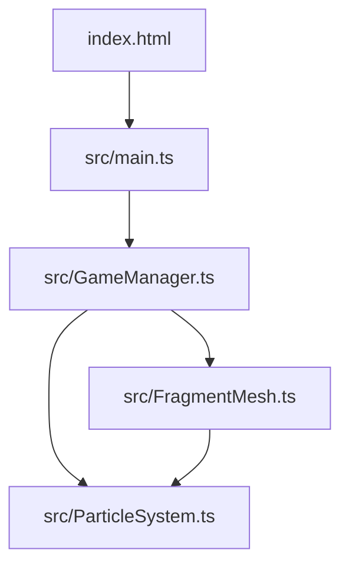

## 1. 架构设计



### 模块职责与调用关系

| 模块 | 职责 | 输入 | 输出 | 调用方 | 被调用方 |
|------|------|------|------|--------|----------|
| main.ts | p5实例初始化、事件分发、主循环 | p5生命周期事件 | 调用GameManager方法 | p5.js | GameManager |
| GameManager.ts | 游戏状态管理、配对逻辑、分数生命、动画调度 | main.ts传递的事件、鼠标坐标 | 状态更新、触发渲染 | main.ts | FragmentMesh, ParticleSystem |
| FragmentMesh.ts | 残片生成、形状管理、点击检测、残片动画 | GameManager调用、鼠标坐标 | 残片渲染、配对结果 | GameManager | ParticleSystem |
| ParticleSystem.ts | 粒子创建、更新、回收、渲染 | GameManager/FragmentMesh触发 | 粒子渲染 | GameManager, FragmentMesh | - |

### 数据流向

```
用户交互 → p5事件 → main.ts → GameManager.update()
                                    ↓
                          FragmentMesh.update()
                                    ↓
                          ParticleSystem.update()
                                    ↓
                          GameManager.render()
                                    ↓
                          FragmentMesh.render()
                                    ↓
                          ParticleSystem.render()
```

## 2. 技术说明

- **前端框架**：p5@1.9.0（Canvas 2D渲染）
- **开发语言**：TypeScript@5.5.0（严格模式）
- **构建工具**：Vite@5.4.0（开发服务器端口3000）
- **后端**：无（纯前端游戏）
- **数据库**：无

## 3. 核心数据模型

### 3.1 残片数据结构

```typescript
interface Fragment {
  id: number;
  shapeHash: string;        // 形状哈希值，用于配对匹配
  color: string;            // 颜色：#ff3366/#33ff66/#3366ff/#ffcc33/#aa66ff
  points: { x: number; y: number }[];  // 多边形顶点（相对坐标，5-8个点）
  gridX: number;            // 网格列位置 (0-5)
  gridY: number;            // 网格行位置 (0-3)
  x: number;                // 屏幕x坐标
  y: number;                // 屏幕y坐标
  size: number;             // 残片区域大小 30px
  isSelected: boolean;      // 是否被选中
  isMatched: boolean;       // 是否已配对成功
  isHovered: boolean;       // 是否悬停
  // 动画状态
  breathPhase: number;      // 呼吸动画相位
  bounceProgress: number;   // 弹跳动画进度 (0-1)
  shakeProgress: number;    // 抖动动画进度 (0-1)
  flashProgress: number;    // 闪烁动画进度 (0-1)
  mergeProgress: number;    // 融合动画进度 (0-1)
}
```

### 3.2 粒子数据结构

```typescript
interface Particle {
  x: number;
  y: number;
  vx: number;               // 初速度2-6px/帧
  vy: number;
  size: number;             // 3-6px
  color: string;
  life: number;             // 剩余生命 (0-1)
  maxLife: number;          // 总生命 1.5秒
  createdAt: number;        // 创建时间戳
}
```

### 3.3 光柱数据结构

```typescript
interface LightPillar {
  x: number;
  color: string;
  progress: number;         // 0-1，升起动画进度
  duration: number;         // 持续时间 3秒
  createdAt: number;
}
```

### 3.4 游戏状态

```typescript
interface GameState {
  score: number;
  lives: number;
  selectedFragmentId: number | null;
  isGameOver: boolean;
  isVictory: boolean;
  matchedPairs: number;
  victoryPhase: number;     // 胜利动画阶段
}
```

## 4. 文件结构

```
auto136/
├── package.json
├── vite.config.js
├── tsconfig.json
├── index.html
└── src/
    ├── main.ts
    ├── GameManager.ts
    ├── FragmentMesh.ts
    └── ParticleSystem.ts
```

## 5. 性能优化策略

1. **帧率控制**：使用 p5.frameRate(60) 限制帧率
2. **粒子回收**：粒子总数超过300时，回收最早创建的粒子
3. **离屏渲染**：背景噪声纹理使用 p5.createGraphics() 预渲染
4. **对象池**：粒子对象复用，避免频繁GC
5. **动画优化**：使用 requestAnimationFrame（p5内置），仅在必要时重绘
