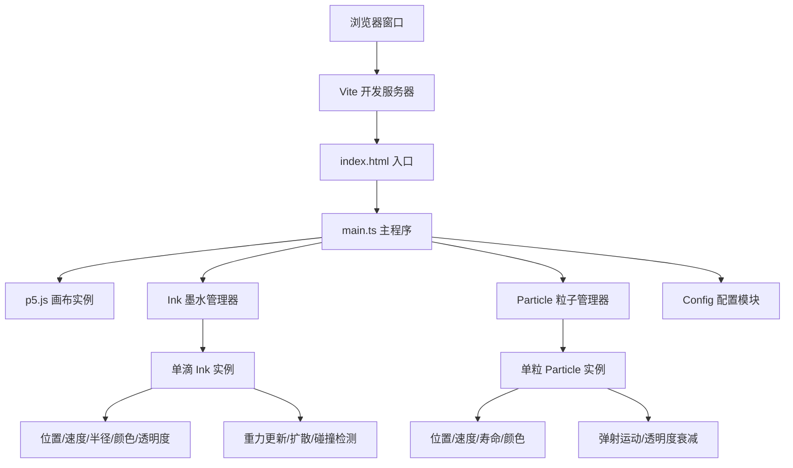

## 1. 架构设计



## 2. 技术描述

- **前端框架**: 原生 TypeScript + p5.js@1.9.0
- **构建工具**: Vite@5.4.0
- **类型系统**: TypeScript@5.5.0 (严格模式)
- **开发服务器**: Vite 内置 dev server (端口 3000)

## 3. 文件结构

```
auto137/
├── .trae/documents/
│   ├── PRD.md
│   └── ARCHITECTURE.md
├── src/
│   ├── main.ts        # 主程序入口，p5.js 实例模式，游戏循环
│   ├── ink.ts         # Ink 类：墨滴属性、物理、渲染、碰撞
│   ├── particle.ts    # Particle 类：粒子属性、运动、生命周期
│   └── config.ts      # 颜色调色板、物理参数、性能限制配置
├── index.html         # 入口 HTML，深色背景
├── package.json       # 依赖与启动脚本
├── vite.config.js     # Vite 构建配置 (端口 3000)
└── tsconfig.json      # TypeScript 严格模式配置
```

## 4. 核心类设计

### 4.1 Config 配置模块

| 配置项 | 类型 | 值 | 说明 |
|--------|------|-----|------|
| COLOR_PALETTE | ColorItem[] | 5 种荧光色 | 预设调色板，含颜色值与中文名称 |
| GRAVITY | number | 0.15 | 重力加速度 px/帧² |
| VELOCITY_FACTOR | number | 0.3 | 水平速度系数 (鼠标速度倍数) |
| DRIP_RATE_MIN/MAX | number | 8-12 | 每秒墨滴生成数量范围 |
| INK_RADIUS_MIN/MAX | number | 3-5 | 墨滴初始半径 px |
| ALPHA_INITIAL | number | 0.9 | 墨滴初始透明度 |
| ALPHA_DECAY_MIN/MAX | number | 0.003-0.008 | 每帧透明度衰减 |
| RADIUS_GROW_MIN/MAX | number | 0.1-0.3 | 每帧半径增长 px |
| REPULSION_FORCE | number | 0.3 | 墨水排斥力 px/帧² |
| PARTICLE_COUNT_MIN/MAX | number | 3-6 | 每次碰撞产生粒子数 |
| PARTICLE_SPEED_MIN/MAX | number | 2-4 | 粒子弹射速度 px/帧 |
| PARTICLE_LIFE_MIN/MAX | number | 60-120 | 粒子寿命帧数 (1-2秒@60FPS) |
| MAX_INK_COUNT | number | 200 | 最大同时墨滴数 |
| MAX_PARTICLE_COUNT | number | 500 | 最大同时粒子数 |
| FADE_DELAY | number | 90 | 痕迹褪色延迟帧数 (1.5秒) |
| FADE_DURATION | number | 360 | 痕迹褪色持续帧数 (6秒) |
| CLEAR_ANIMATION_DURATION | number | 30 | 清空动画持续帧数 (0.5秒) |
| COLOR_SWITCH_DISTANCE | number | 50 | 颜色切换鼠标移动距离 px |

### 4.2 Ink 类

| 属性 | 类型 | 说明 |
|------|------|------|
| x, y | number | 位置坐标 |
| vx, vy | number | 速度分量 |
| radius | number | 当前半径 |
| color | p5.Color | 墨水颜色 |
| alpha | number | 当前透明度 |
| growRate | number | 每帧半径增长率 |
| decayRate | number | 每帧透明度衰减率 |
| createdAt | number | 创建时间戳 (帧数) |
| isClearing | boolean | 是否处于清空动画状态 |

| 方法 | 返回 | 说明 |
|------|------|------|
| update() | void | 更新物理状态：重力、扩散、透明度 |
| draw(p: p5) | void | 绘制带发光效果的墨滴 |
| isDead() | boolean | 判断透明度是否低于 0.05 |
| collidesWith(other: Ink) | boolean | 检测与另一滴墨水是否碰撞 |
| repelFrom(other: Ink) | void | 施加排斥力 |

### 4.3 Particle 类

| 属性 | 类型 | 说明 |
|------|------|------|
| x, y | number | 位置坐标 |
| vx, vy | number | 速度分量 |
| radius | number | 粒子大小 1-3px |
| color | p5.Color | 混合色 |
| alpha | number | 当前透明度 |
| life | number | 剩余寿命帧数 |
| maxLife | number | 初始寿命帧数 |

| 方法 | 返回 | 说明 |
|------|------|------|
| update() | void | 更新位置、寿命、透明度 |
| draw(p: p5) | void | 绘制粒子 |
| isDead() | boolean | 判断寿命是否结束 |

### 4.4 main.ts 主程序

| 函数/变量 | 说明 |
|-----------|------|
| inks: Ink[] | 活跃墨滴数组 |
| particles: Particle[] | 活跃粒子数组 |
| mousePrevX/Y | 上一帧鼠标位置，计算速度 |
| currentColorIndex | 当前颜色索引 |
| distanceAccumulated | 累计鼠标移动距离 |
| dripAccumulator | 墨滴生成计时器 |
| isMousePressed | 鼠标按下状态 |
| isClearing | 清空动画状态 |
| clearTimer | 清空动画计时器 |
| setup() | p5 初始化：画布大小、像素密度 |
| draw() | 主循环：背景、墨滴更新/绘制、粒子更新/绘制、碰撞检测、控制面板绘制、光标绘制 |
| spawnInk(x, y, vx, vy) | 生成新墨滴 |
| spawnParticles(x, y, c1, c2) | 生成碰撞粒子 |
| checkInkCollisions() | 检测所有墨滴间碰撞 |
| keyPressed() | 空格键触发清空 |
| mousePressed()/Released() | 鼠标状态更新 |

## 5. 性能优化策略

1. **对象池**: 使用数组管理墨滴和粒子，超出上限时移除最旧的 (shift)
2. **空间优化**: 碰撞检测只在活跃墨滴间进行，最多 200 滴，O(n²) 在可接受范围
3. **渲染优化**: 使用 p5.js 内置绘图函数，避免 DOM 操作
4. **帧时间控制**: 物理更新和粒子生成计算量控制在单帧 12ms 以内
5. **垃圾回收**: 及时过滤死亡对象，避免内存泄漏
