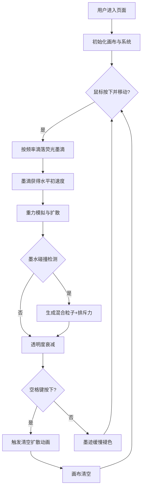

## 1. 产品概述

虚拟荧光墨迹扩散交互应用 - 用户通过鼠标在深色吸墨纸上滴落和引导荧光墨水，体验沉浸式的数字墨画创作。

- 面向所有喜欢艺术创作和视觉交互的用户，提供放松和创意表达的平台
- 打造独特的视觉体验，模拟真实墨水物理行为，支持多色混合与排斥效果

## 2. 核心功能

### 2.1 功能模块

1. **画布渲染层**: 深色渐变背景，全屏画布，十字准星光标
2. **墨水生成系统**: 鼠标拖拽滴落墨水，按距离循环切换颜色
3. **物理模拟系统**: 重力、扩散、透明度衰减、墨水排斥力
4. **粒子效果系统**: 墨水碰撞时产生混合色粒子并向四周弹射
5. **痕迹消退系统**: 墨迹随时间缓慢褪色，模拟纸张吸墨效果
6. **控制面板**: 显示当前颜色、色块、墨滴数量统计
7. **清空动画**: 空格键触发墨滴快速扩散消散动画

### 2.2 页面详情

| 页面名称 | 模块名称 | 功能描述 |
|-----------|-------------|---------------------|
| 主画布页 | 画布区域 | 全屏画布，深色渐变背景，十字准星光标，支持鼠标绘画 |
| 主画布页 | 控制面板 | 右上角半透明面板，显示当前颜色名称、色块、墨滴计数 |
| 主画布页 | 墨水系统 | 墨水生成、重力下落、扩散、透明度衰减、碰撞排斥 |
| 主画布页 | 粒子系统 | 墨水碰撞时产生混合色粒子，粒子弹射与寿命管理 |
| 主画布页 | 痕迹系统 | 墨迹路径记录与缓慢褪色消退效果 |

## 3. 核心流程

用户进入应用后，按住鼠标左键在画布上拖拽，系统持续生成荧光墨滴。每滴墨水受重力影响向下流动并扩散，不同颜色墨水相遇产生混合粒子和排斥效果。墨迹随时间缓慢褪色，用户可按空格键触发清空动画。

## 4. 用户界面设计

### 4.1 设计风格

- **主色调**: 深色系背景 (#0a0a1a 到 #1a0a0a 渐变)
- **强调色**: 荧光调色板 (#ff00ff 荧光粉, #00ffff 荧光青, #ffff00 荧光黄, #ff6600 荧光橙, #00ff66 荧光绿)
- **字体**: monospace 等宽字体，字号 14px
- **风格定位**: 赛博朋克荧光艺术风格，深色神秘氛围，高对比度发光效果

### 4.2 页面设计概述

| 页面名称 | 模块名称 | UI 元素 |
|-----------|-------------|-------------|
| 主画布页 | 画布区域 | 全屏 100vw×100vh，深色渐变背景，十字准星光标 (#ffffff, 1px, 20px) |
| 主画布页 | 控制面板 | 右上角半透明面板 (背景 #1a1a2e，透明度 0.7，圆角 8px，内边距 12px) |
| 主画布页 | 墨水渲染 | 圆形墨滴，shadowBlur 10px 发光效果，与墨水色一致 |
| 主画布页 | 粒子渲染 | 1-3px 圆形粒子，高透明度，快速弹射运动 |

### 4.3 响应式设计

- 采用全屏响应式设计，画布自动适配窗口大小
- 桌面端鼠标交互为主，十字准星光标
- 窗口 resize 时自动调整画布尺寸

### 4.4 动效设计

- 墨水自然下落与扩散动画
- 粒子从碰撞点向四周弹射动画
- 墨迹随时间线性褪色与饱和度衰减
- 清空时墨滴 5 倍速度扩散消散动画 (0.5 秒)
