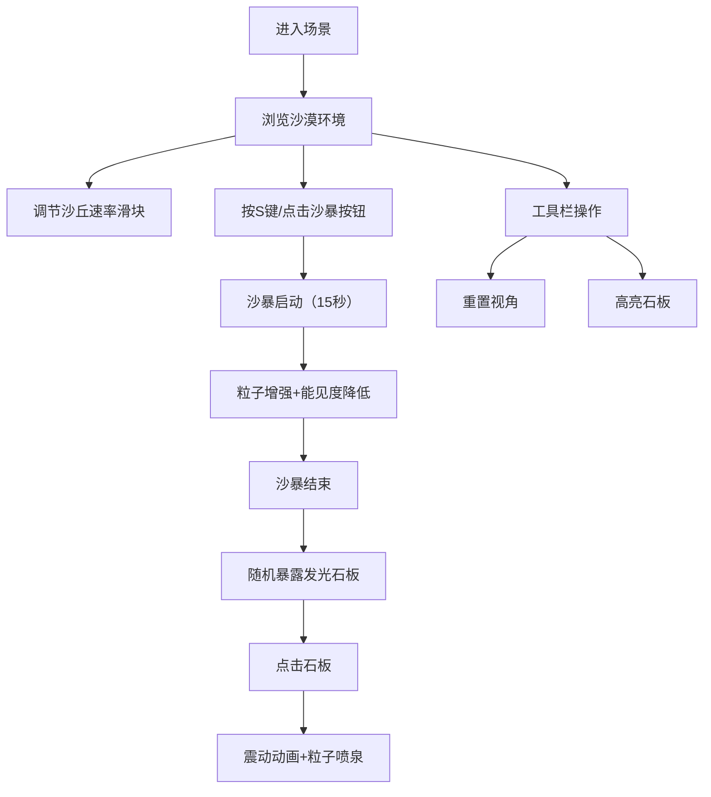

## 1. 产品概述

3D沙漠沙丘生态系统与沙暴粒子交互的游戏化应用，让用户在浏览器中身临其境地感受沙漠腹地的动态神秘感。
- 解决用户无法亲临沙漠体验沙丘随风吹拂缓慢迁移、沙暴中隐藏古老遗迹的问题
- 通过沉浸式3D场景、动态粒子系统和互动遗迹探索，提供教育与娱乐结合的沙漠生态体验

## 2. 核心功能

### 2.1 用户角色

| 角色 | 注册方式 | 核心权限 |
|------|----------|----------|
| 普通用户 | 无需注册，直接访问 | 浏览3D场景、触发沙暴、交互遗迹、调节参数 |

### 2.2 功能模块

1. **3D沙漠场景**：广袤沙丘地形、金字塔废墟、落日天空渐变
2. **沙丘动态迁移系统**：基于风向的沙丘高度变化、沙粒扩散粒子效果
3. **沙暴粒子系统**：S键触发沙暴、10倍粒子生成速率、橙红渐变粒子、能见度降低
4. **遗迹交互系统**：沙暴后暴露发光石板、点击触发震动和粒子喷泉
5. **UI控制面板**：风向指示器、沙暴倒计时、沙丘迁移速率滑块、工具栏

### 2.3 页面详情

| 页面名称 | 模块名称 | 功能描述 |
|----------|----------|----------|
| 主场景 | 3D沙漠渲染 | 20x20网格噪声沙丘、5-8座锥形金字塔废墟、落日天空渐变 |
| 主场景 | 沙丘动态迁移 | 每2秒西风微调沙丘高度、边缘扩散粒子模拟风吹效果 |
| 主场景 | 沙暴触发 | S键触发15秒沙暴，粒子速率×10，橙红渐变粒子，雾效降低能见度 |
| 主场景 | 遗迹交互 | 沙暴后随机暴露发光石板，点击触发震动和金色粒子喷泉 |
| UI面板 | 控制面板 | 风向指示器、沙暴倒计时、沙丘速率滑块、工具栏按钮 |

## 3. 核心流程

用户打开页面进入3D沙漠场景，鼠标拖拽可旋转视角。可通过右上角滑块调节沙丘迁移速率，按S键或工具栏按钮触发沙暴。沙暴持续15秒，期间视野模糊，沙暴结束后随机一处金字塔会露出发光石板。点击石板触发震动动画和金色粒子喷泉。可随时点击工具栏重置视角或高亮石板位置。

## 4. 用户界面设计

### 4.1 设计风格
- **主色调**：沙色系（浅沙#f5deb3 → 深沙#d2b48c）、落日橙红（#ff7f50）、冰蓝工具按钮（#00bfff）
- **按钮风格**：圆形（直径36px），悬停放大1.2倍+发光滤镜
- **字体**：Sans-serif，UI文字清晰易读
- **布局风格**：全屏沉浸式，左侧竖排工具栏（60px宽），右上角控制面板
- **视觉风格**：神秘古老遗迹氛围，落日光影，半透明磨砂UI面板

### 4.2 页面设计概览

| 页面名称 | 模块名称 | UI元素 |
|----------|----------|--------|
| 主场景 | 3D渲染区 | 全屏Three.js画布，鼠标拖拽旋转，平滑跟随（灵敏度0.05） |
| 主场景 | 左侧工具栏 | 深蓝半透明背景#0a0a2a80，3个圆形冰蓝色图标按钮 |
| 主场景 | 右上角面板 | 半透明白色#ffffff45，圆角8px，阴影，风向箭头+倒计时+滑块 |
| 主场景 | 沙暴倒计时 | 红色警示#ff4500，24px字体，15→0递减 |
| 主场景 | 速率滑块 | 沙色渐变，0.5x~2x范围，默认1x |

### 4.3 响应式
- 桌面端优先设计，全屏沉浸式体验
- 自适应窗口大小，Canvas随窗口resize

### 4.4 3D场景指导
- **环境与氛围**：落日沙漠，从淡蓝#87ceeb到橙红#ff7f50的天空渐变，暖色调主光
- **光照设置**：方向光模拟夕阳，配合环境光提供基础照明
- **相机设置**：PerspectiveCamera，初始俯视沙漠全景，鼠标拖拽OrbitControls
- **构图与焦点**：中央沙丘为主体，金字塔分散布局形成视觉引导，石板发光为互动焦点
- **交互与动画**：沙丘高度正弦波动、粒子随风飘动、沙暴粒子旋转、石板点击震动
- **后处理效果**：沙暴期间雾效波纹降低能见度，石板发光材质辉光
- **性能预算**：沙暴时≥30FPS，粒子总数≤3000无卡顿，平时≥45FPS

## 5. 性能指标
- 沙暴爆发时帧率 ≥ 30FPS
- 常规状态帧率 ≥ 45FPS
- 粒子总数 ≤ 3000 时无明显卡顿
- 鼠标拖拽延迟 < 50ms
