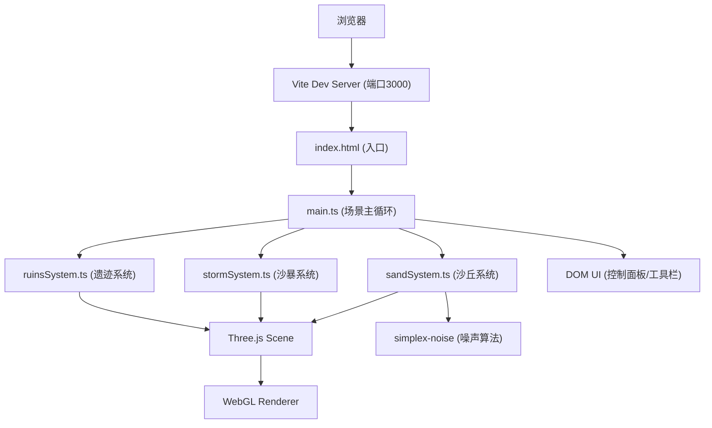

## 1. 架构设计



## 2. 技术描述

- **前端框架**：原生 TypeScript + Three.js (无React/Vue，按用户需求直接操作Three.js)
- **构建工具**：Vite@5.4.0，TypeScript@5.5.0
- **3D引擎**：Three.js@0.160.0
- **噪声算法**：simplex-noise@3.0.0（沙丘地形生成）
- **后端**：无（纯前端应用）
- **数据库**：无

## 3. 文件结构

```
project-root/
├── package.json           # 依赖与脚本配置
├── vite.config.js         # Vite构建配置
├── tsconfig.json          # TypeScript编译配置
├── index.html             # 入口HTML
└── src/
    ├── main.ts            # 场景初始化、主循环、事件绑定、UI
    ├── sandSystem.ts      # 沙丘生成与迁移、沙粒粒子管理
    ├── stormSystem.ts     # 沙暴触发、粒子特效、雾效
    └── ruinsSystem.ts     # 金字塔废墟、发光石板、交互效果
```

## 4. 核心模块接口设计

### 4.1 sandSystem.ts

```typescript
export interface SandSystemConfig {
  gridSize: number;        // 20x20网格
  minHeight: number;       // 0
  maxHeight: number;       // 3
  windDirection: THREE.Vector3;  // 西风
  migrationInterval: number;     // 2000ms
  particleEmitRate: number;      // 50个/秒
}

export class SandSystem {
  constructor(scene: THREE.Scene, config: Partial<SandSystemConfig>);
  init(): void;              // 初始化沙丘地形
  update(delta: number, migrationSpeedMultiplier: number): void;  // 每帧更新
  getWindDirection(): THREE.Vector3;
  getTerrainMesh(): THREE.Mesh;
  setStormMode(active: boolean): void;  // 切换沙暴模式
}
```

### 4.2 stormSystem.ts

```typescript
export interface StormSystemConfig {
  duration: number;         // 15000ms
  particleMultiplier: number;  // 10x
  particleColors: [string, string];  // #ff6347 → #8b4513
  fogDensity: number;
}

export class StormSystem {
  constructor(scene: THREE.Scene, sandSystem: SandSystem);
  trigger(): void;           // 触发沙暴
  update(delta: number): void;  // 每帧更新
  isActive(): boolean;
  getRemainingTime(): number;  // 剩余秒数
  onEnd(callback: () => void): void;
}
```

### 4.3 ruinsSystem.ts

```typescript
export interface RuinsSystemConfig {
  pyramidCount: number;     // 5-8随机
  pyramidRadius: number;    // 2
  pyramidHeight: number;    // 4
  tabletSize: number;       // 1.5
  tabletGlowColor: string;  // #00ff7f
  tabletGlowIntensity: number;  // 1.5
}

export class RuinsSystem {
  constructor(scene: THREE.Scene, camera: THREE.Camera, renderer: THREE.WebGLRenderer);
  init(): void;              // 生成金字塔废墟
  revealRandomTablet(): void;   // 随机暴露石板
  update(delta: number): void;  // 每帧更新
  highlightTablets(active: boolean): void;  // 高亮石板
  onTabletClick(callback: () => void): void;
}
```

## 5. 性能优化策略

| 优化点 | 策略 |
|--------|------|
| 粒子数量上限 | 3000个，使用对象池复用粒子，超出则淘汰最旧粒子 |
| 顶点性能 | 沙丘使用PlaneGeometry + 顶点色，单Mesh绘制 |
| 粒子渲染 | 使用THREE.Points + BufferGeometry批量渲染 |
| 沙暴粒子 | 独立Points对象，沙暴结束后隐藏而非销毁 |
| 帧率监控 | requestAnimationFrame + deltaTime控制动画速度 |
| 内存管理 | 粒子对象池复用，避免频繁GC |

## 6. 构建与运行

- **开发模式**：`npm run dev` → http://localhost:3000
- **依赖安装**：`npm install`
- **TypeScript严格模式**：启用strict模式，目标ES2020，模块解析bundler
