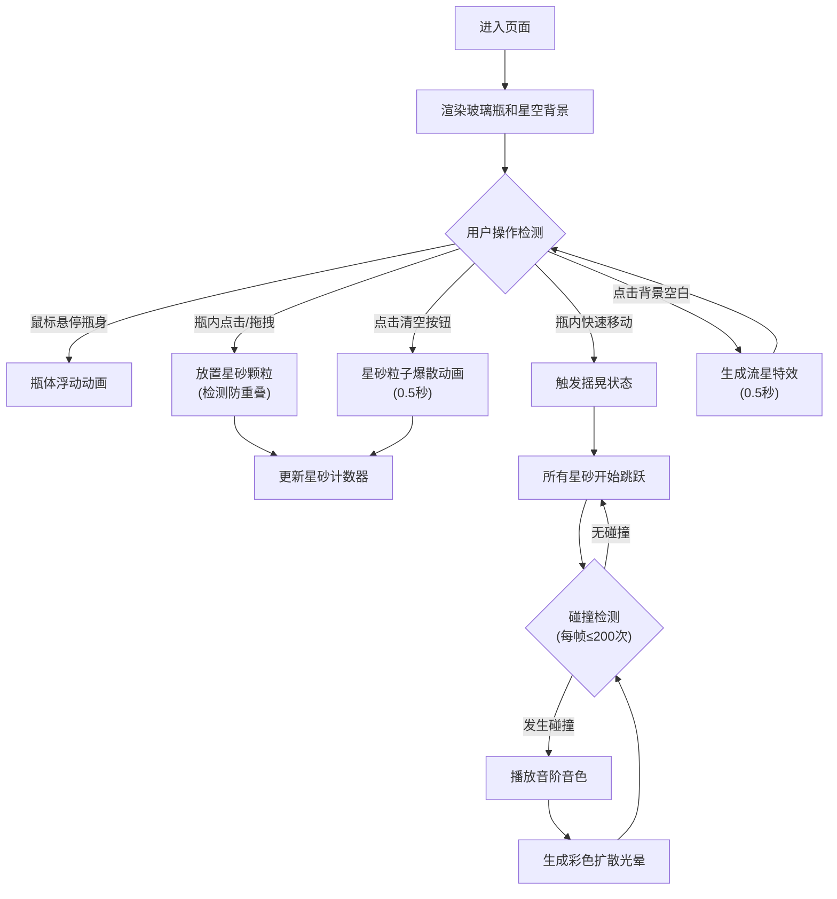

## 1. 产品概述

"星砂共鸣瓶"是一个基于Web的创意交互音乐体验页面。用户扮演星砂调音师角色，在透明玻璃瓶中放置不同音阶的星砂颗粒，通过摇晃瓶身触发星砂碰撞，产生随机旋律和彩色光晕，打造沉浸式的视听体验。

### 产品价值
- 提供放松解压的创意音乐交互体验
- 将视觉艺术与音乐创作结合，探索声音和色彩的融合
- 适合个人创作、展示和分享即兴音乐片段

### 目标用户
- 喜欢创意交互和音乐体验的普通用户
- 设计师、艺术家、音乐爱好者
- 寻求放松解压方式的上班族

---

## 2. 核心功能

### 2.1 功能模块

| 模块名称 | 功能描述 |
|---------|---------|
| 玻璃瓶渲染 | 圆角矩形瓶体、径向渐变填充、软木塞、悬停浮动动画 |
| 星砂放置系统 | 鼠标拖拽放置星砂，随机大小/颜色，碰撞检测防重叠 |
| 摇晃触发系统 | 检测鼠标快速移动触发摇晃状态 |
| 弹跳物理系统 | 星砂跳跃动画，大小与高度成反比 |
| 碰撞检测系统 | 颗粒间碰撞检测，触发音效和光晕 |
| 音频系统 | Web Audio API生成7音阶正弦波音色 |
| 光晕特效系统 | 碰撞点彩色扩散光晕动画 |
| UI控制系统 | 星砂计数器、清空按钮 |
| 背景氛围系统 | 星空背景、流星交互反馈 |

### 2.2 页面详情

| 页面名称 | 模块名称 | 功能描述 |
|---------|---------|---------|
| 主页面 | 玻璃瓶体 | 400x600px圆角矩形瓶，悬停浮动动画，瓶底弧光折射 |
| 主页面 | 星砂颗粒 | 随机5-15px半径，7种音阶色，噪点纹理 |
| 主页面 | 碰撞光晕 | 碰撞点0-30px扩散光晕，颜色混合 |
| 主页面 | UI控制区 | 左下计数器（Jura字体16px白字），右下圆形清空按钮 |
| 主页面 | 背景星空 | 150颗静态星点，点击空白处生成流星特效 |

---

## 3. 核心流程

### 用户操作流程
1. 用户进入页面，看到居中的玻璃瓶和星空背景
2. 鼠标悬停在瓶身上，瓶体轻微浮动
3. 用户在瓶内点击/拖拽放置星砂颗粒（最多50颗）
4. 用户鼠标在瓶内快速来回移动触发摇晃
5. 星砂开始跳跃并相互碰撞
6. 每次碰撞播放对应音阶音色，产生彩色光晕
7. 用户可随时点击清空按钮，星砂粒子爆散消失
8. 点击背景空白处生成流星视觉反馈

### Mermaid流程图

---

## 4. 用户界面设计

### 4.1 设计风格
- **主色调**: 深蓝#0b0e2a到紫黑#1a0d1a径向渐变（瓶内），深蓝#0a0a1a到纯黑（背景）
- **强调色**: 7音阶色（Do:#ff4466红、Re:#ff8844橙、Mi:#ffcc33黄、Fa:#66ff66绿、Sol:#44aaff蓝、La:#8844ff紫、Si:#ff66aa粉）
- **按钮风格**: 圆形清空按钮，背景#ff4466，悬停#ff6688
- **字体**: Jura（计数器）
- **整体风格**: 梦幻星空/神秘宇宙/空灵艺术感

### 4.2 页面设计

| 元素 | 样式说明 |
|-----|---------|
| 玻璃瓶 | 400x600px圆角矩形，2px半透明白色边框，径向渐变内部，瓶底微弱弧光 |
| 软木塞 | 棕色半透明椭圆（60x40px），瓶口顶部，细纤维纹理 |
| 星砂 | 5-15px圆形，7色循环，表面随机噪点纹理 |
| 光晕 | 碰撞点0→30px扩散，0.8→0透明度过渡，0.3秒动画 |
| 计数器 | 瓶左下角，白色Jura 16px |
| 清空按钮 | 瓶右下角，30px圆形，#ff4466背景 |
| 星点 | 背景150颗1-2px半透明白色圆点 |
| 流星 | 4px粗细白色弧线，0.5秒斜向划过 |

### 4.3 响应式设计
- 桌面优先设计，瓶体水平垂直居中
- 窗口尺寸变化时保持居中布局
- 鼠标交互为主，不支持移动端触摸

---

## 5. 性能要求

- 帧率维持30FPS以上
- 星砂颗粒上限50颗
- 碰撞检测每帧最多处理200次
- 音频资源轻量（Web Audio API实时生成）
