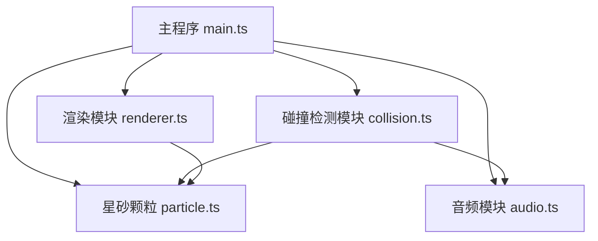

## 1. 架构设计



### 模块职责
- **main.ts**: 核心调度，p5.js实例管理，鼠标交互，状态控制，游戏循环
- **particle.ts**: 星砂颗粒数据模型和行为方法
- **audio.ts**: Web Audio API封装，音阶音色播放
- **collision.ts**: 碰撞检测算法，碰撞响应触发
- **renderer.ts**: 所有视觉元素绘制（瓶体、星砂、光晕、UI、背景）

---

## 2. 技术选型

| 技术 | 版本 | 用途 |
|-----|------|------|
| p5.js | 1.9.0 | 图形渲染、动画循环、交互处理 |
| TypeScript | 5.5.0 | 类型安全的开发语言 |
| Vite | 5.4.0 | 构建工具和开发服务器 |
| Web Audio API | - | 原生API，实时生成正弦波音频 |

---

## 3. 项目结构

```
auto142/
├── .trae/
│   └── documents/
│       ├── prd.md
│       └── tech-architecture.md
├── src/
│   ├── main.ts          # 主程序入口
│   ├── particle.ts      # 星砂颗粒类
│   ├── audio.ts         # 音频模块
│   ├── renderer.ts      # 渲染模块
│   └── collision.ts     # 碰撞检测模块
├── index.html           # 入口HTML
├── package.json         # 项目依赖配置
├── vite.config.js       # Vite构建配置
└── tsconfig.json        # TypeScript配置
```

---

## 4. 核心数据模型

### 4.1 音阶配置
```typescript
// 7音阶定义
interface ScaleNote {
  name: string;      // Do Re Mi Fa Sol La Si
  frequency: number; // 频率 Hz
  color: string;     // 颜色 HEX
}

const SCALES: ScaleNote[] = [
  { name: 'Do',  frequency: 261, color: '#ff4466' },
  { name: 'Re',  frequency: 293, color: '#ff8844' },
  { name: 'Mi',  frequency: 329, color: '#ffcc33' },
  { name: 'Fa',  frequency: 349, color: '#66ff66' },
  { name: 'Sol', frequency: 392, color: '#44aaff' },
  { name: 'La',  frequency: 440, color: '#8844ff' },
  { name: 'Si',  frequency: 493, color: '#ff66aa' },
];
```

### 4.2 星砂颗粒 Particle
```typescript
class Particle {
  x: number;              // 位置X
  y: number;              // 位置Y
  baseY: number;          // 基准Y位置（用于跳跃）
  radius: number;         // 半径 5-15px
  color: string;          // 颜色
  scaleIndex: number;     // 音阶索引 0-6
  vx: number;             // 水平速度
  vy: number;             // 垂直速度
  isJumping: boolean;     // 是否跳跃中
  jumpHeight: number;     // 跳跃高度
  jumpProgress: number;   // 跳跃进度 0-1
  noiseTexture: number[]; // 噪点纹理数据
  exploding: boolean;     // 是否爆散中
  explodeProgress: number;// 爆散进度 0-1
}
```

### 4.3 光晕效果 Glow
```typescript
interface Glow {
  x: number;          // 中心X
  y: number;          // 中心Y
  color: string;      // 混合颜色
  radius: number;     // 当前半径
  maxRadius: number;  // 最大半径 30px
  alpha: number;      // 当前透明度
  life: number;       // 生命周期 0-1
}
```

### 4.4 流星 Meteor
```typescript
interface Meteor {
  x: number;        // 起始X
  y: number;        // 起始Y
  angle: number;    // 角度
  length: number;   // 长度
  progress: number; // 进度 0-1
}
```

---

## 5. 核心算法

### 5.1 碰撞检测
```
两颗粒碰撞判定: distance(p1, p2) < p1.radius + p2.radius
优化: 每帧最多处理200次碰撞对
```

### 5.2 摇晃检测
```
条件1: 鼠标速度 > 100px/s
条件2: 连续5帧每帧移动距离 > 10px
同时满足触发摇晃状态
```

### 5.3 跳跃物理
```
小颗粒(5px): 最大跳跃高度 50px
大颗粒(15px): 最小跳跃高度 20px
线性插值: height = 50 - (radius - 5) * 3
落回偏移: 水平 ±10% 随机
```

### 5.4 颜色混合
```
RGB加权平均：混合色 = (颜色1 + 颜色2) / 2
```

---

## 6. 性能优化

- **碰撞检测**: 限制每帧最多200次检测，使用空间分区（可选）
- **渲染优化**: 星砂噪点纹理预计算，不在每帧重新生成
- **音频节流**: 每次碰撞只触发一个音，避免重叠混乱
- **对象池**: 光晕和流星对象复用（可选）
- **帧率目标**: 30FPS+，使用p5.js的requestAnimationFrame循环

---

## 7. 构建配置

### Vite配置要点
- 开发服务器端口: 3000
- 热模块替换(HMR)启用
- TypeScript源文件支持

### TypeScript配置
- 严格模式 (strict: true)
- 目标ES2020
- 模块ESNext
- 类型声明包含p5.js类型
